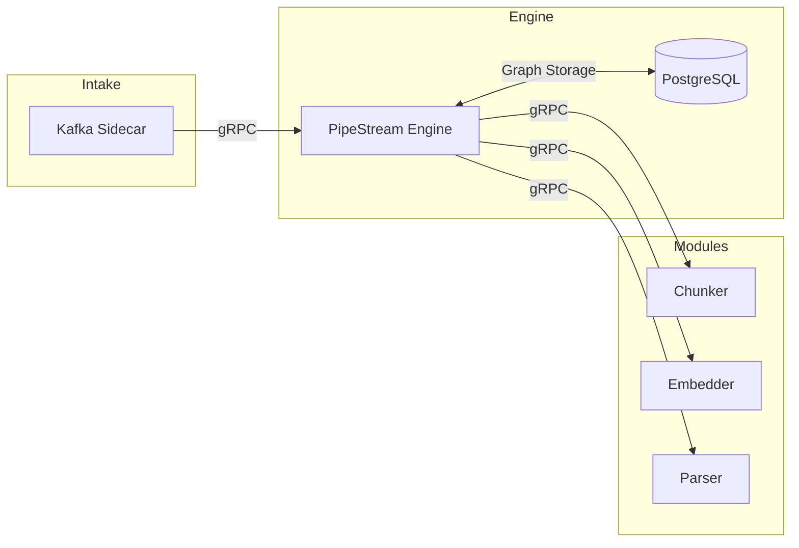
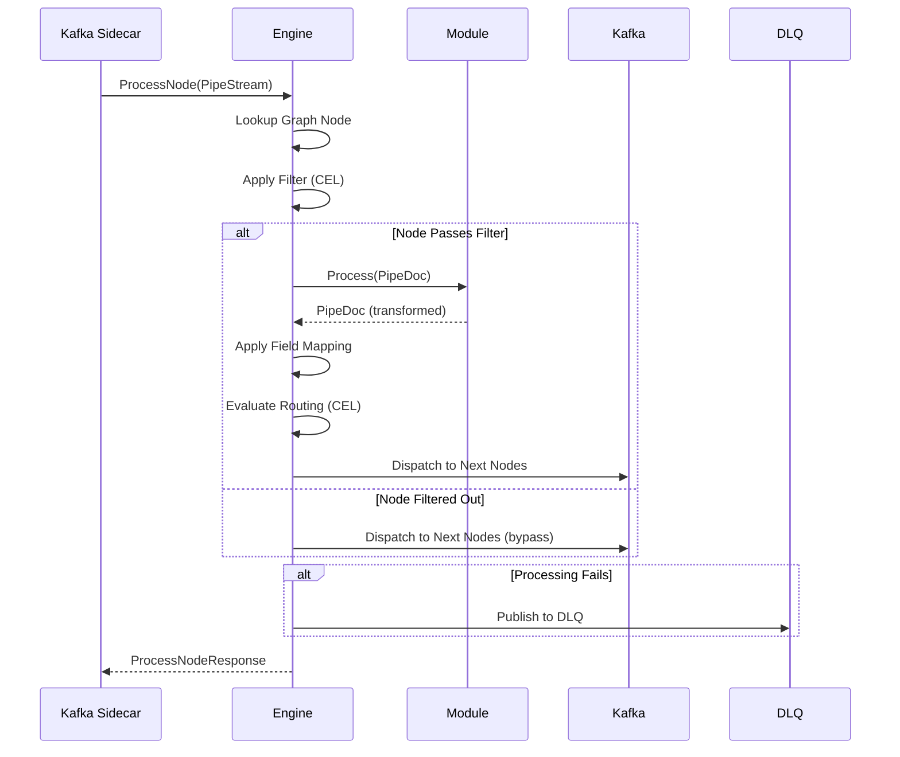
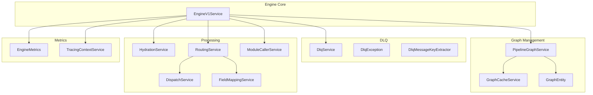

# PipeStream Engine

[](https://openjdk.org/)
[](https://quarkus.io/)
[](https://grpc.io/)
[](./LICENSE)
[](https://www.postgresql.org/)
[](https://prometheus.io/)
[](https://opentelemetry.io/)

Central orchestration service that routes documents through processing pipelines. The engine is the core brain of the PipeStream platform, managing document lifecycle as they flow through a configurable graph of processing nodes.

## Overview

The PipeStream Engine is a pure gRPC service focused entirely on orchestration. It:

- **Executes Pipeline Graphs**: Routes `PipeStream` documents through a directed acyclic graph (DAG) of processing nodes
- **Coordinates Remote Modules**: Calls external gRPC processing modules (chunkers, embedders, parsers, etc.)
- **Manages Graph State**: Stores, versions, and activates pipeline graph definitions in PostgreSQL
- **Handles Failures**: Implements Dead Letter Queue (DLQ) with retry limits and poison message quarantine
- **Provides Observability**: Exposes Prometheus metrics and OpenTelemetry tracing

## Architecture



### Document Flow



### Key Design Principles

- **Pure gRPC**: The engine has no knowledge of Kafka. It receives gRPC requests from sidecars and calls remote modules via gRPC.
- **Sidecar Pattern**: Kafka consumption, hydration, and lease management are offloaded to the Kafka Sidecar.
- **Stateless Modules**: Processing modules follow a simple `PipeDoc in → PipeDoc out` contract.
- **Explicit Transport**: Each graph edge is configured as either gRPC (fast path) or Kafka (reliable path).
- **Multi-Level Hydration**: Documents are passed as lightweight references; full content is fetched only when needed.

### Node Processing Pipeline

Each node execution follows this sequence:

1. **Hydration** - Fetch document from repository if needed (Level 1: metadata, Level 2: blob content)
2. **Filter Evaluation** - Check CEL filter conditions; skip node if any condition fails
3. **Pre-Mappings** - Apply field transformations before module processing
4. **Module Call** - Invoke remote gRPC module with retry logic for transient failures
5. **Post-Mappings** - Apply field transformations after module processing
6. **Metadata Update** - Record execution history, hop count, timestamps
7. **Routing** - Dispatch to next nodes based on CEL edge conditions

## Features

### Pipeline Graph Management
- Store multiple versions of pipeline graphs with PostgreSQL/JSONB
- Activate/deactivate graph versions at runtime
- In-memory caching for high-performance graph lookups

### CEL-Based Routing
- Common Expression Language (CEL) for dynamic routing decisions
- Filter expressions to skip nodes based on document attributes
- Field mapping and transformation within the engine

### Dead Letter Queue (DLQ)
- Per-node DLQ topic configuration with `dlq_config.topic_override`
- Global DLQ fallback for pre-node failures (`pipestream.global.dlq`)
- Poison message detection with configurable retry limits
- Automatic quarantine for messages exceeding max retries
- DLQ topic naming: `pipestream.{cluster}.{node_id}.dlq`
- Quarantine topic naming: `pipestream.{cluster}.{node_id}.quarantine`
- Error classification with typed exceptions (`DlqException` hierarchy)
- Save-on-error support for preserving document state before DLQ publish

### Metrics & Tracing
- Micrometer/Prometheus metrics for document processing, DLQ operations, and module calls
- OpenTelemetry integration for distributed tracing
- MDC-based log correlation with trace_id, stream_id, node_id

### Dynamic Service Discovery
- Consul-based service discovery for remote modules
- SmallRye Stork integration for client-side load balancing

## Getting Started

### Prerequisites

- **Java 21+** (tested with OpenJDK 21)
- **Docker** (for dev services)
- **Gradle 8+** (wrapper included)

### Building

```bash
# Build the project
./gradlew build

# Build without tests
./gradlew build -x test

# Run tests
./gradlew test
```

### Running in Dev Mode

```bash
# Start with Quarkus dev mode (hot reload enabled)
./gradlew quarkusDev
```

Dev mode automatically starts:
- PostgreSQL (via shared dev services)
- Kafka (via Quarkus DevServices)
- Schema Registry (Apicurio)

### Docker Image

```bash
# Build Docker image
./gradlew build -Dquarkus.container-image.build=true

# Image tag: git.rokkon.com/io-pipeline/pipestream-engine:latest
```

## Configuration

### Environment Variables

| Variable | Default | Description |
|----------|---------|-------------|
| `HOSTNAME` | `unknown` | Used for service instance ID |
| `KAFKA_BOOTSTRAP_SERVERS` | `localhost:9094` | Kafka bootstrap servers |
| `CONSUL_HOST` | `localhost` | Consul agent host |
| `CONSUL_PORT` | `8500` | Consul agent port |
| `OTEL_EXPORTER_OTLP_ENDPOINT` | `http://localhost:4317` | OpenTelemetry collector endpoint |
| `APICURIO_REGISTRY_URL` | `http://localhost:8081/apis/registry/v3` | Schema registry URL |

### Core Settings

| Property | Default | Description |
|----------|---------|-------------|
| `quarkus.http.port` | `38100` | Engine HTTP/gRPC port |
| `pipestream.engine.instance-id` | `${HOSTNAME}` | Service instance identifier |
| `pipestream.dlq.global-topic` | `pipestream.global.dlq` | Default DLQ topic |
| `pipestream.dlq.max-reprocess-count` | `3` | Max DLQ retry attempts before quarantine |
| `pipestream.cluster.id` | `default-cluster` | Cluster identifier for routing |

### Module Retry Settings

| Property | Default | Description |
|----------|---------|-------------|
| `pipestream.module.retry.max-attempts` | `3` | Max retry attempts for transient gRPC failures |
| `pipestream.module.retry.initial-delay-ms` | `100` | Initial exponential backoff delay |
| `pipestream.module.retry.max-delay-ms` | `2000` | Maximum backoff delay |

### gRPC Settings

| Property | Default | Description |
|----------|---------|-------------|
| `quarkus.grpc.server.use-virtual-threads` | `true` | Enable virtual threads (JDK 21+) |
| `quarkus.grpc.server.max-inbound-message-size` | `2147483647` | Max gRPC message size (2GB) |
| `quarkus.grpc.server.flow-control-window` | `52428800` | gRPC flow control window (50MB) |

### Database

| Property | Default | Description |
|----------|---------|-------------|
| `quarkus.datasource.db-kind` | `postgresql` | Database type |
| `quarkus.flyway.migrate-at-start` | `true` | Run migrations on startup |

### Service Registration

| Property | Default | Description |
|----------|---------|-------------|
| `pipestream.registration.enabled` | `true` | Enable Consul service registration |
| `pipestream.registration.service-name` | `engine` | Service name in Consul |
| `quarkus.consul.host` | `localhost` | Consul agent host |
| `quarkus.consul.port` | `8500` | Consul agent port |

### Kafka Configuration

| Property | Default | Description |
|----------|---------|-------------|
| `kafka.bootstrap.servers` | `localhost:9094` | Kafka bootstrap servers |
| `mp.messaging.outgoing.engine-routing-out.topic` | `engine-routing-default` | Default routing topic |
| `mp.messaging.outgoing.engine-dlq-out.topic` | `pipestream.global.dlq` | Default DLQ topic |

### Observability

| Property | Default | Description |
|----------|---------|-------------|
| `quarkus.micrometer.export.prometheus.enabled` | `true` | Enable Prometheus metrics |
| `quarkus.micrometer.export.prometheus.path` | `/q/metrics` | Metrics endpoint |
| `quarkus.otel.enabled` | `true` (prod) | Enable OpenTelemetry tracing |
| `quarkus.otel.exporter.otlp.endpoint` | `http://localhost:4317` | OTLP collector endpoint |

## API Reference

### gRPC Services

The engine exposes these gRPC services (defined in [pipestream-protos](https://github.com/ai-pipestream/pipestream-protos)):

#### PipelineGraphService
Manages pipeline graph definitions:
- `CreateGraphVersion` - Create a new graph version
- `ActivateGraph` - Activate a specific version
- `DeactivateGraph` - Deactivate the current active graph
- `GetActiveGraph` - Get the currently active graph
- `ListGraphVersions` - List all versions of a graph
- `DeleteGraphVersion` - Delete a specific version
- `DeleteAllGraphVersions` - Delete all versions of a graph

#### EngineV1Service
Document processing entry points:
- `ProcessNode` - Process a document through a specific node
- `ProcessStream` - Stream-based document processing
- `IntakeHandoff` - Accept documents from Kafka sidecar
- `RouteToCluster` - Cross-cluster document routing
- `GetHealth` - Health status check
- `UpdateTopicSubscriptions` - Dynamic Kafka topic management
- `GetTopicSubscriptions` - Query current topic subscriptions

### REST Endpoints

| Endpoint | Description |
|----------|-------------|
| `/q/health` | Health check root |
| `/q/health/live` | Liveness probe |
| `/q/health/ready` | Readiness probe |
| `/q/metrics` | Prometheus metrics |
| `/q/openapi` | OpenAPI specification |

## Database Schema

The engine uses PostgreSQL with Flyway migrations:

```sql
CREATE TABLE pipeline_graphs (
    id              UUID PRIMARY KEY,
    graph_id        VARCHAR(255) NOT NULL,    -- Logical graph identifier
    cluster_id      VARCHAR(255) NOT NULL,    -- Cluster this graph belongs to
    version         BIGINT NOT NULL,          -- Auto-increment per graph_id
    graph_data      JSONB NOT NULL,           -- Full PipelineGraph as JSON
    is_active       BOOLEAN DEFAULT false,    -- Currently active version
    created_at      TIMESTAMP,
    created_by      VARCHAR(255),
    UNIQUE(graph_id, version)
);
```

## Project Structure



### Source Layout

```
src/main/java/ai/pipestream/engine/
├── EngineV1Service.java              # Core orchestration and processing loop
├── EngineApplication.java            # Quarkus application entry point
├── dlq/                              # Dead Letter Queue handling
│   ├── DlqService.java               # DLQ publishing, quarantine, reprocess tracking
│   ├── DlqException.java             # DLQ exception hierarchy (Quarantined, Publish, Disabled)
│   └── DlqMessageKeyExtractor.java   # Deterministic key generation for DLQ messages
├── graph/                            # Pipeline graph management
│   ├── PipelineGraphService.java     # Graph persistence service
│   ├── PipelineGraphGrpcService.java # gRPC service implementation
│   ├── PipelineGraphEntity.java      # Hibernate entity
│   ├── GraphCache.java               # In-memory graph cache
│   └── GraphLoadedEvent.java         # CDI event for graph loading
├── hydration/                        # Document hydration
│   └── RepoClient.java               # Repository service client for hydration
├── kafka/                            # Kafka message handling
│   └── PipeStreamKeyExtractor.java   # UUID key extraction for partitioning
├── mapping/                          # Field mapping engine
│   ├── MappingEngine.java            # CEL-based field transformations
│   ├── MappingServiceImpl.java       # Mapping service implementation
│   └── util/                         # Mapping utilities (TypeConverter, ProtoFieldMapper, etc.)
├── metrics/                          # Observability
│   ├── EngineMetrics.java            # Micrometer counters and timers
│   └── TracingContextService.java    # MDC/OpenTelemetry context propagation
├── module/                           # Remote module calling
│   ├── ModuleCapabilityService.java  # Query module capabilities (blob requirements)
│   └── ModuleClientFactory.java      # Dynamic gRPC client creation
├── routing/                          # CEL-based routing
│   ├── CelEvaluatorService.java      # CEL expression evaluation and caching
│   └── InvalidCelExpressionException.java
└── validation/                       # Graph validation
    ├── GraphValidationService.java   # Node/module validation
    ├── ValidationServiceImpl.java    # Validation implementation
    └── NodeNotFoundException.java    # Validation exceptions
```

## Testing

```bash
# Run all tests
./gradlew test

# Run specific test class
./gradlew test --tests "ai.pipestream.engine.dlq.DlqServiceTest"

# Run with increased heap (for large test suites)
./gradlew test -Dorg.gradle.jvmargs="-Xmx10g"
```

Tests use:
- **Quarkus Test** for integration testing
- **Testcontainers** for PostgreSQL
- **Mockito** for unit testing
- **Awaitility** for async assertions

## Metrics

Key metrics exposed:

| Metric | Type | Description |
|--------|------|-------------|
| `engine.doc.success` | Counter | Successfully processed documents |
| `engine.doc.failure` | Counter | Failed document processing attempts |
| `engine.dlq.published` | Counter | Documents published to DLQ |
| `engine.dlq.publish_failure` | Counter | Failed DLQ publish attempts |
| `engine.dlq.quarantined` | Counter | Poison messages quarantined |
| `engine.routing.dispatched` | Counter | Documents dispatched to next nodes |
| `engine.processNode.duration` | Timer | Node processing duration |
| `engine.callModule.duration` | Timer | Remote module call duration |
| `engine.dispatch.duration` | Timer | Routing dispatch duration |
| `engine.hydration.duration` | Timer | Document hydration duration |

## Related Projects

- [pipestream-protos](https://github.com/ai-pipestream/pipestream-protos) - Protocol Buffer definitions
- [connector-intake-service](https://github.com/ai-pipestream/connector-intake-service) - Document intake gateway
- [pipestream-bom](https://github.com/ai-pipestream/pipestream-bom) - Bill of Materials for version alignment

## Documentation

See the [docs/architecture](./docs/architecture/) directory for detailed architecture documentation:

- [01: Overview](./docs/architecture/01-overview.md) - High-level architecture
- [02: Processing Loop](./docs/architecture/02-processing-loop.md) - Node execution logic
- [03: Graph Management](./docs/architecture/03-graph-management.md) - DAG storage and caching
- [04: Transport & Routing](./docs/architecture/04-transport-routing.md) - gRPC/Kafka transport
- [05: Hydration Model](./docs/architecture/05-hydration-model.md) - Multi-level hydration
- [06: Mapping & Filtering](./docs/architecture/06-mapping-filtering.md) - CEL transformations
- [07: Module Integration](./docs/architecture/07-module-integration.md) - Remote module contract
- [08: Kafka Sidecar](./docs/architecture/08-kafka-sidecar.md) - Sidecar pattern
- [09: Scaling Model](./docs/architecture/09-scaling-model.md) - Scaling strategies
- [10: DLQ Handling](./docs/architecture/10-dlq-handling.md) - Dead letter queue

## License

MIT License - see [LICENSE](./LICENSE) for details.
