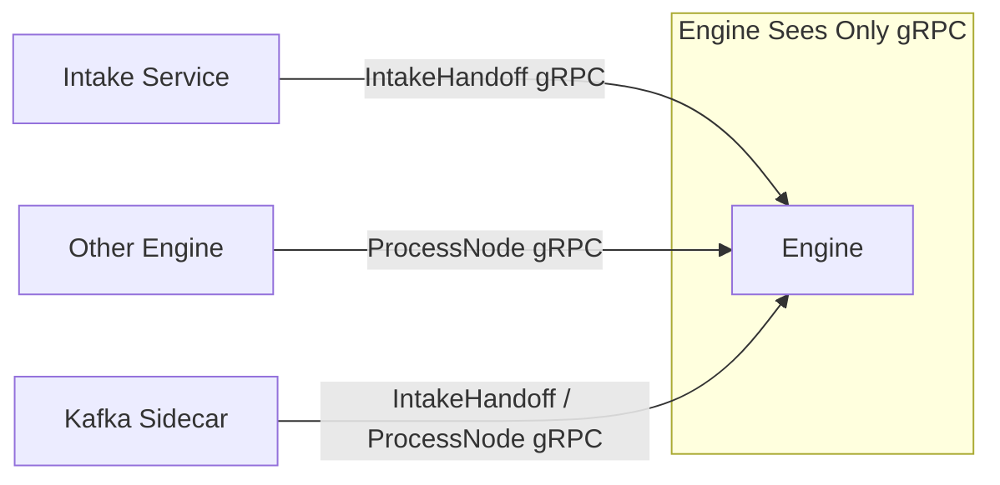
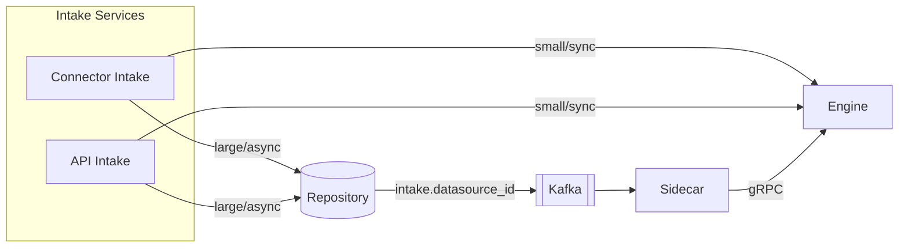
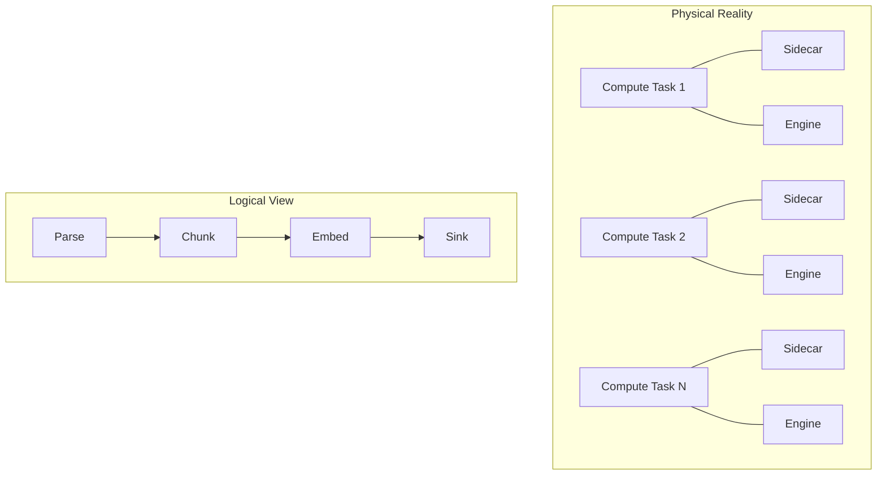
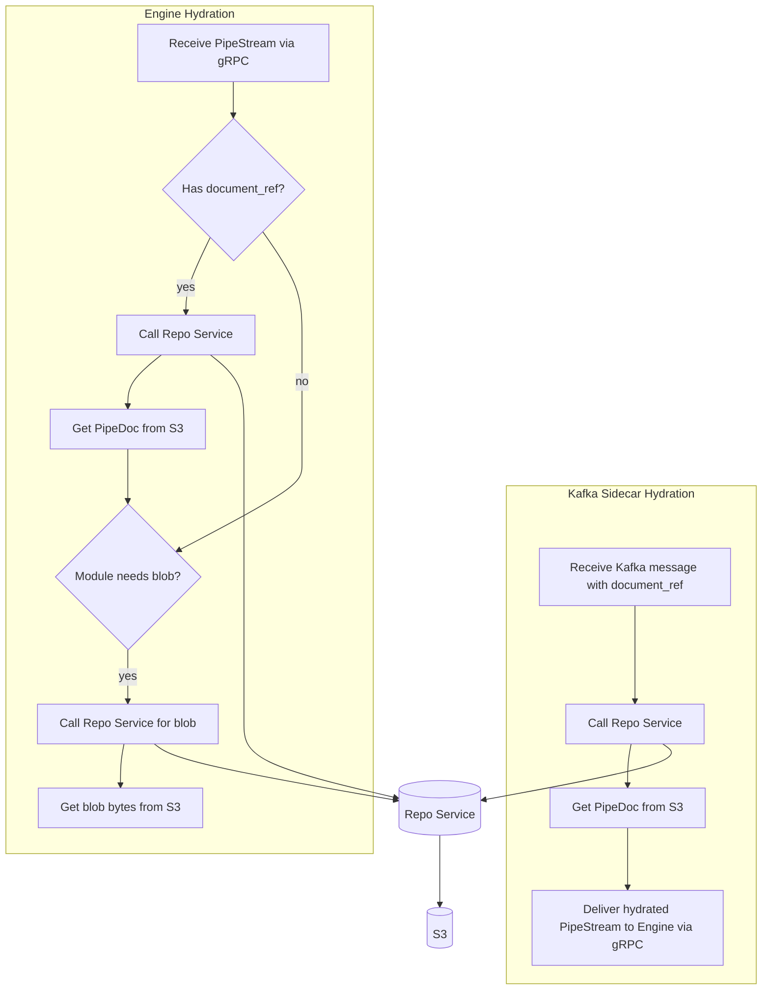

# Pipestream Engine Overview

## What is the Pipestream Engine?

The PipeStream Engine is the central orchestration service that routes documents through processing pipelines. It is a **pure gRPC service** that:

- Receives documents via `IntakeHandoff` (from Intake services) or `ProcessNode` (from Sidecars/other Engines)
- Determines which processing modules to invoke
- Manages the flow through the pipeline graph
- Retries on infrastructure failures, returns errors to callers

## Design Principles

### 1. Engine is Pure gRPC (Input)

The engine doesn't consume from Kafka. All inputs arrive via gRPC:



Engine can publish to Kafka for outbound routing - publishing is simple. The complexity is in consuming (leases, offsets, rebalancing) which Sidecar handles.

### 2. Dual Intake Paths

Documents enter the pipeline two ways:

| Path | Flow | Use Case |
|------|------|----------|
| **Repository Path** | Intake → Repo (stores, publishes to `intake.{datasource_id}`) → Sidecar → Engine | Large files, async, replay needed |
| **Direct Path** | Intake → Engine.IntakeHandoff (gRPC) | Small docs, sync response needed |



### 3. Sidecar Handles Kafka Consumption

```mermaid
graph LR
    subgraph ComputeTask [Compute Task]
        Consul[\"Consul Agent<br/>• Health check<br/>• Service reg\"]
        Sidecar[\"Kafka Sidecar<br/>• Lease mgmt<br/>• Consume intake + node topics<br/>• Hydrate<br/>• DLQ publish on failure\"]
        Engine[\"Engine<br/>• Pure gRPC input<br/>• Stateless<br/>• Routes/maps<br/>• Calls modules<br/>• Kafka publish for routing\"]

        Sidecar <--> Consul
        Sidecar -- gRPC --> Engine
        Engine -- Response --> Sidecar
    end
```

### 4. Modules are Stateless Transformers

Modules know nothing about:
- The graph topology
- Other nodes in the pipeline
- Routing decisions
- Where they are in the pipeline
- Kafka, S3, or any infrastructure

They simply: `PipeDoc in → transform → PipeDoc out`

### 5. Nodes are Logical Constructs



### 6. One Transport Per Edge, Multiple Edges per Node

| Transport | Use Case | Characteristics |
|-----------|----------|------------------|
| **gRPC** | Fast path, same cluster | Direct, low latency, no replay |
| **Kafka** | Async, cross-cluster, replay needed | Buffered, durable, replayable |

No mixing - each edge chooses one transport.

## Processing Flow

### Overview
1. Receive PipeStream (gRPC - from any source)
2. Hydrate Level 1: document_ref → PipeDoc (if needed)
3. Filter (CEL) - skip node if false
4. Pre-mapping (CEL transforms)
5. Hydrate Level 2: blob storage_ref → bytes (if parser module needs it)
6. Call Module (gRPC)
7. Post-mapping (CEL transforms)
8. Determine outgoing edges (CEL conditions)
9. For each edge:
   - gRPC edge: call next engine directly
   - Kafka edge: persist to Repo, publish to Kafka

### Visual Overview

```mermaid
flowchart TD
    Start([Receive PipeStream gRPC]) --> Hydrate1[\"Hydrate Level 1: document_ref -> PipeDoc\"]
    Hydrate1 --> Filter{Filter CEL}
    Filter -- false --> End([End])
    Filter -- true --> PreMap[Pre-mapping CEL transforms]
    PreMap --> Hydrate2[\"Hydrate Level 2: storage_ref -> bytes\"]
    Hydrate2 --> CallModule[Call Module gRPC]
    CallModule --> PostMap[Post-mapping CEL transforms]
    PostMap --> Edges{For each edge}
    
    Edges --> gRPC[gRPC edge]
    Edges --> Kafka[Kafka edge]
    
    gRPC --> CallNext[Call next engine directly]
    Kafka --> Persist[Persist to Repo & publish to Kafka]
    
    CallNext --> End
    Persist --> End
```

## Hydration Responsibilities

Both the Engine and Kafka Sidecar can perform hydration, but they have **independent strategies** and both access storage through the **Repo Service** (never directly):



| Component | Hydration Responsibility | When |
|-----------|-------------------------|------|
| **Kafka Sidecar** | Level 1: `document_ref` → `PipeDoc` | Always (Kafka messages only contain refs) |
| **Engine** | Level 1: `document_ref` → `PipeDoc` | When gRPC sender used a ref (rare, for >2GB docs) |
| **Engine** | Level 2: `storage_ref` → blob bytes | When module needs blob content (parsers) |

**Key points:**
- Kafka Sidecar handles its own hydration before calling Engine
- Engine handles hydration for gRPC-delivered documents when needed
- Both use **Repo Service gRPC API** - never access S3 directly
- For now, gRPC path rarely needs Level 1 hydration (2GB limit is generous)
- Level 2 blob hydration is always Engine's responsibility

## DLQ Model

Dead Letter Queue handling depends on how the document arrived:

| Arrival | On Failure | DLQ Behavior |
|---------|------------|--------------|
| **Via Sidecar (Kafka)** | Engine returns error | Sidecar publishes to DLQ (has offset context) |
| **Via gRPC (direct)** | Engine returns error | Error bubbles up - replay from last Kafka checkpoint |
| **Via gRPC with `save_on_error=true`** | Engine returns error | Engine persists + publishes to DLQ |

The `save_on_error` node config option enables DLQ for expensive nodes in gRPC chains (e.g., GPU embedders).

## What's Embedded in Engine

| Component | Purpose |
|-----------|---------| 
| **MappingService** | Apply field transformations (CEL-based) |
| **Graph Cache** | In-memory graph with helper lookups |
| **CEL Evaluator** | Compile and evaluate CEL expressions |
| **Module Caller** | gRPC client pool for modules |
| **Repo Client** | gRPC client for hydration/persistence |
| **Kafka Producer** | For Kafka edge routing and DLQ (when save_on_error) |

## What's NOT in Engine

| Component | Where It Lives |
|-----------|----------------|
| **Kafka Consumer** | Kafka Sidecar (separate service) |
| **Topic Leases** | Consul (via sidecar) |
| **Document Storage** | Repo Service + S3 |
| **Module Logic** | Remote Module Services |
| **Direct S3 Access** | Never - always through Repo Service |
