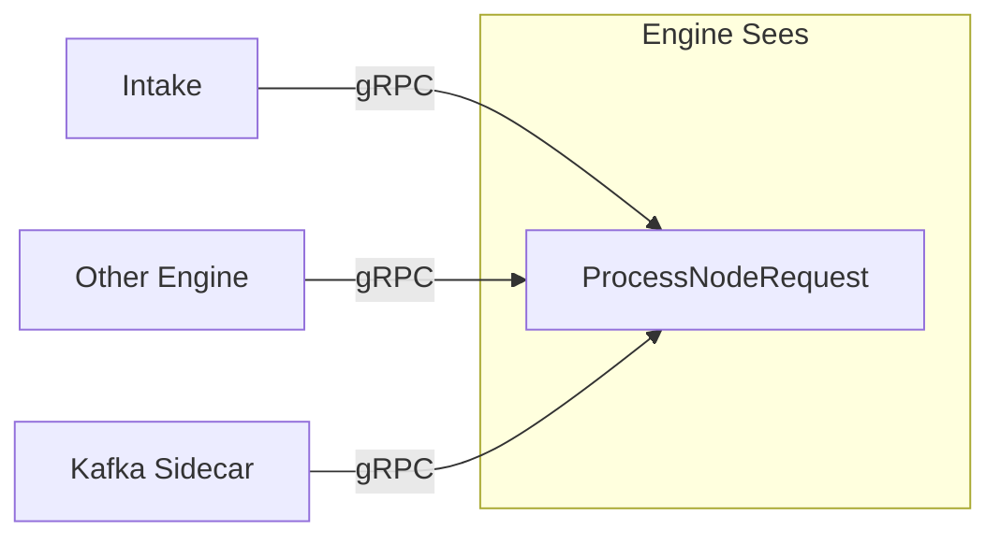
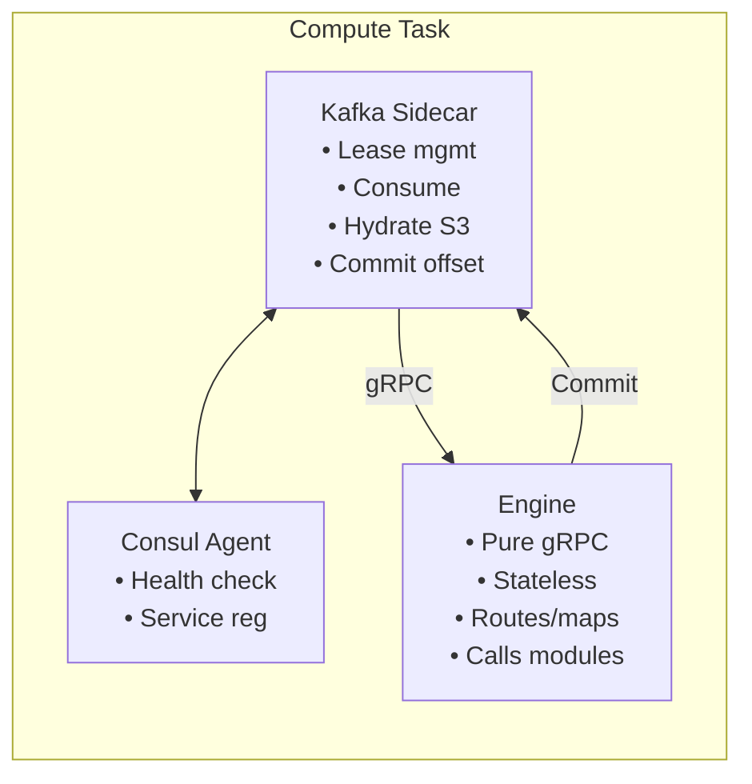
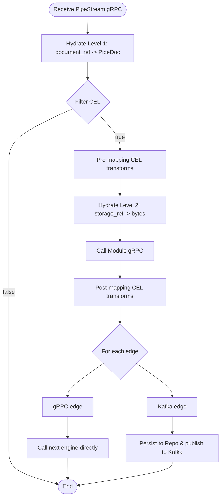

# Pipestream Engine Overview

## What is the Pipestream Engine?

The PipeStream Engine is the central orchestration service that routes documents through processing pipelines. It is a **pure gRPC service** that:

- Receives documents from Intake, other engines, or Kafka sidecars
- Determines which processing modules to invoke
- Manages the flow through the pipeline graph
- Handles failures and dead-letter queuing

## Design Principles

### 1. Engine is Pure gRPC

The engine doesn't know Kafka exists. All inputs arrive via gRPC:

### 2. Sidecar Handles Kafka Complexity

### 3. Modules are Stateless Transformers

Modules know nothing about:
- The graph topology
- Other nodes in the pipeline
- Routing decisions
- Where they are in the pipeline
- Kafka, S3, or any infrastructure

They simply: `PipeDoc in → transform → PipeDoc out`

### 4. Nodes are Logical Constructs

### 5. One Transport Per Edge, Multiple Edges per Node

| Transport | Use Case | Characteristics |
|-----------|----------|------------------|
| **gRPC** | Fast path, same cluster | Direct, low latency, no replay |
| **Kafka** | Async, cross-cluster, replay needed | Buffered, durable, replayable |

No mixing - each edge chooses one transport.

## Processing Flow

### Overview
1. Receive PipeStream (gRPC - from any source)
2. Hydrate Level 1: document_ref → PipeDoc (if needed)
3. Filter (CEL) - skip node if false
4. Pre-mapping (CEL transforms)
5. Hydrate Level 2: blob storage_ref → bytes (if parser module needs it)
6. Call Module (gRPC)
7. Post-mapping (CEL transforms)
8. Determine outgoing edges (CEL conditions)
9. For each edge:
   - gRPC edge: call next engine directly
   - Kafka edge: persist to Repo, publish to Kafka

### Visual Overview

## What's Embedded in Engine

| Component | Purpose |
|-----------|---------|
| **MappingService** | Apply field transformations (CEL-based) |
| **Graph Cache** | In-memory graph with helper lookups |
| **CEL Evaluator** | Compile and evaluate CEL expressions |
| **Module Caller** | gRPC client pool for modules |
| **Repo Client** | gRPC client for hydration/persistence |

## What's NOT in Engine

| Component | Where It Lives |
|-----------|----------------|
| **Kafka Consumer** | Kafka Sidecar (separate container) |
| **Topic Leases** | Consul (via sidecar) |
| **Document Storage** | Repo Service + S3 |
| **Module Logic** | Remote Module Services |
