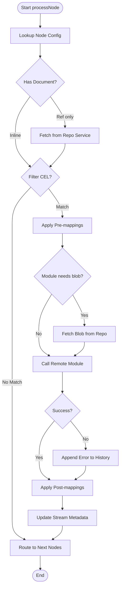
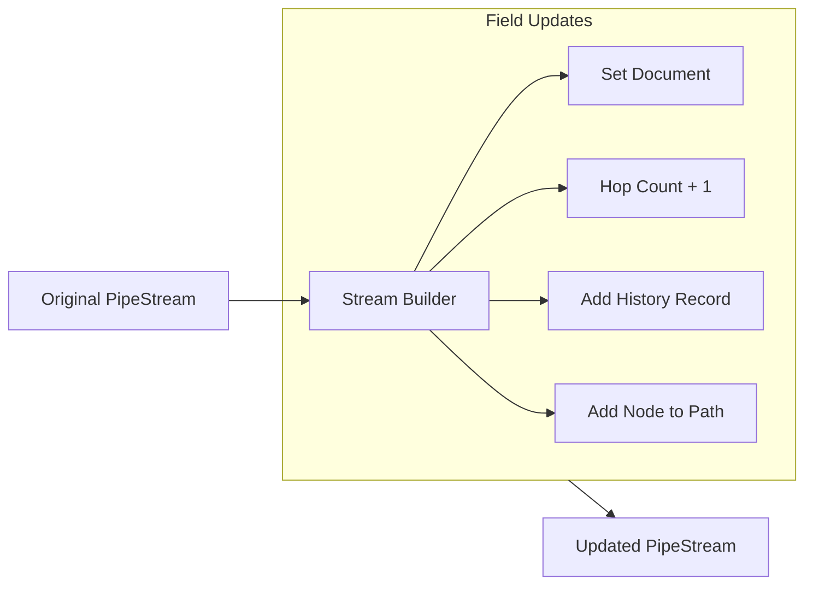
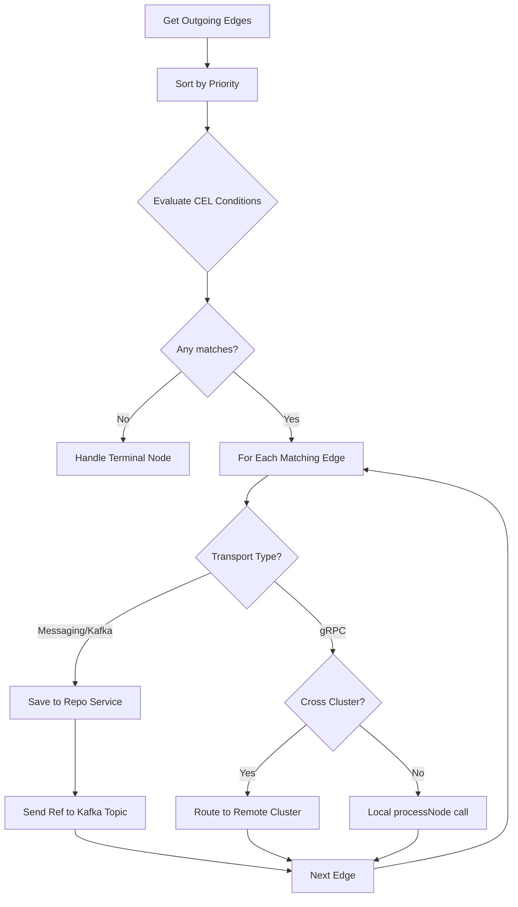
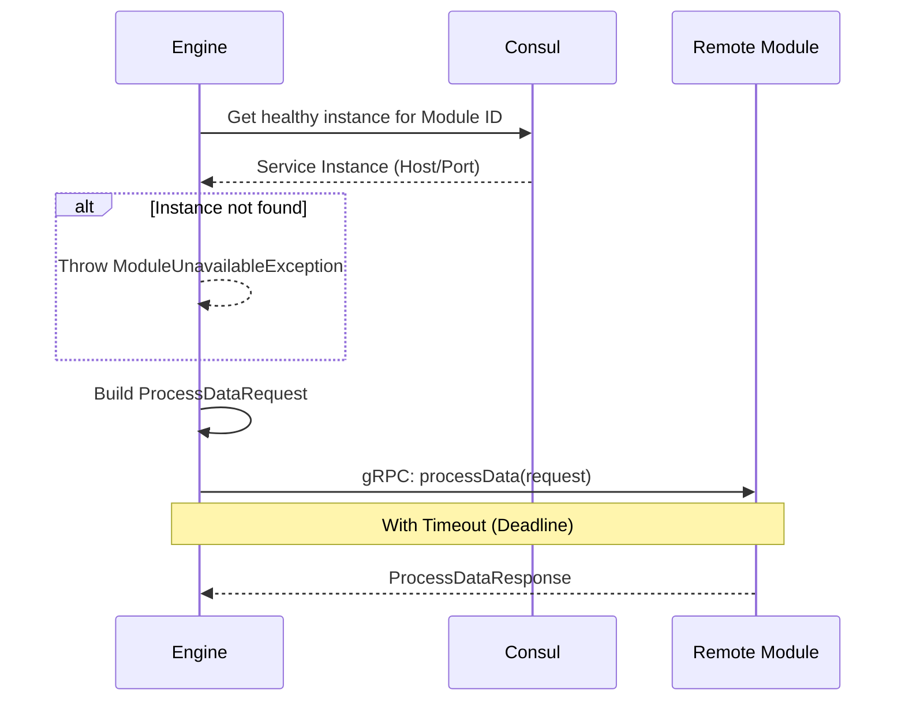

# Engine Processing Loop

The Engine Processing Loop is the heart of the Pipestream orchestration. It manages the lifecycle of a document as it moves through a specific node in the pipeline graph, handling everything from data preparation to remote module execution and routing to subsequent nodes.

## Core Loop

The core loop orchestrates the execution of a single pipeline node. It fetches the necessary configuration, prepares the document data, evaluates whether the node should be executed, calls the remote module, and finally routes the result to the next steps in the graph.

### Processing Steps
- **Node Configuration Lookup**: Retrieves the specific settings for the current node from the in-memory graph cache.
- **Document Hydration (Level 1)**: Ensures the full document data is available, fetching it from the repository service if only a reference was provided.
- **Filter Evaluation**: Checks a CEL (Common Expression Language) condition to decide if the node's logic should be applied or if the document should bypass this node.
- **Pre-mapping Transforms**: Applies data transformations to the document before it is sent to the module.
- **Blob Hydration (Level 2)**: If the module needs blob content (e.g., parsers), fetches the binary data from the repository service.
- **Module Execution**: Calls the remote module service via gRPC and handles the response.
- **Post-mapping Transforms**: Applies further transformations to the output document received from the module.
- **Metadata Update**: Records the execution history and updates stream-level information.
- **Routing**: Determines the next nodes in the pipeline and dispatches the stream.

```java
void processNode(PipeStream stream) {
    String nodeId = stream.getCurrentNodeId();
    
    // 1. Lookup node config from graph cache (1)
    NodeConfig config = graphCache.getNode(nodeId);
    
    // 2. Hydrate PipeDoc if reference-only (Level 1) (2)
    PipeDoc doc;
    if (stream.hasDocument()) {
        doc = stream.getDocument();
    } else {
        DocumentReference ref = stream.getDocumentRef();
        doc = repoService.getPipeDoc(
            ref.getDocId(), 
            ref.getSourceNodeId(), 
            ref.getAccountId()
        );
    }
    
    // 3. Filter check (CEL) (3)
    if (config.hasFilterCondition()) {
        boolean shouldProcess = celEvaluate(config.getFilterCondition(), doc);
        if (!shouldProcess) {
            // Skip this node, route directly to next
            routeToNextNodes(stream, doc);
            return;
        }
    }
    
    // 4. Apply pre-mappings (4)
    doc = applyMappings(doc, config.getPreMappingsList());
    
    // 5. Blob hydration if module needs it (Level 2) (5)
    ModuleCapabilities caps = getModuleCapabilities(config.getModuleId());
    if (caps.needsBlobContent() && doc.getBlobBag().getBlob().hasStorageRef()) {
        FileStorageReference blobRef = doc.getBlobBag().getBlob().getStorageRef();
        byte[] blobData = repoService.getBlob(blobRef);
        doc = doc.toBuilder()
            .setBlobBag(doc.getBlobBag().toBuilder()
                .setBlob(doc.getBlobBag().getBlob().toBuilder()
                    .setData(ByteString.copyFrom(blobData))
                    .clearStorageRef()
                    .build())
                .build())
            .build();
    }
    
    // 6. Call remote module (6)
    ProcessDataResponse response = callModule(nodeId, doc, config);
    
    if (!response.getSuccess()) {
        // Log error in history, continue (not DLQ for logical failures)
        appendError(stream, response.getMessage());
    }
    
    PipeDoc outputDoc = response.getOutputDoc();
    
    // 7. Apply post-mappings (7)
    outputDoc = applyMappings(outputDoc, config.getPostMappingsList());
    
    // 8. Update stream metadata (8)
    stream = updateStreamMetadata(stream, outputDoc, nodeId);
    
    // 9. Route to next nodes (9)
    routeToNextNodes(stream, outputDoc);
}
```

#### Code Deep Dive:
1. **Graph Cache Lookup**: Retrieves the immutable `NodeConfig` for the current step. This contains the module ID, filter conditions, and mappings.
2. **Level 1 Hydration**: If the incoming `PipeStream` only contains a reference (common in Kafka transport), the Engine fetches the full `PipeDoc` metadata from the Repository Service.
3. **CEL Filter**: Evaluates whether the document meets the criteria to be processed by this node. If the condition is false, the node is bypassed.
4. **Pre-Mapping**: Applies field transformations defined in the graph to prepare the document for the module (e.g., renaming fields or extracting sub-objects).
5. **Level 2 Hydration**: If the module requires the raw file (like a parser), the Engine fetches the actual bytes from storage via the Repository Service.
6. **Remote Execution**: Invokes the module's gRPC endpoint. This is a stateless call; the module only sees the hydrated `PipeDoc`.
7. **Post-Mapping**: Transforms the module's output back into the format expected by the rest of the pipeline.
8. **Metadata Update**: Records the node execution in the `StepExecutionRecord` history and increments the hop count.
9. **Routing**: Analyzes outgoing edges to determine where the document should go next.



## Stream Metadata Updates

Metadata updates ensure that every step of the document's journey is tracked and that the stream state correctly reflects its current position and history.

### Metadata Update Actions
- **Document Replacement**: Updates the stream with the latest version of the document (the output from the node).
- **Hop Count Increment**: Tracks the number of nodes the document has passed through.
- **Execution History Logging**: Adds a `StepExecutionRecord` containing the node ID, timestamp, processing duration, and status.
- **Processing Path Tracking**: Appends the current node ID to the ordered list of visited nodes.

```java
PipeStream updateStreamMetadata(PipeStream stream, PipeDoc doc, String nodeId) {
    return stream.toBuilder()
        // Replace document (1)
        .setDocument(doc)
        // Increment hop (2)
        .setHopCount(stream.getHopCount() + 1)
        // Append to history (3)
        .setMetadata(stream.getMetadata().toBuilder()
            .addHistory(StepExecutionRecord.newBuilder()
                .setNodeId(nodeId)
                .setTimestamp(now())
                .setDurationMs(processingTime)
                .setStatus(SUCCESS)
                .build())
            .setLastProcessedAt(now())
            .build())
        // Append to path (4)
        .addProcessingPath(nodeId)
        .build();
}
```

#### Code Deep Dive:
1. **Document Swap**: Replaces the `PipeDoc` within the stream with the output from the current node.
2. **Hop Counting**: Increments the total number of processing steps the document has completed.
3. **Execution History**: Appends a detailed record of this node's execution, including timing and status, for auditing and debugging.
4. **Path Tracking**: Adds the current node ID to a flat list of visited nodes, providing a quick view of the document's journey.



## Routing to Next Nodes

Routing manages the "fan-out" logic of the pipeline. It determines which edges to follow based on priority and conditional logic, and then chooses the appropriate transport mechanism (gRPC or Kafka) to deliver the document.

### Routing Logic
- **Edge Retrieval**: Gets all outgoing connections for the current node from the graph cache.
- **Priority Sorting**: Ensures edges are evaluated in the defined order.
- **Condition Evaluation**: Uses CEL to determine which edges the document qualifies for.
- **Terminal Handling**: Finalizes the stream if no matching outgoing edges are found.
- **Transport Selection**:
    - **Kafka Path**: Persists the document to the repository service and sends a reference via a Kafka topic.
    - **gRPC Path**: Sends the document directly to another engine instance, either in a different cluster or via a local recursive call.

```java
void routeToNextNodes(PipeStream stream, PipeDoc doc) {
    String currentNodeId = stream.getCurrentNodeId();
    List<GraphEdge> edges = graphCache.getOutgoingEdges(currentNodeId);
    
    // Sort by priority
    edges.sort(Comparator.comparingInt(GraphEdge::getPriority));
    
    // Find all matching edges (fan-out)
    List<GraphEdge> matchingEdges = new ArrayList<>();
    for (GraphEdge edge : edges) {
        if (!edge.hasCondition() || celEvaluate(edge.getCondition(), doc)) {
            matchingEdges.add(edge);
        }
    }
    
    if (matchingEdges.isEmpty()) {
        // Terminal node - no outgoing edges
        handleTerminalNode(stream, doc);
        return;
    }
    
    // Route to each matching edge
    for (GraphEdge edge : matchingEdges) {
        PipeStream clonedStream = stream.toBuilder()
            .setCurrentNodeId(edge.getToNodeId())
            .build();
        
        routeViaTransport(clonedStream, doc, edge);
    }
}

void routeViaTransport(PipeStream stream, PipeDoc doc, GraphEdge edge) {
    String currentNodeId = stream.getCurrentNodeId();
    String accountId = stream.getMetadata().getAccountId();
    
    if (edge.getTransportType() == TransportType.MESSAGING) {
        // Kafka path - persist doc to repo, send reference
        repoService.savePipeDoc(doc, currentNodeId, accountId);
        
        PipeStream streamWithRef = stream.toBuilder()
            .clearDocument()
            .setDocumentRef(DocumentReference.newBuilder()
                .setDocId(doc.getDocId())
                .setSourceNodeId(currentNodeId)
                .setAccountId(accountId)
                .build())
            .build();
        
        String topic = edge.hasKafkaTopic() 
            ? edge.getKafkaTopic()
            : graphCache.getNode(edge.getToNodeId()).getKafkaInputTopic();
        
        kafkaProducer.send(topic, streamWithRef);
        
    } else if (edge.getTransportType() == TransportType.GRPC) {
        // gRPC path - inline doc
        if (edge.getIsCrossCluster()) {
            engineClient.routeToCluster(
                edge.getToClusterId(), 
                edge.getToNodeId(), 
                stream.toBuilder().setDocument(doc).build());
        } else {
            // Local recursive call or queue
            processNode(stream.toBuilder()
                .setCurrentNodeId(edge.getToNodeId())
                .setDocument(doc)
                .build());
        }
    }
}
```



## Calling Remote Modules

The engine communicates with external modules (like parsers or LLMs) via gRPC. This process includes discovering healthy service instances and building a standard request structure.

### Module Call Steps
- **Service Discovery**: Queries Consul to find a healthy instance of the required module service.
- **Availability Check**: Ensures a service instance exists; otherwise, throws an exception for retry/DLQ handling.
- **Request Construction**: Packages the document, node configuration, and stream metadata into a `ProcessDataRequest`.
- **gRPC Invocation**: Executes the remote call using a blocking stub with a configurable deadline/timeout.

```java
ProcessDataResponse callModule(String nodeId, PipeDoc doc, NodeConfig config) {
    // Lookup module endpoint from Consul
    String moduleName = config.getModuleId();
    ServiceInstance instance = consul.getHealthyInstance(moduleName);
    
    if (instance == null) {
        // Module unavailable - DLQ or retry
        throw new ModuleUnavailableException(moduleName);
    }
    
    // Build request
    ProcessDataRequest request = ProcessDataRequest.newBuilder()
        .setDocument(doc)
        .setConfig(ProcessConfiguration.newBuilder()
            .setCustomJsonConfig(config.getCustomConfig())
            .build())
        .setMetadata(ServiceMetadata.newBuilder()
            .setStreamId(currentStream.getStreamId())
            .setCurrentHopNumber(currentStream.getHopCount())
            .build())
        .build();
    
    // gRPC call with timeout
    ManagedChannel channel = getOrCreateChannel(instance);
    PipeStepProcessorServiceGrpc.PipeStepProcessorServiceBlockingStub stub = 
        PipeStepProcessorServiceGrpc.newBlockingStub(channel)
            .withDeadlineAfter(config.getTimeout(), TimeUnit.MILLISECONDS);
    
    return stub.processData(request);
}
```



## Error Handling

The engine employs different strategies depending on the nature of the failure to ensure robustness and observability.

| Error Type | Handling |
|------------|----------|
| Module returns `success=false` | Log in history, continue to next nodes |
| Module unreachable (Consul down) | Route to DLQ |
| gRPC timeout | Retry with backoff, then DLQ |
| CEL evaluation error | Log error, skip edge |
| Document hydration failure | Retry, then DLQ |
| Blob hydration failure | Retry, then DLQ |
