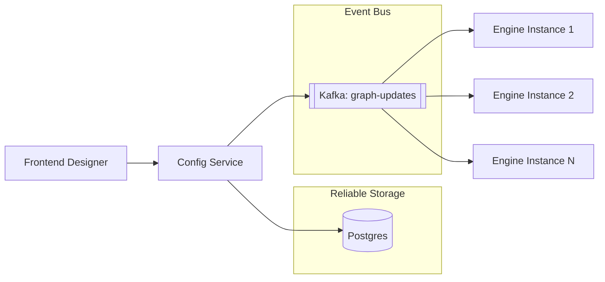
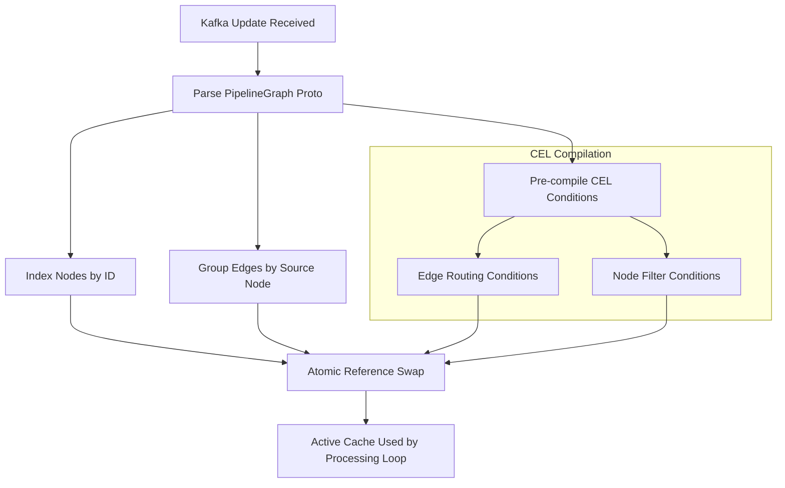
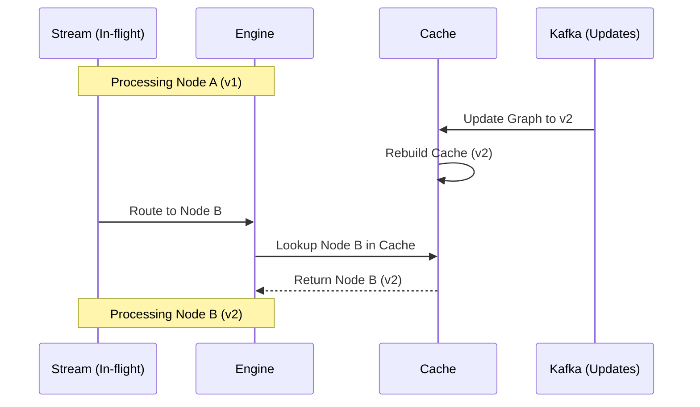

# Graph Management

Graph management ensures that pipeline definitions are stored durably, updated reliably across a distributed cluster, and cached efficiently for high-performance execution. It handles versioning, multi-tenancy, and the atomic swap of graph definitions in the engine's memory.

## Storage Model

Pipestream uses a snapshot-based storage model for pipeline graphs. Instead of storing complex diffs, every change results in a complete, new version of the graph stored as a JSON blob.

### Database Schema
```sql
CREATE TABLE pipeline_graphs (
    id              UUID PRIMARY KEY DEFAULT gen_random_uuid(),
    graph_id        VARCHAR(255) NOT NULL,      -- Logical graph identifier
    cluster_id      VARCHAR(255) NOT NULL,
    account_id      VARCHAR(255) NOT NULL,
    version         BIGINT NOT NULL,            -- Auto-increment per graph_id
    graph_data      JSONB NOT NULL,             -- Full PipelineGraph proto as JSON
    is_active       BOOLEAN DEFAULT false,
    created_at      TIMESTAMP DEFAULT NOW(),
    created_by      VARCHAR(255),
    
    UNIQUE(graph_id, version)
);

CREATE INDEX idx_graphs_active ON pipeline_graphs(graph_id, is_active) WHERE is_active = true;
CREATE INDEX idx_graphs_cluster ON pipeline_graphs(cluster_id);
```

### Key Design Choices
- **Full Snapshots**: Every version is complete and self-contained, eliminating complex reconstruction logic.
- **Auditability**: A perfect history of every pipeline state is preserved.
- **Fast Activation**: Single database read to load the entire graph for any version.
- **Atomic Rollbacks**: Any previous version can be set to `is_active = true` to revert changes instantly.

## Graph Update Flow

The update flow coordinates the transition from a user's design change to active execution across all engine instances. It uses a combination of synchronous database writes and asynchronous event distribution.

### Update Workflow
- **State Persistence**: The Config Service writes the new graph snapshot to Postgres within a transaction.
- **Event Broadcast**: A full snapshot is published to the `graph-updates` Kafka topic.
- **Distributed Cache Invalidation**: All Engine instances consuming the topic receive the update and trigger an internal rebuild.



## Engine In-Memory Cache

To minimize latency during document processing, Engines maintain a highly optimized, in-memory representation of the active graph. This cache includes pre-compiled expressions and specialized lookups.

### Cache Implementation
```java
public class GraphCache {
    // 1. Immutable graph state (1)
    private volatile PipelineGraph graph;
    private volatile long version;
    
    // 2. Optimized lookup indexes (2)
    private Map<String, GraphNode> nodeById;
    private Map<String, List<GraphEdge>> outgoingEdgesByNode;
    private Map<String, CelProgram> compiledConditions;
    
    public void rebuild(PipelineGraph newGraph) {
        // 3. Indexing phase (3)
        Map<String, GraphNode> newNodeById = new HashMap<>();
        for (GraphNode node : newGraph.getNodesList()) {
            newNodeById.put(node.getNodeId(), node);
        }
        
        // 4. Adjacency calculation (4)
        Map<String, List<GraphEdge>> newEdgesByNode = new HashMap<>();
        for (GraphEdge edge : newGraph.getEdgesList()) {
            newEdgesByNode
                .computeIfAbsent(edge.getFromNodeId(), k -> new ArrayList<>())
                .add(edge);
        }
        
        // 5. Pre-compilation phase (5)
        Map<String, CelProgram> newConditions = new HashMap<>();
        for (GraphEdge edge : newGraph.getEdgesList()) {
            if (edge.hasCondition()) {
                newConditions.put("edge:" + edge.getEdgeId(), 
                    celCompiler.compile(edge.getCondition()));
            }
        }
        for (GraphNode node : newGraph.getNodesList()) {
            if (node.getProcessingConfig().hasFilterCondition()) {
                newConditions.put("node:" + node.getNodeId(),
                    celCompiler.compile(node.getProcessingConfig().getFilterCondition()));
            }
        }
        
        // 6. Atomic state swap (6)
        this.graph = newGraph;
        this.version = newGraph.getVersion();
        this.nodeById = newNodeById;
        this.outgoingEdgesByNode = newEdgesByNode;
        this.compiledConditions = newConditions;
    }
}
```

#### Code Deep Dive:
1. **Volatile References**: Ensures that all processing threads immediately see the new graph definition once the `rebuild` is complete.
2. **Specialized Indexes**: Instead of traversing the graph list for every document, the engine uses maps for O(1) lookups of nodes and edges.
3. **Node Index**: Allows immediate access to a node's configuration by its UUID.
4. **Adjacency List**: Pre-groups edges by their source node, which is essential for fast routing decisions during document fan-out.
5. **Expression Pre-compilation**: Compiling Common Expression Language (CEL) conditions is an expensive operation. By doing it once during the cache rebuild, the engine avoids repetitive work during the critical processing loop.
6. **Atomic Update**: By swapping all references at the end of the method, the engine ensures that a processing thread never sees a partially updated or inconsistent graph state.

### Optimization Details
- **Node Indexing**: O(1) lookup of node configurations by ID.
- **Adjacency Mapping**: Pre-calculated outgoing edges to speed up routing decisions.
- **CEL Pre-compilation**: Compiling Common Expression Language (CEL) conditions once during rebuild, rather than on every document hop. This includes both edge routing conditions and node filter conditions.
- **Atomic Swapping**: Uses `volatile` references to ensure that processing threads always see a consistent version of the graph during a switch.



## Versioning Strategy

The versioning strategy ensures that updates are sequential and that only one version of a graph is "active" for a cluster at any given time.

### Implementation Logic
- **Version Increment**: Calculates the next version number based on the current maximum for that graph ID.
- **Exclusive Activation**: Deactivates all existing versions before inserting the new one as the active state.
- **Atomic Transaction**: Database write and Kafka publication are coordinated to ensure consistency.

```java
@Transactional
public PipelineGraph saveGraph(PipelineGraph graph) {
    // 1. Version management (1)
    long nextVersion = graphRepo.getMaxVersion(graph.getGraphId()) + 1;
    
    // 2. Exclusive activation (2)
    graphRepo.deactivateAll(graph.getGraphId());
    
    // 3. Immutable snapshot (3)
    PipelineGraph versioned = graph.toBuilder()
        .setVersion(nextVersion)
        .build();
    
    // 4. Persistence (4)
    graphRepo.insert(GraphEntity.builder()
        .graphId(graph.getGraphId())
        .clusterId(graph.getClusterId())
        .version(nextVersion)
        .graphData(toJson(versioned))
        .isActive(true)
        .build());
    
    // 5. Distributed broadcast (5)
    kafkaProducer.send("graph-updates", versioned);
    
    return versioned;
}
```

#### Code Deep Dive:
1. **Incremental Versioning**: Ensures every update is unique and traceable. Versions are scoped per logical `graph_id`.
2. **Deactivation**: Before the new version is marked active, all previous active versions are cleared. This prevents "dual-active" states in the database.
3. **Proto Versioning**: The version number is baked into the Protobuf message itself, ensuring the engine can always identify the version of the graph it is currently running.
4. **JSONB Storage**: The complete graph structure is stored as a JSON blob in Postgres, allowing for flexible schema evolution without complex table migrations.
5. **Update Event**: Publishing to Kafka ensures that all distributed engine instances receive the update simultaneously, triggering their internal cache rebuilds.

## In-Flight Stream Handling

Pipestream prioritizes eventual consistency and simplicity when a graph is updated while documents are still being processed.

### Handling Behaviors
- **Latest Graph Wins**: Documents always use the most recent version of the graph available at the current engine instance. There is no "version pinning" for a stream's entire journey.
- **Orphaned Nodes**: If a node is deleted while a document is in flight to it, the routing fails and the document is sent to the Dead Letter Queue (DLQ).
- **Backward Compatibility**: It is recommended that graph changes remain backward compatible to avoid processing interruptions.



## Multi-Tenant Isolation

Isolation is maintained at the database and engine levels to ensure that processing logic and data do not leak between accounts or clusters.

### Isolation Mechanisms
- **Account Scoping**: Every graph is explicitly tied to an `account_id`.
- **Cluster Assignment**: Engines only load graphs assigned to their specific `cluster_id`.
- **Cross-Cluster Routing**: Explicitly handled via `CrossClusterEdge` types which define target clusters.

```sql
-- Engines load only their assigned active graphs
SELECT * FROM pipeline_graphs 
WHERE account_id = ? 
  AND cluster_id = ? 
  AND is_active = true;
```
