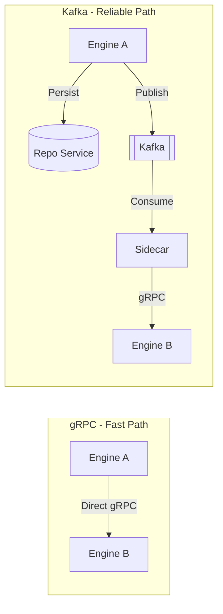
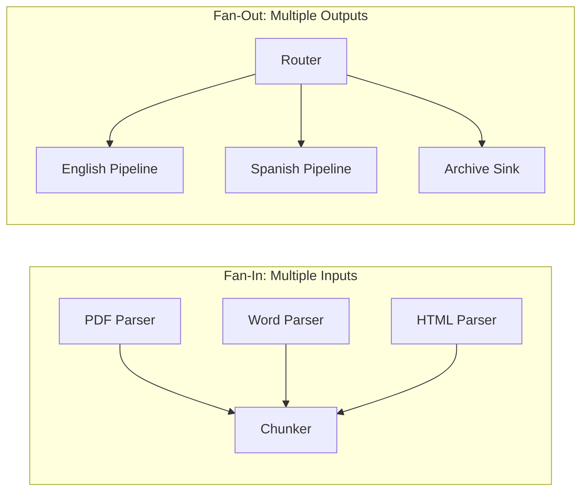
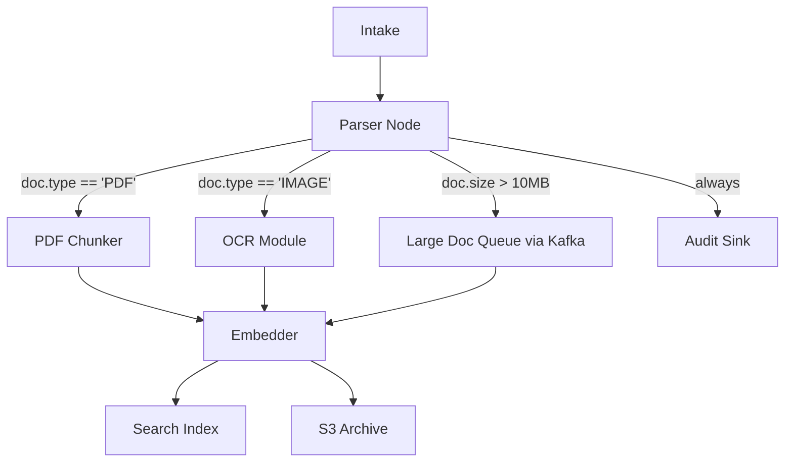
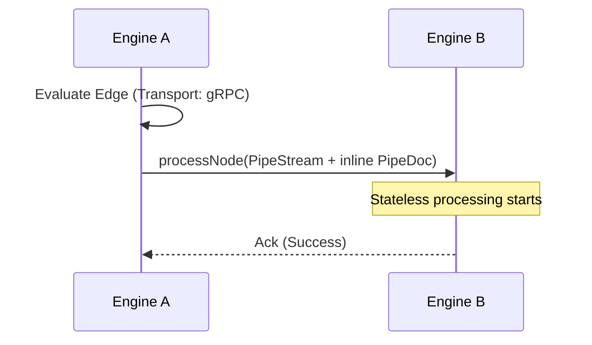
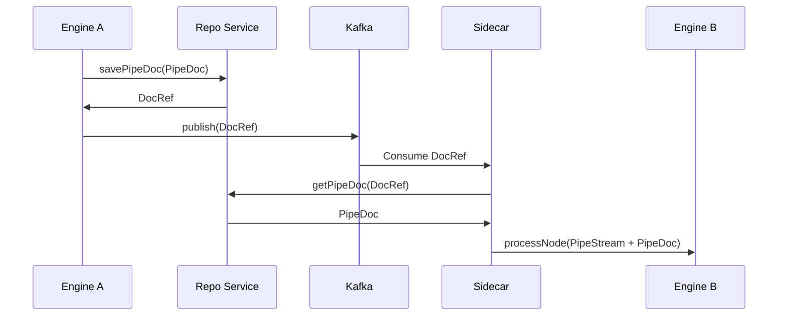
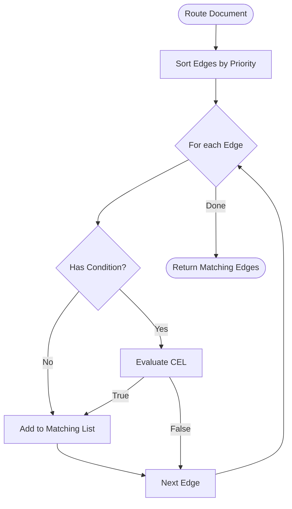

# Transport & Routing

Transport and routing manage how documents move between processing nodes in the Pipestream ecosystem. The engine supports two primary transport mechanisms—synchronous gRPC for low-latency flows and asynchronous Kafka for durable, replayable pipelines—allowing each connection (edge) in the graph to choose the most appropriate path.

## Transport Strategy

Pipestream adopts a hybrid transport model where gRPC handles the "fast path" of execution, while Kafka provides a "reliable path" for cross-cluster communication or heavy processing. Every edge in the pipeline graph is explicitly configured with one of these transport types.

### Strategy Characteristics
- **Unified Interface**: The Engine treats all inputs as gRPC requests; Kafka complexity is abstracted by sidecars.
- **Granular Control**: Transport is decided at the edge level, not the node level.
- **Performance vs. Durability**: Choose gRPC for sub-millisecond overhead; choose Kafka for guaranteed delivery and backpressure management.



## Node Inputs and Outputs

Nodes in a pipeline graph can have **multiple inputs** and **multiple outputs**. Understanding this model is fundamental to designing flexible pipelines.

### Input/Output Model
- **Inputs are implicit**: A node receives documents from any edge that points TO it. You don't configure inputs on the node itself—they're determined by edges defined elsewhere in the graph.
- **Outputs are explicit**: You define edges FROM your node to specify where documents go next. Each outgoing edge can have its own transport type, condition, and priority.
- **Fan-In**: Multiple edges can point to the same node (e.g., multiple parsers feeding into a single chunker).
- **Fan-Out**: A single node can have multiple outgoing edges (e.g., routing PDFs to one path and images to another).



### Key Points
| Aspect | How It Works |
|--------|--------------|
| **Inputs** | Automatic - determined by edges pointing TO this node |
| **Outputs** | Defined by edges you create FROM this node |
| **Multiple inputs** | Yes - any number of edges can target a node (fan-in) |
| **Multiple outputs** | Yes - define multiple edges from a node (fan-out) |
| **Mixed transports** | Yes - one output edge can be gRPC, another Kafka |
| **Conditional outputs** | Yes - each edge can have a CEL condition |

### Example: Complex Routing



In this example:
- **Parser** has 4 outgoing edges (fan-out with conditions)
- **Embedder** has 3 incoming edges (fan-in from different paths)
- **Embedder** has 2 outgoing edges (fan-out to index and archive)
- The "Large Doc Queue" edge uses Kafka transport; others use gRPC

## Edge Definition

The `GraphEdge` defines the connection between two nodes, including the conditions under which the connection is followed and the transport mechanism used for the transfer.

### Edge Configuration Fields
- **Source and Destination**: Identifies the `from_node_id` and `to_node_id`.
- **Cross-Cluster Routing**: Support for routing documents between different geographic or logical clusters.
- **Routing Logic**: A CEL expression that must evaluate to `true` for the document to traverse this edge.
- **Priority**: Determines the order of evaluation when multiple edges originate from the same node.
- **Transport Selection**: Explicitly sets the transport to `GRPC` or `MESSAGING` (Kafka).

```protobuf
message GraphEdge {
  optional string edge_id = 1;
  optional string from_node_id = 2;
  optional string to_node_id = 3;
  
  // Cross-cluster routing
  optional string to_cluster_id = 4;
  optional bool is_cross_cluster = 5;
  
  // Routing logic (CEL)
  optional string condition = 6;
  optional int32 priority = 7;
  
  // Transport selection
  optional TransportType transport_type = 8;    // GRPC or MESSAGING
  optional string kafka_topic = 9;              // Override default if Kafka
  
  // Loop prevention
  optional int32 max_hops = 10;
}
```

## gRPC Transport (Fast Path)

The gRPC transport is the default for most internal pipeline steps. It allows for high-throughput processing by passing the `PipeDoc` directly in-memory between engine instances without the overhead of intermediate storage.

### gRPC Flow Details
- **Low Latency**: Eliminates the write-to-S3 and Kafka-broker round trips.
- **In-Memory Handoff**: The full `PipeDoc` is typically sent inline in the `PipeStream` message.
- **Synchronous Execution**: The sending engine waits for the receiving engine to acknowledge receipt (though not necessarily completion).
- **Size Limits**: Supports documents up to 2GB (the standard gRPC limit), which covers the vast majority of processing use cases.



## Kafka Transport (Reliable Path)

Kafka transport is used when durability and decoupling are required. It is essential for cross-cluster routing, handling load spikes via buffering, and enabling the replay of specific pipeline segments.

### Kafka Flow Details
- **Persistence First**: Before publishing, the engine saves the `PipeDoc` to the Repository Service (backed by S3).
- **Reference Passing**: The Kafka message only contains a `DocumentReference` to keep message sizes under the 10MB limit.
- **Sidecar Orchestration**: A Kafka Sidecar manages the consumer lease, hydrates the document from the Repo Service, and delivers it to the local Engine via gRPC.
- **Replayability**: Allows operators to "rewind" a specific node by resetting Kafka offsets.



## Conditional Routing

Routing decisions are powered by the Common Expression Language (CEL), allowing for complex, type-safe logic to determine document flow based on metadata or content.

### Routing Logic Overview
- **Priority Sorting**: Edges are evaluated in ascending order of their priority value.
- **Fan-Out Support**: If multiple edges match their conditions, the document is cloned and routed to all matching paths.
- **Fallback Logic**: Edges with no conditions act as "always match" paths (useful for default routing).

```java
List<GraphEdge> resolveMatchingEdges(String nodeId, PipeDoc doc) {
    List<GraphEdge> edges = graphCache.getOutgoingEdges(nodeId);
    
    // Sort by priority (lower = higher priority)
    edges.sort(Comparator.comparingInt(GraphEdge::getPriority));
    
    List<GraphEdge> matching = new ArrayList<>();
    
    for (GraphEdge edge : edges) {
        // 1. Empty condition = always match
        if (!edge.hasCondition()) {
            matching.add(edge);
            continue;
        }
        
        // 2. Evaluate pre-compiled CEL condition (keyed with "edge:" prefix)
        CelProgram program = graphCache.getCompiledCondition("edge:" + edge.getEdgeId());
        if (celEvaluator.evaluate(program, doc)) {
            matching.add(edge);
        }
    }
    
    return matching;  // Fan-out to ALL matching edges
}
```



## Infrastructure Integration

The routing system integrates directly with Kafka and Consul to manage the underlying physical infrastructure required for messaging.

### Topic Management
- **Deterministic Naming**: Topics follow the pattern `pipestream.{cluster}.{node_uuid}` for clear ownership.
- **Automatic Provisioning**: The system creates both the main data topic and a corresponding Dead Letter Queue (DLQ) for every Kafka-enabled node.
- **Service Discovery**: Node-to-topic mappings are registered in Consul, allowing Sidecars to dynamically discover which topics they should consume.

```java
void onNodeCreated(GraphNode node) {
    if (hasIncomingKafkaEdges(node)) {
        String topicName = "pipestream." + node.getClusterId() + "." + node.getNodeId();
        
        // 1. Create main processing topic
        kafkaAdmin.createTopic(topicName, partitions, replicationFactor);
        
        // 2. Create Dead Letter Queue
        String dlqTopic = "dlq." + node.getClusterId() + "." + node.getNodeId();
        kafkaAdmin.createTopic(dlqTopic, partitions, replicationFactor);
        
        // 3. Register in Consul for sidecar lease distribution
        consul.kvPut("pipestream/topics/" + node.getNodeId(), topicName);
    }
}
```
