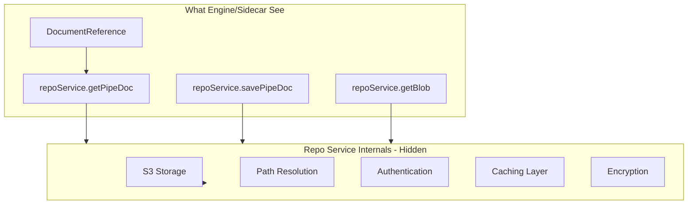
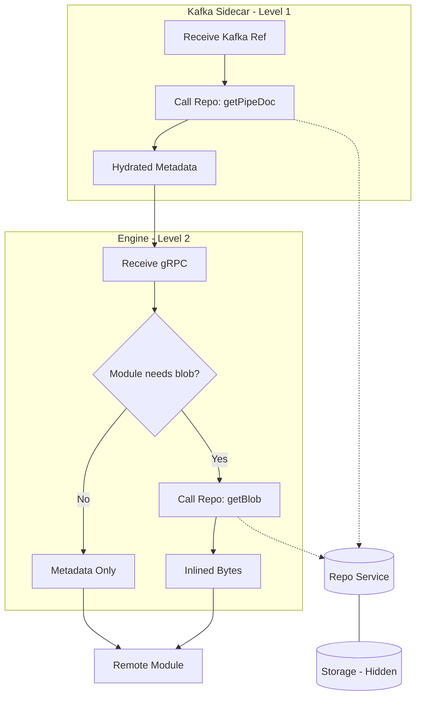
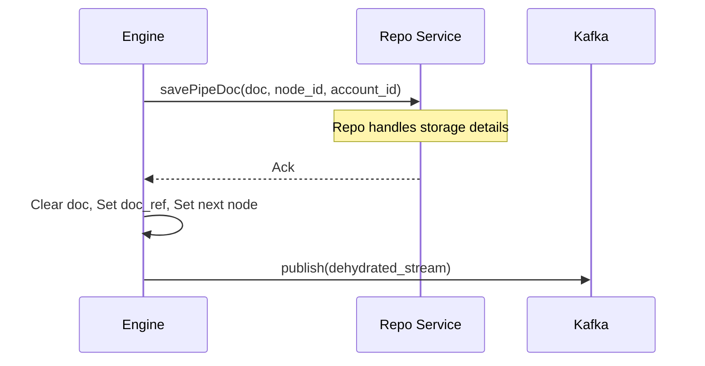
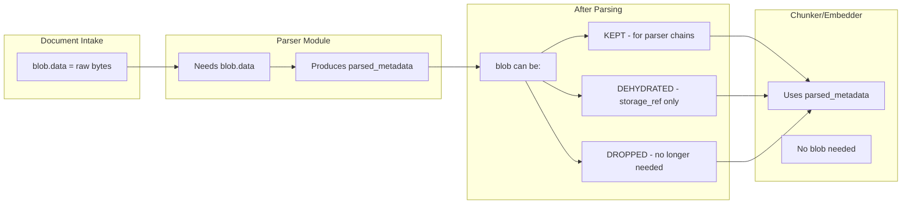

# Hydration Model

The Hydration Model defines how the PipeStream engine retrieves document content and metadata from persistent storage. By separating the document reference from its physical content, the engine can efficiently route large documents across the network while only fetching the binary data when strictly required by a processing module.

## Hydration Levels

- **Level 1: Document Hydration**: Resolves a `DocumentReference` into a full `PipeDoc` metadata object. This is typically done by the Kafka Sidecar or the Engine when a gRPC sender provides only a reference.
- **Level 2: Blob Hydration**: Fetches the raw binary content (bytes) via the Repo Service. This is an on-demand process triggered only if the target module (like a parser) requires the raw file for processing.
- **Dehydration**: The inverse process where a full document is replaced by a reference after persistence, ensuring Kafka message size limits (10MB) are respected.

## DocumentReference Proto

The `DocumentReference` provides the **logical coordinates** needed to retrieve a document. No storage details (S3 paths, bucket names) are exposed:

```protobuf
message DocumentReference {
  // 1. Unique document identifier (1)
  string doc_id = 1;
  
  // 2. State management (2)
  string source_node_id = 2;
  
  // 3. Multi-tenant context (3)
  string account_id = 3;
}
```

#### Code Deep Dive:
1. **Document ID**: The UUID that identifies the core document across all its versions and hops.
2. **Node ID**: Identifies exactly which node produced the version of the document being referenced. This is critical for fetching the correct state from the Repository.
3. **Account Isolation**: Ensures that hydration requests are scoped to the correct tenant, preventing cross-account data access.

## Storage Abstraction

**Critical Design Point:** The Engine and Sidecar never see S3 details. All storage is abstracted through the Repo Service gRPC API.



| Layer | Knows About | Doesn't Know About |
|-------|-------------|-------------------|
| **Engine** | doc_id, node_id, account_id | S3 buckets, paths, keys |
| **Sidecar** | doc_id, node_id, account_id | S3 buckets, paths, keys |
| **Repo Service** | Everything | N/A - owns the abstraction |

This ensures:
- **Security**: S3 credentials and paths never leak to processing layer
- **Flexibility**: Repo Service can change storage backend without affecting Engine
- **Multi-tenancy**: Account isolation is enforced at the Repo Service level

## Engine Hydration Implementation

The engine handles hydration within its processing loop, checking the requirements of the module before execution.

```java
void processNode(PipeStream stream) {
    String accountId = stream.getMetadata().getAccountId();
    
    // 1. Level 1 Hydration (1)
    PipeDoc doc;
    if (stream.hasDocumentRef()) {
        DocumentReference ref = stream.getDocumentRef();
        doc = repoService.getPipeDoc(
            ref.getDocId(), 
            ref.getSourceNodeId(), 
            ref.getAccountId()
        );
    } else {
        doc = stream.getDocument();
    }
    
    // 2. Module capability check (2)
    GraphNode node = graphCache.getNode(stream.getCurrentNodeId());
    ModuleCapabilities caps = getModuleCapabilities(node.getModuleId());
    
    // 3. Level 2 Hydration (3)
    if (caps.needsBlobContent() && doc.getBlobBag().getBlob().hasStorageRef()) {
        FileStorageReference ref = doc.getBlobBag().getBlob().getStorageRef();
        byte[] blobData = repoService.getBlob(ref);
        
        // 4. Inlining the bytes (4)
        doc = doc.toBuilder()
            .setBlobBag(doc.getBlobBag().toBuilder()
                .setBlob(doc.getBlobBag().getBlob().toBuilder()
                    .setData(ByteString.copyFrom(blobData))
                    .clearStorageRef()
                    .build())
                .build())
            .build();
    }
    
    // 5. Module invocation (5)
    ProcessDataResponse response = callModule(node, doc);
}
```

#### Code Deep Dive:
1. **Metadata Retrieval**: If the document is currently a reference (common in Kafka paths), it is promoted to a full `PipeDoc` metadata object.
2. **On-Demand Logic**: The engine checks if the specific module assigned to this node (e.g., Tika Parser) actually requires the raw binary content.
3. **Blob Fetching**: Only if the module needs it, the engine makes a second call to the Repository Service to fetch the raw bytes from S3. This minimizes network traffic for modules like chunkers or embedders that only work with text.
4. **Hydration**: The raw bytes are injected directly into the `PipeDoc` object, and the storage reference is cleared to indicate that the document is now fully hydrated for this step.
5. **Remote Call**: The hydrated document is sent to the module. Because the bytes are inline, the module doesn't need to know anything about storage or the Repository Service.

## Deep Dive: Hydration Decisions

The hydration strategy is optimized for the "Fast Path" where documents move via gRPC.

| Decision | Criteria | Action |
|----------|----------|--------|
| **Level 1** | `stream.hasDocumentRef()` | Fetch PipeDoc from Repo Service |
| **Level 2** | `caps.needsBlobContent() && blob.hasStorageRef()` | Fetch blob bytes from Repo Service |
| **Skip L2** | Module doesn't need blob (chunker, embedder) | Use metadata only |

### Key Points

- **Selective Fetching**: Level 2 hydration is only performed if `needsBlobContent()` is true. Parsers (Tika, Docling) need blobs; Chunkers and Embedders do not.
- **Sidecar Responsibility**: When documents arrive via Kafka, the Sidecar performs Level 1 hydration before the Engine ever sees the request, keeping the Engine's gRPC interface consistent.
- **Repo Service Abstraction**: Neither the Engine nor the Sidecar access storage directly. They use the Repo Service gRPC API, which manages authentication, path resolution, caching, and multi-tenant isolation.

## Visualization of Hydration Flow



## Dehydration Flow (Post-Processing)

After a module completes its work, the engine may dehydrate the document before routing it to the next node, especially if the next hop is via Kafka.

```java
void routeToNextNode(PipeStream stream, PipeDoc doc, GraphEdge edge) {
    String currentNodeId = stream.getCurrentNodeId();
    String accountId = stream.getMetadata().getAccountId();
    
    // 1. Transport decision (1)
    if (edge.getTransportType() == TRANSPORT_TYPE_MESSAGING) {
        // 2. Mandatory persistence for Kafka (2)
        repoService.savePipeDoc(doc, currentNodeId, accountId);
        
        // 3. Dehydration (3)
        PipeStream dehydrated = stream.toBuilder()
            .clearDocument()
            .setDocumentRef(DocumentReference.newBuilder()
                .setDocId(doc.getDocId())
                .setSourceNodeId(currentNodeId)
                .setAccountId(accountId)
                .build())
            .setCurrentNodeId(edge.getToNodeId())
            .build();
            
        // 4. Kafka publish (4)
        kafkaProducer.send(edge.getKafkaTopic(), dehydrated);
    } else {
        // 5. gRPC fast-path (5)
        PipeStream next = stream.toBuilder()
            .setDocument(doc)
            .setCurrentNodeId(edge.getToNodeId())
            .build();
            
        engineClient.processNode(next);
    }
}
```

#### Code Deep Dive:
1. **Transport Type**: Routing logic branches based on whether the next hop is synchronous (gRPC) or asynchronous (Kafka/Messaging).
2. **Persistence Guarantee**: Before a document can be sent over Kafka, its current state *must* be saved to the Repository Service. This ensures that any instance in the cluster can hydrate it later.
3. **Dehydration**: The full `PipeDoc` is removed from the stream and replaced with a lightweight `DocumentReference`. This prevents "message too large" errors in Kafka.
4. **Reliable Path**: The dehydrated stream is published to the node-specific Kafka topic.
5. **In-Memory Handoff**: For gRPC edges, the full hydrated document is kept in the message. This avoids the overhead of intermediate storage and is significantly faster for same-cluster communication.



## Blob Lifecycle

The blob (raw binary content) has a distinct lifecycle separate from the document metadata:



Most pipelines: **Intake → Parser (needs blob) → Chunker (no blob) → Embedder (no blob) → Sink**

After parsing, the blob is typically dehydrated or dropped since downstream modules work with `parsed_metadata`.
