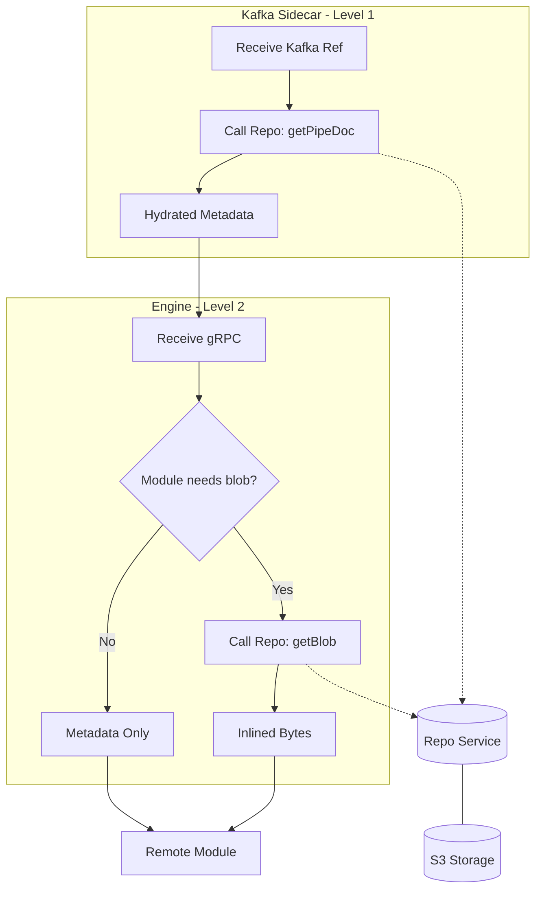
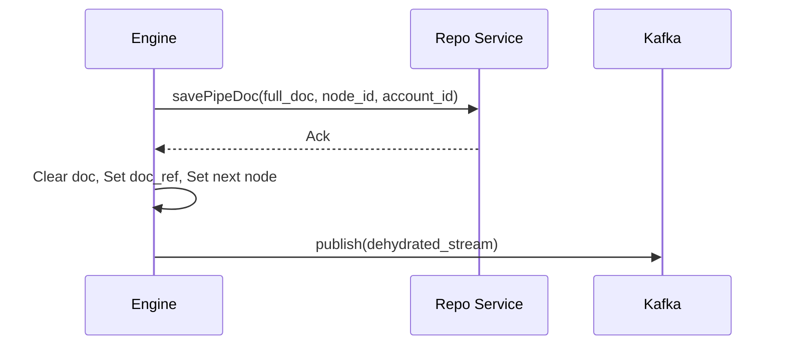
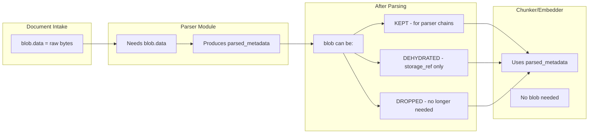

# Hydration Model

The Hydration Model defines how the PipeStream engine retrieves document content and metadata from persistent storage. By separating the document reference from its physical content, the engine can efficiently route large documents across the network while only fetching the binary data when strictly required by a processing module.

## Hydration Levels

- **Level 1: Document Hydration**: Resolves a `DocumentReference` into a full `PipeDoc` metadata object. This is typically done by the Kafka Sidecar or the Engine when a gRPC sender provides only a reference.
- **Level 2: Blob Hydration**: Fetches the raw binary content (bytes) from S3 via the Repo Service. This is an on-demand process triggered only if the target module (like a parser) requires the raw file for processing.
- **Dehydration**: The inverse process where a full document is replaced by a reference after persistence, ensuring Kafka message size limits (10MB) are respected.

## DocumentReference Proto

The `DocumentReference` provides the coordinates needed to retrieve a document from storage:

```protobuf
message DocumentReference {
  string doc_id = 1;           // Document identifier
  string source_node_id = 2;   // Node that produced this version
  string account_id = 3;       // Account for multi-tenant isolation
}
```

## Engine Hydration Implementation

The engine handles hydration within its processing loop, checking the requirements of the module before execution.

```java
void processNode(PipeStream stream) {
    String accountId = stream.getMetadata().getAccountId();
    
    // 1. Level 1 Hydration: Reference -> Metadata
    PipeDoc doc;
    if (stream.hasDocumentRef()) {
        DocumentReference ref = stream.getDocumentRef();
        doc = repoService.getPipeDoc(
            ref.getDocId(), 
            ref.getSourceNodeId(), 
            ref.getAccountId()
        );
    } else {
        doc = stream.getDocument();
    }
    
    // 2. Level 2 Hydration: Reference -> Binary Bytes
    GraphNode node = graphCache.getNode(stream.getCurrentNodeId());
    ModuleCapabilities caps = getModuleCapabilities(node.getModuleId());
    
    if (caps.needsBlobContent() && doc.getBlobBag().getBlob().hasStorageRef()) {
        FileStorageReference ref = doc.getBlobBag().getBlob().getStorageRef();
        byte[] blobData = repoService.getBlob(ref);
        
        // Inline the bytes for the module
        doc = doc.toBuilder()
            .setBlobBag(doc.getBlobBag().toBuilder()
                .setBlob(doc.getBlobBag().getBlob().toBuilder()
                    .setData(ByteString.copyFrom(blobData))
                    .clearStorageRef()
                    .build())
                .build())
            .build();
    }
    
    // Call module with hydrated document
    ProcessDataResponse response = callModule(node, doc);
}
```

## Deep Dive: Hydration Decisions

The hydration strategy is optimized for the "Fast Path" where documents move via gRPC.

| Decision | Criteria | Action |
|----------|----------|--------|
| **Level 1** | `stream.hasDocumentRef()` | Fetch PipeDoc from Repo Service |
| **Level 2** | `caps.needsBlobContent() && blob.hasStorageRef()` | Fetch blob bytes from Repo Service |
| **Skip L2** | Module doesn't need blob (chunker, embedder) | Use metadata only |

### Key Points

- **Selective Fetching**: Level 2 hydration is only performed if `needsBlobContent()` is true. Parsers (Tika, Docling) need blobs; Chunkers and Embedders do not.
- **Sidecar Responsibility**: When documents arrive via Kafka, the Sidecar performs Level 1 hydration before the Engine ever sees the request, keeping the Engine's gRPC interface consistent.
- **Repo Service Abstraction**: Neither the Engine nor the Sidecar access S3 directly. They use the Repo Service gRPC API, which manages authentication, path resolution, and caching.

## Storage Structure

Documents are stored in S3 using a node-centric hierarchy:

```
s3://{bucket}/
  └── {node-uuid}/
      ├── {doc-id-1}.pipedoc
      ├── {doc-id-2}.pipedoc
      └── ... (millions of docs per node)
```

- **Node-centric**: Each node's outputs are stored in its own directory
- **Account isolation**: Handled at the bucket or Repo Service level
- **Scalable**: Millions of documents per node directory (S3 handles this well)
- **Replayable**: All outputs from a node version are co-located

## Visualization of Hydration Flow



## Dehydration Flow (Post-Processing)

After a module completes its work, the engine may dehydrate the document before routing it to the next node, especially if the next hop is via Kafka.

```java
void routeToNextNode(PipeStream stream, PipeDoc doc, GraphEdge edge) {
    String currentNodeId = stream.getCurrentNodeId();
    String accountId = stream.getMetadata().getAccountId();
    
    if (edge.getTransportType() == TRANSPORT_TYPE_MESSAGING) {
        // MUST persist and dehydrate for Kafka
        repoService.savePipeDoc(doc, currentNodeId, accountId);
        
        PipeStream dehydrated = stream.toBuilder()
            .clearDocument()
            .setDocumentRef(DocumentReference.newBuilder()
                .setDocId(doc.getDocId())
                .setSourceNodeId(currentNodeId)
                .setAccountId(accountId)
                .build())
            .setCurrentNodeId(edge.getToNodeId())
            .build();
            
        kafkaProducer.send(edge.getKafkaTopic(), dehydrated);
    } else {
        // gRPC path - keep document inline
        PipeStream next = stream.toBuilder()
            .setDocument(doc)
            .setCurrentNodeId(edge.getToNodeId())
            .build();
            
        engineClient.processNode(next);
    }
}
```



## Blob Lifecycle

The blob (raw binary content) has a distinct lifecycle separate from the document metadata:



Most pipelines: **Intake → Parser (needs blob) → Chunker (no blob) → Embedder (no blob) → Sink**

After parsing, the blob is typically dehydrated or dropped since downstream modules work with `parsed_metadata`.
