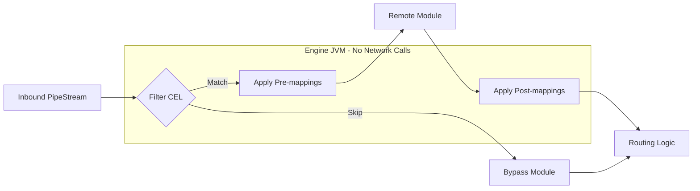

# Mapping & Filtering

Mapping and filtering are lightweight, in-engine operations used to transform document data and control its flow through the pipeline. By performing these actions within the Engine JVM, Pipestream eliminates unnecessary network latency and simplifies the integration of remote modules.

## Mapping & Filtering Workflow

- **Node Filtering**: Evaluation of a CEL expression to determine if a document should be processed by the current node or bypass it entirely.
- **Pre-mapping**: Field-level transformations applied to the document *before* it is sent to the remote module. This is used to normalize data or extract specific fields the module expects.
- **Post-mapping**: Transformations applied to the module's output document *after* execution. This is used to map results back to common schemas or clean up temporary data.

## Proto Structures

### NodeProcessingConfig

```protobuf
message NodeProcessingConfig {
  // 1. Identity (1)
  string node_id = 1;
  
  // 2. Transformation sequences (2)
  repeated ProcessingMapping pre_mappings = 2;
  repeated ProcessingMapping post_mappings = 3;
  
  // 3. Module configuration (3)
  Intent intent = 4;
  google.protobuf.Any node_config = 5;
  
  // 4. Bypass logic (4)
  optional string filter_condition = 6;
}
```

#### Code Deep Dive:
1. **Node Link**: Associates this configuration with a specific node in the pipeline graph.
2. **Mappings**: Ordered lists of transformations to apply before and after the remote module is called.
3. **Module Parameters**: The `Any` object allows node-specific configuration (like "model_name" for an embedder) to be passed to the remote module.
4. **Conditional Skip**: A CEL expression that allows a document to bypass this node entirely if it doesn't meet specific criteria (e.g., mime-type mismatch).

### ProcessingMapping

```protobuf
message ProcessingMapping {
  string mapping_id = 1;
  
  // Source field paths to map from
  // For AGGREGATE, multiple paths are used. For other types, only the first.
  repeated string source_field_paths = 2;
  
  // Target field paths to map to
  // For SPLIT, multiple paths are used. For other types, only the first.
  repeated string target_field_paths = 3;
  
  MappingType mapping_type = 4;
  
  oneof mapping_config {
    TransformConfig transform_config = 5;
    AggregateConfig aggregate_config = 6;
    SplitConfig split_config = 7;
  }
}

enum MappingType {
  MAPPING_TYPE_UNSPECIFIED = 0;
  MAPPING_TYPE_DIRECT = 1;      // Direct field-to-field copy
  MAPPING_TYPE_TRANSFORM = 2;   // Apply CEL transformation
  MAPPING_TYPE_AGGREGATE = 3;   // Combine multiple sources into one target
  MAPPING_TYPE_SPLIT = 4;       // Split one source into multiple targets
}
```

### TransformConfig

```protobuf
message TransformConfig {
  // CEL expression that returns the transformed value.
  // Variables available:
  //   - `value`: The source field value being transformed
  //   - `doc`: The full PipeDoc (for context-aware transforms)
  string cel_expression = 3;
}
```

## Mapping Types

| Type | Sources | Targets | Use Case |
|------|---------|---------|----------|
| **DIRECT** | 1 | 1 | Copy field as-is |
| **TRANSFORM** | 1 | 1 | Apply CEL expression |
| **AGGREGATE** | N | 1 | Combine fields (concatenate, sum) |
| **SPLIT** | 1 | N | Split field by delimiter |

## Mapping Implementation

The engine applies mappings in sequence during the processing loop.

```java
PipeDoc applyMappings(PipeDoc doc, List<ProcessingMapping> mappings) {
    PipeDoc.Builder builder = doc.toBuilder();
    
    for (ProcessingMapping mapping : mappings) {
        Object result;
        
        switch (mapping.getMappingType()) {
            case MAPPING_TYPE_DIRECT:
                // 1. Straight copy (1)
                result = FieldGetter.getField(doc, mapping.getSourceFieldPaths(0));
                break;
                
            case MAPPING_TYPE_TRANSFORM:
                // 2. CEL transformation (2)
                CelProgram program = graphCache.getCompiledCondition(
                    "mapping:" + mapping.getMappingId());
                Object sourceValue = FieldGetter.getField(doc, mapping.getSourceFieldPaths(0));
                result = celEvaluator.evaluate(program, Map.of(
                    "value", sourceValue,
                    "doc", doc
                ));
                break;
                
            case MAPPING_TYPE_AGGREGATE:
                // 3. Multi-source merge (3)
                List<Object> values = mapping.getSourceFieldPathsList().stream()
                    .map(path -> FieldGetter.getField(doc, path))
                    .collect(toList());
                AggregateConfig aggConfig = mapping.getAggregateConfig();
                result = aggregate(values, aggConfig);
                break;
                
            case MAPPING_TYPE_SPLIT:
                // 4. One-to-many split (4)
                String sourceStr = (String) FieldGetter.getField(doc, mapping.getSourceFieldPaths(0));
                String[] parts = sourceStr.split(mapping.getSplitConfig().getDelimiter());
                for (int i = 0; i < mapping.getTargetFieldPathsCount(); i++) {
                    if (i < parts.length) {
                        FieldSetter.setField(builder, mapping.getTargetFieldPaths(i), parts[i]);
                    }
                }
                continue; 
                
            default:
                continue;
        }
        
        // 5. Apply result (5)
        FieldSetter.setField(builder, mapping.getTargetFieldPaths(0), result);
    }
    
    return builder.build();
}
```

#### Code Deep Dive:
1. **Direct Copy**: Simplest mapping. It reads a field value from the source path and prepares it for the target.
2. **CEL Logic**: Fetches a pre-compiled expression. It provides the current field `value` and the full `doc` context to the CEL evaluator for sophisticated transformations.
3. **Aggregation**: Collects multiple source fields into a list and uses a helper to combine them (e.g., concatenating strings with a delimiter).
4. **Data Splitting**: Breaks a single string source into multiple target fields based on a delimiter. This handles its own field setting logic because it has multiple targets.
5. **Field Setter**: Uses a reflection-like utility to set the value on the `PipeDoc` builder at the specified dot-notation path.

## Node Filtering

Node filtering uses CEL to skip nodes entirely when documents don't match criteria:

```java
void processNode(PipeStream stream, PipeDoc doc) {
    GraphNode node = graphCache.getNode(stream.getCurrentNodeId());
    NodeProcessingConfig config = node.getProcessingConfig();
    
    // 1. Filter evaluation (1)
    if (config.hasFilterCondition()) {
        CelProgram program = graphCache.getCompiledCondition("node:" + node.getNodeId());
        if (!celEvaluator.evaluate(program, doc)) {
            // 2. Skip logic (2)
            routeToNextNodes(stream, doc);
            return;
        }
    }
    
    // 3. Data preparation (3)
    doc = applyMappings(doc, config.getPreMappingsList());
    
    // 4. Remote invocation (4)
    ProcessDataResponse response = callModule(node, doc);
    PipeDoc outputDoc = response.getOutputDoc();
    
    // 5. Result normalization (5)
    outputDoc = applyMappings(outputDoc, config.getPostMappingsList());
    
    // 6. Fan-out (6)
    routeToNextNodes(stream, outputDoc);
}
```

#### Code Deep Dive:
1. **Gatekeeping**: Checks the `filter_condition` (CEL) before any heavy processing or remote calls occur.
2. **Short-Circuit**: If the document doesn't match the node's criteria, it is immediately routed to the next steps in the pipeline, effectively treating this node as a no-op.
3. **Pre-Mapping**: Normalizes the document structure to match the remote module's expected interface.
4. **Module Call**: Executes the core processing logic (e.g., parsing, embedding).
5. **Post-Mapping**: Maps the module's output back into the pipeline's canonical document format.
6. **Continuation**: Forwards the processed document to all matching outgoing edges.

## Common Expression Language (CEL)

Pipestream uses CEL for filtering and transformations because it is fast, type-safe, and side-effect free.

### Filter Examples

```cel
// Only process PDFs
doc.blob_bag.blob.mime_type == "application/pdf"

// Only process documents with parsed content
has(doc.parsed_metadata) && size(doc.parsed_metadata) > 0

// Skip small documents
doc.blob_bag.blob.size_bytes > 1000

// Process only English documents
doc.search_metadata.language == "en"

// Has specific tag
"legal" in doc.search_metadata.tags.tag_data
```

### Transform Examples

```cel
// Normalize title to uppercase
value.upperAscii()

// Trim whitespace
value.trim()

// Extract substring
value.substring(0, 100)

// Conditional default
value.size() > 0 ? value : "untitled"

// Context-aware transform using full doc
doc.search_metadata.language == "en" ? value : translate(value, "en")

// Combine multiple operations
value.trim().lowerAscii()
```

### CEL Performance

- Expressions are compiled once during graph cache rebuild
- Compiled programs execute in microseconds per document
- No side effects - safe for parallel execution

## Visualization of Engine Operations



## Mapping Compilation

All CEL expressions are pre-compiled during graph cache rebuild for optimal performance:

```java
// In GraphCache.rebuild()
for (GraphNode node : newGraph.getNodesList()) {
    NodeProcessingConfig config = node.getProcessingConfig();
    
    // 1. Compile node filter (1)
    if (config.hasFilterCondition()) {
        newConditions.put("node:" + node.getNodeId(),
            celCompiler.compile(config.getFilterCondition()));
    }
    
    // 2. Compile mapping transforms (2)
    compileMappings(config.getPreMappingsList(), newConditions);
    compileMappings(config.getPostMappingsList(), newConditions);
}

void compileMappings(List<ProcessingMapping> mappings, Map<String, CelProgram> conditions) {
    for (ProcessingMapping mapping : mappings) {
        if (mapping.getMappingType() == MAPPING_TYPE_TRANSFORM) {
            // 3. Compile individual transform (3)
            conditions.put("mapping:" + mapping.getMappingId(),
                celCompiler.compile(mapping.getTransformConfig().getCelExpression()));
        }
    }
}
```

#### Code Deep Dive:
1. **Bypass Logic Compilation**: Filters are compiled once during the graph cache rebuild. This prevents expensive string parsing during the document processing loop.
2. **Sequential Compilation**: Both pre- and post-module transformation sequences are processed and their CEL expressions are added to the in-memory program cache.
3. **Key Convention**: Compiled programs are stored in a map with typed prefixes (e.g., `mapping:`, `node:`) to prevent ID collisions between different types of conditions.

### CEL Key Prefix Convention

| Prefix | Usage |
|--------|-------|
| `edge:` | Edge routing conditions |
| `node:` | Node filter conditions |
| `mapping:` | Mapping transform expressions |

## Example Configurations

### Filter: Only Process PDFs

```json
{
  "node_id": "pdf-parser",
  "filter_condition": "has(doc.blob_bag.blob) && doc.blob_bag.blob.mime_type == 'application/pdf'"
}
```

### Transform: Normalize Title

```json
{
  "mapping_id": "normalize-title",
  "source_field_paths": ["parsed_metadata.tika.data.title"],
  "target_field_paths": ["search_metadata.title"],
  "mapping_type": "MAPPING_TYPE_TRANSFORM",
  "transform_config": {
    "cel_expression": "value.trim()"
  }
}
```

### Aggregate: Combine Author Fields

```json
{
  "mapping_id": "combine-authors",
  "source_field_paths": [
    "parsed_metadata.tika.data.creator",
    "parsed_metadata.tika.data.author"
  ],
  "target_field_paths": ["search_metadata.author"],
  "mapping_type": "MAPPING_TYPE_AGGREGATE",
  "aggregate_config": {
    "aggregation_type": "AGGREGATION_TYPE_CONCATENATE",
    "delimiter": ", "
  }
}
```

### Split: Parse Path Segments

```json
{
  "mapping_id": "split-path",
  "source_field_paths": ["search_metadata.source_path"],
  "target_field_paths": ["search_metadata.source_path_segments"],
  "mapping_type": "MAPPING_TYPE_SPLIT",
  "split_config": {
    "delimiter": "/"
  }
}
```
