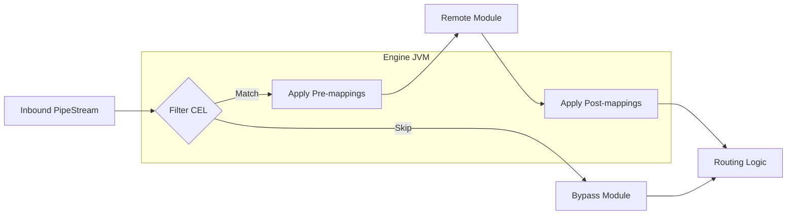
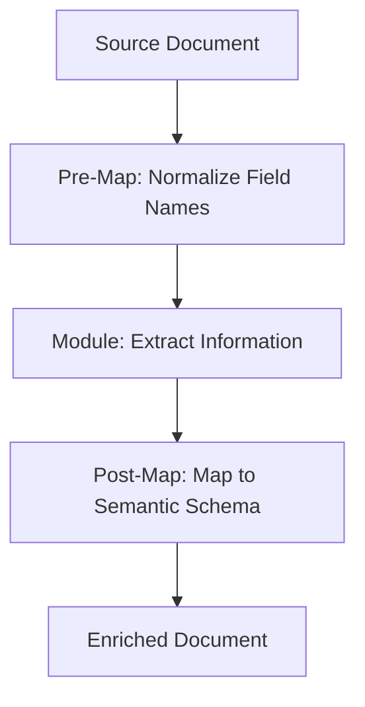

# Mapping & Filtering

Mapping and filtering are lightweight, in-engine operations used to transform document data and control its flow through the pipeline. By performing these actions within the Engine JVM, Pipestream eliminates unnecessary network latency and simplifies the integration of remote modules.

### Mapping & Filtering Workflow
- **Node Filtering**: Evaluation of a CEL expression to determine if a document should be processed by the current node or bypass it entirely.
- **Pre-mapping**: Field-level transformations applied to the document *before* it is sent to the remote module. This is used to normalize data or extract specific fields the module expects.
- **Post-mapping**: Transformations applied to the module's output document *after* execution. This is used to map results back to common schemas or clean up temporary data.

### Mapping Implementation

The engine uses a pre-compiled `CelProgram` to execute these transformations efficiently during the processing loop.

```java
// Simplified mapping execution
PipeDoc applyMappings(PipeDoc doc, List<ProcessingMapping> mappings) {
    PipeDoc.Builder builder = doc.toBuilder();
    
    for (ProcessingMapping mapping : mappings) {
        // 1. Get pre-compiled CEL program for this mapping
        CelProgram program = graphCache.getCompiledMapping(mapping.getMappingId());
        
        // 2. Evaluate transformation
        Object result = celEvaluator.evaluate(program, doc);
        
        // 3. Apply result to target paths
        for (String targetPath : mapping.getTargetFieldPathsList()) {
            FieldSetter.setField(builder, targetPath, result);
        }
    }
    
    return builder.build();
}
```

### Deep Dive: Common Expression Language (CEL)

Pipestream relies on CEL for all dynamic logic because it is fast, type-safe, and side-effect free.

- **Filter Example**: `doc.blob_bag.blob.mime_type == "application/pdf"` ensures only PDFs are processed.
- **Transform Example**: `doc.parsed_metadata.title.upperAscii()` normalizes a title field to uppercase.
- **Conditional Logic**: `doc.search_metadata.language == "en" ? value : translate(value, "en")` allows for complex, context-aware transformations.
- **In-Memory Performance**: CEL expressions are compiled once during graph activation and executed in microseconds per document.

### Visualization of Engine Operations



### Node Configuration Example

A typical node configuration in the graph includes both the filter and the mapping rules required to prepare data for a specific module (e.g., a Chunker).

```protobuf
message NodeProcessingConfig {
  optional string node_id = 1;
  
  // Only process if document has text
  optional string filter_condition = 6;
  
  // Map parsed content to chunker input
  repeated ProcessingMapping pre_mappings = 2;
}
```


