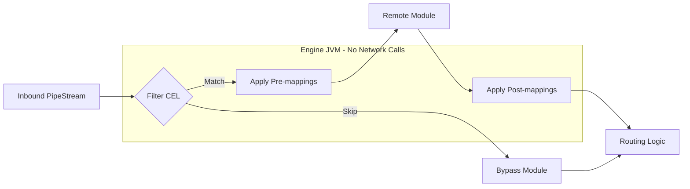

# Mapping & Filtering

Mapping and filtering are lightweight, in-engine operations used to transform document data and control its flow through the pipeline. By performing these actions within the Engine JVM, Pipestream eliminates unnecessary network latency and simplifies the integration of remote modules.

## Mapping & Filtering Workflow

- **Node Filtering**: Evaluation of a CEL expression to determine if a document should be processed by the current node or bypass it entirely.
- **Pre-mapping**: Field-level transformations applied to the document *before* it is sent to the remote module. This is used to normalize data or extract specific fields the module expects.
- **Post-mapping**: Transformations applied to the module's output document *after* execution. This is used to map results back to common schemas or clean up temporary data.

## Proto Structures

### NodeProcessingConfig

```protobuf
message NodeProcessingConfig {
  string node_id = 1;
  repeated ProcessingMapping pre_mappings = 2;
  repeated ProcessingMapping post_mappings = 3;
  Intent intent = 4;
  google.protobuf.Any node_config = 5;
  
  // Proposed (Issue #14): CEL filter to skip node processing
  // optional string filter_condition = 6;
}
```

### ProcessingMapping

```protobuf
message ProcessingMapping {
  string mapping_id = 1;
  
  // Source field paths to map from
  // For AGGREGATE, multiple paths are used. For other types, only the first.
  repeated string source_field_paths = 2;
  
  // Target field paths to map to
  // For SPLIT, multiple paths are used. For other types, only the first.
  repeated string target_field_paths = 3;
  
  MappingType mapping_type = 4;
  
  oneof mapping_config {
    TransformConfig transform_config = 5;
    AggregateConfig aggregate_config = 6;
    SplitConfig split_config = 7;
  }
}

enum MappingType {
  MAPPING_TYPE_UNSPECIFIED = 0;
  MAPPING_TYPE_DIRECT = 1;      // Direct field-to-field copy
  MAPPING_TYPE_TRANSFORM = 2;   // Apply transformation function
  MAPPING_TYPE_AGGREGATE = 3;   // Combine multiple sources into one target
  MAPPING_TYPE_SPLIT = 4;       // Split one source into multiple targets
}
```

### TransformConfig

```protobuf
message TransformConfig {
  // Current: Named transformation rule
  string rule_name = 1;
  optional google.protobuf.Struct params = 2;
  
  // Proposed (Issue #14): CEL expression for flexible transforms
  // string cel_expression = 3;
}
```

## Mapping Types

| Type | Sources | Targets | Use Case |
|------|---------|---------|----------|
| **DIRECT** | 1 | 1 | Copy field as-is |
| **TRANSFORM** | 1 | 1 | Apply function (uppercase, trim, etc.) |
| **AGGREGATE** | N | 1 | Combine fields (concatenate, sum) |
| **SPLIT** | 1 | N | Split field by delimiter |

## Mapping Implementation

The engine applies mappings in sequence during the processing loop.

```java
PipeDoc applyMappings(PipeDoc doc, List<ProcessingMapping> mappings) {
    PipeDoc.Builder builder = doc.toBuilder();
    
    for (ProcessingMapping mapping : mappings) {
        Object result;
        
        switch (mapping.getMappingType()) {
            case MAPPING_TYPE_DIRECT:
                // Direct copy from source to target
                result = FieldGetter.getField(doc, mapping.getSourceFieldPaths(0));
                break;
                
            case MAPPING_TYPE_TRANSFORM:
                // Apply transformation rule
                Object sourceValue = FieldGetter.getField(doc, mapping.getSourceFieldPaths(0));
                TransformConfig config = mapping.getTransformConfig();
                result = transformRegistry.apply(
                    config.getRuleName(), 
                    sourceValue, 
                    config.getParams()
                );
                break;
                
            case MAPPING_TYPE_AGGREGATE:
                // Combine multiple source fields
                List<Object> values = mapping.getSourceFieldPathsList().stream()
                    .map(path -> FieldGetter.getField(doc, path))
                    .collect(toList());
                AggregateConfig aggConfig = mapping.getAggregateConfig();
                result = aggregate(values, aggConfig);
                break;
                
            case MAPPING_TYPE_SPLIT:
                // Split handled separately - multiple targets
                String sourceStr = (String) FieldGetter.getField(doc, mapping.getSourceFieldPaths(0));
                String[] parts = sourceStr.split(mapping.getSplitConfig().getDelimiter());
                for (int i = 0; i < mapping.getTargetFieldPathsCount(); i++) {
                    if (i < parts.length) {
                        FieldSetter.setField(builder, mapping.getTargetFieldPaths(i), parts[i]);
                    }
                }
                continue; // Skip normal target setting
                
            default:
                continue;
        }
        
        // Set result on first target path (except SPLIT which handles its own)
        FieldSetter.setField(builder, mapping.getTargetFieldPaths(0), result);
    }
    
    return builder.build();
}
```

## Node Filtering (Proposed)

> **Note:** Filter conditions are proposed in Issue #14 and not yet in the proto.

When implemented, filtering will use CEL to skip nodes entirely:

```java
void processNode(PipeStream stream, PipeDoc doc) {
    GraphNode node = graphCache.getNode(stream.getCurrentNodeId());
    NodeProcessingConfig config = node.getProcessingConfig();
    
    // Check filter condition (proposed)
    if (config.hasFilterCondition()) {
        CelProgram program = graphCache.getCompiledCondition("node:" + node.getNodeId());
        if (!celEvaluator.evaluate(program, doc)) {
            // Skip this node, route directly to next nodes
            routeToNextNodes(stream, doc);
            return;
        }
    }
    
    // Apply pre-mappings
    doc = applyMappings(doc, config.getPreMappingsList());
    
    // Call module
    ProcessDataResponse response = callModule(node, doc);
    PipeDoc outputDoc = response.getOutputDoc();
    
    // Apply post-mappings
    outputDoc = applyMappings(outputDoc, config.getPostMappingsList());
    
    // Route to next nodes
    routeToNextNodes(stream, outputDoc);
}
```

## Common Expression Language (CEL)

Pipestream uses CEL for filtering and conditional routing because it is fast, type-safe, and side-effect free.

### Filter Examples (Proposed)

```cel
// Only process PDFs
doc.blob_bag.blob.mime_type == "application/pdf"

// Only process documents with parsed content
has(doc.parsed_metadata) && size(doc.parsed_metadata) > 0

// Skip small documents
doc.blob_bag.blob.size_bytes > 1000
```

### Transform Examples (Proposed Issue #14)

When `cel_expression` is added to TransformConfig:

```cel
// Normalize title to uppercase
doc.parsed_metadata["tika"].data.title.upperAscii()

// Conditional transformation
doc.search_metadata.language == "en" ? value : translate(value, "en")

// Extract and format
value.trim().substring(0, 100)
```

### CEL Performance

- Expressions are compiled once during graph cache rebuild
- Compiled programs execute in microseconds per document
- No side effects - safe for parallel execution

## Visualization of Engine Operations



## Built-in Transform Rules

The transform registry provides common transformations:

| Rule Name | Description | Params |
|-----------|-------------|--------|
| `uppercase` | Convert to uppercase | - |
| `lowercase` | Convert to lowercase | - |
| `trim` | Remove leading/trailing whitespace | - |
| `substring` | Extract substring | `start`, `end` |
| `replace` | Replace text | `pattern`, `replacement` |
| `date_format` | Format date string | `input_format`, `output_format` |
| `default` | Use default if null | `default_value` |

### Example Transform Configuration

```json
{
  "mapping_id": "normalize-title",
  "source_field_paths": ["parsed_metadata.tika.data.title"],
  "target_field_paths": ["search_metadata.title"],
  "mapping_type": "MAPPING_TYPE_TRANSFORM",
  "transform_config": {
    "rule_name": "trim"
  }
}
```

## Mapping Compilation

Mappings with CEL expressions (when implemented) are pre-compiled during graph cache rebuild:

```java
// In GraphCache.rebuild()
for (GraphNode node : newGraph.getNodesList()) {
    NodeProcessingConfig config = node.getProcessingConfig();
    
    // Compile node filter (proposed)
    if (config.hasFilterCondition()) {
        newConditions.put("node:" + node.getNodeId(),
            celCompiler.compile(config.getFilterCondition()));
    }
    
    // Compile mapping transforms (when CEL is added)
    for (ProcessingMapping mapping : config.getPreMappingsList()) {
        if (mapping.hasTransformConfig() && 
            mapping.getTransformConfig().hasCelExpression()) {
            newConditions.put("mapping:" + mapping.getMappingId(),
                celCompiler.compile(mapping.getTransformConfig().getCelExpression()));
        }
    }
}
```

Key prefix convention:
- `edge:` - Edge routing conditions
- `node:` - Node filter conditions  
- `mapping:` - Mapping transform expressions
