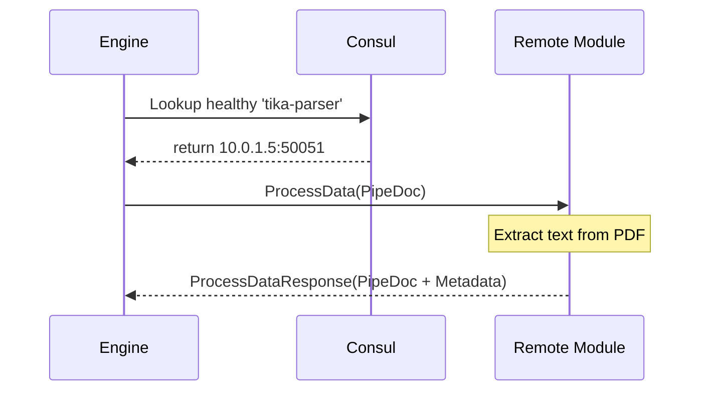
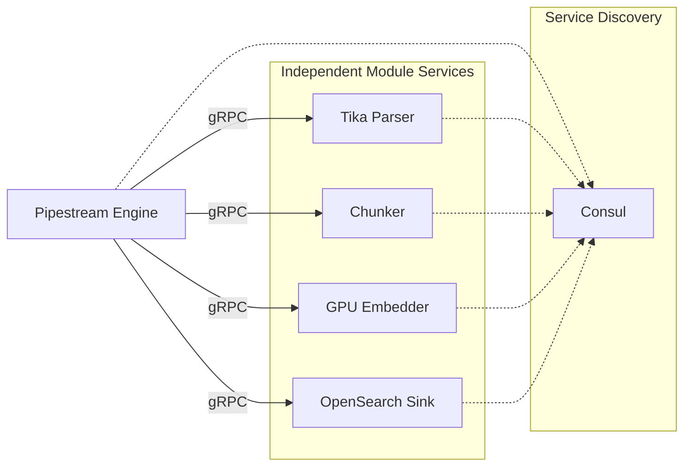

# Module Integration

Module Integration defines the contract between the Pipestream Engine and the specialized services that process documents. By adhering to a stateless, gRPC-based interface, modules can be developed in any language and scaled independently based on the pipeline's demand.

## Module Contract

- **Stateless Transformation**: Modules operate on a `PipeDoc in -> PipeDoc out` principle. They do not maintain state between requests or have any awareness of the overall graph topology.
- **Service Discovery**: The Engine discovers module instances via Consul, enabling dynamic load balancing and failover without manual configuration.
- **Capabilities Reporting**: Modules report their capabilities (e.g., `PARSER`, `SINK`) to the platform, allowing the Engine to optimize data preparation (like blob hydration).

## Module Service Definition

All modules implement the `PipeStepProcessorService` interface:

```protobuf
service PipeStepProcessorService {
  // Primary processing method
  rpc ProcessData(ProcessDataRequest) returns (ProcessDataResponse);
  
  // Registration and capabilities reporting
  rpc GetServiceRegistration(GetServiceRegistrationRequest) 
      returns (GetServiceRegistrationResponse);
}

message ProcessDataRequest {
  PipeDoc document = 1;
  ProcessConfiguration config = 2;
  ServiceMetadata metadata = 3;
  repeated ProcessingMapping post_mappings = 5;
  bool is_test = 6;
}

message ProcessDataResponse {
  bool success = 1;
  optional PipeDoc output_doc = 2;
  optional google.protobuf.Struct error_details = 3;
  repeated string processor_logs = 4;
}
```

## Module Capabilities

Modules report their capabilities during registration, which the Engine uses to optimize processing:

```protobuf
message Capabilities {
  repeated CapabilityType types = 1;
}

enum CapabilityType {
  CAPABILITY_TYPE_UNSPECIFIED = 0;
  CAPABILITY_TYPE_PARSER = 1;    // Converts raw input to documents
  CAPABILITY_TYPE_SINK = 2;      // Outputs to external systems
  // Future: CHUNKER, EMBEDDER, ENRICHER, etc.
}
```

### Capability-Based Optimization

The Engine uses capabilities to make hydration decisions:

```java
boolean needsBlobContent(ModuleCapabilities caps) {
    // Parsers need raw binary content
    return caps.getTypesList().contains(CAPABILITY_TYPE_PARSER);
}
```

| Capability | Needs Blob | Example Modules |
|------------|------------|-----------------|
| `PARSER` | Yes | Tika, Docling, PDF extractor |
| `SINK` | No | OpenSearch indexer, S3 archiver |
| `CHUNKER` (future) | No | Sentence splitter, token chunker |
| `EMBEDDER` (future) | No | OpenAI embedder, local model |

## Remote Module Invocation

The Engine manages a pool of gRPC clients and handles service discovery and request orchestration:

```java
ProcessDataResponse callModule(GraphNode node, PipeDoc doc) {
    // 1. Service Discovery (1)
    String moduleId = node.getModuleId();
    ServiceInstance instance = moduleDiscovery.getHealthyInstance(moduleId);
    
    // 2. Request Preparation (2)
    ProcessDataRequest request = ProcessDataRequest.newBuilder()
        .setDocument(doc)
        .setConfig(ProcessConfiguration.newBuilder()
            .setCustomJsonConfig(node.getCustomConfig().getJsonConfig())
            .putAllConfigParams(node.getCustomConfig().getConfigParams())
            .build())
        .setMetadata(buildServiceMetadata(stream))
        .build();
    
    // 3. Remote gRPC Call (3)
    return moduleClientPool.get(instance).processData(request);
}
```

#### Code Deep Dive:
1. **Consul Lookup**: Resolves a logical module ID (e.g., "tika-parser") to a specific IP and port of a healthy instance. This enables dynamic scaling and high availability.
2. **Configuration Inlining**: Merges the document with node-specific settings defined in the graph. The module receives everything it needs in a single object.
3. **Execution**: Uses a pooled gRPC client to invoke the module. The call is synchronous from the perspective of this thread, but the Engine's orchestration layer handles timeouts and retries.

## Module Responsibilities

To maintain high performance and scalability, a strict separation of concerns is enforced:

| Module Does | Module Does NOT |
|-------------|-----------------|
| Transform PipeDoc | Access Kafka |
| Return success/error status | Access storage (S3/Postgres) |
| Log processing details | Make routing decisions |
| Report capabilities | Know about graph topology |

### Key Principles

- **No Infrastructure Awareness**: Modules never talk to Kafka, S3, or Postgres. They receive all data via gRPC and return results the same way.
- **No Routing Logic**: A module never decides where a document goes next; it only transforms the current document.
- **Error Reporting**: Modules return a `success` flag and `error_details`. If success is `false`, the Engine logs the error in the document's history.
- **Horizontal Scaling**: Modules are stateless and can be scaled independently based on load. GPU-intensive modules (embedders) can scale to zero when idle.

## Module Interaction Sequence



## Module Registration Response

Modules provide rich metadata during registration for UI and operational purposes:

```protobuf
message GetServiceRegistrationResponse {
  // Identity
  string module_name = 1;           // e.g., "acme-text-chunker-v2"
  string version = 2;               // e.g., "1.2.1"
  optional string json_config_schema = 3;
  
  // UI & Developer Experience
  optional string display_name = 4;  // e.g., "Acme Text Chunker"
  optional string description = 5;
  optional string owner = 6;
  optional string documentation_url = 7;
  repeated string tags = 8;
  
  // Health & Operational Status
  bool health_check_passed = 9;
  string health_check_message = 10;
  
  // Runtime Intelligence
  string server_info = 12;
  string sdk_version = 13;
  repeated string dependencies = 14;
  
  // Capabilities for Engine optimization
  Capabilities capabilities = 16;
}
```

## Module Architecture



## Testing with grpc-wiremock

Modules can be mocked during testing using the [grpc-wiremock](https://github.com/ai-pipestream/grpc-wiremock) project, which offers 4 different patterns for mocking gRPC services.
