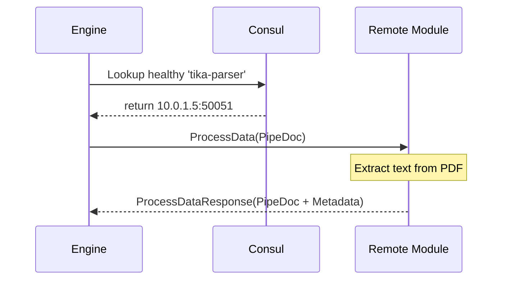
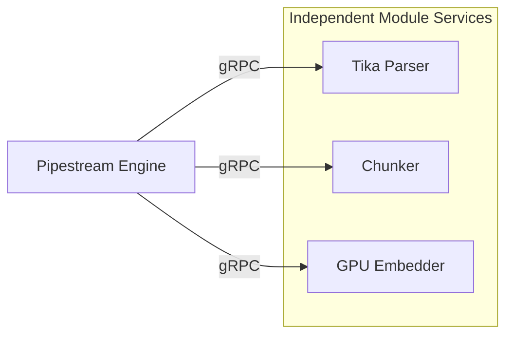

# Module Integration

Module Integration defines the contract between the Pipestream Engine and the specialized services that process documents. By adhering to a stateless, gRPC-based interface, modules can be developed in any language and scaled independently based on the pipeline's demand.

### Module Contract & Integration
- **Stateless Transformation**: Modules operate on a `PipeDoc in -> PipeDoc out` principle. They do not maintain state between requests or have any awareness of the overall graph topology.
- **Service Discovery**: The Engine discovers module instances via Consul, enabling dynamic load balancing and failover without manual configuration.
- **Capabilities Reporting**: Modules report their capabilities (e.g., `PARSER`, `CHUNKER`, `EMBEDDER`) to the platform, allowing the Engine to optimize data preparation (like blob hydration).

### Remote Module Invocation

The Engine manages a pool of gRPC clients and handles the complexities of service discovery and request orchestration.

```java
ProcessDataResponse callModule(String nodeId, PipeDoc doc, NodeConfig config) {
    // 1. Discover healthy instance via Consul
    ServiceInstance instance = moduleDiscovery.getHealthyInstance(config.getModuleId());
    
    // 2. Prepare request with module-specific settings
    ProcessDataRequest request = ProcessDataRequest.newBuilder()
        .setDocument(doc)
        .setConfig(config.getModuleSettings())
        .build();
    
    // 3. Execute gRPC call with timeout/retry logic
    return moduleClientPool.get(instance).processData(request);
}
```

### Deep Dive: Module Responsibilities

To maintain high performance and scalability, a strict "Separation of Concerns" is enforced:

- **No Infrastructure Awareness**: Modules never talk to Kafka, S3, or Postgres. They receive all data via gRPC and return results the same way.
- **No Routing Logic**: A module never decides where a document goes next; it only transforms the current document.
- **Error Reporting**: Modules return a `success` flag and an `error_message`. If success is `false`, the Engine logs the error in the document's history but continues the pipeline execution if appropriate.
- **Performance**: Modules are expected to be optimized for their specific task (e.g., using GPUs for embeddings) and are scaled horizontally by KEDA.

### Module Interaction Sequence



### Module Definition (Protobuf)

The standard interface ensures all modules, regardless of their internal logic, can be invoked by the Engine.

```protobuf
service PipeStepProcessorService {
  // Primary processing method
  rpc ProcessData(ProcessDataRequest) returns (ProcessDataResponse);
  
  // Registration and capabilities check
  rpc GetServiceRegistration(GetServiceRegistrationRequest) 
      returns (GetServiceRegistrationResponse);
}
```


