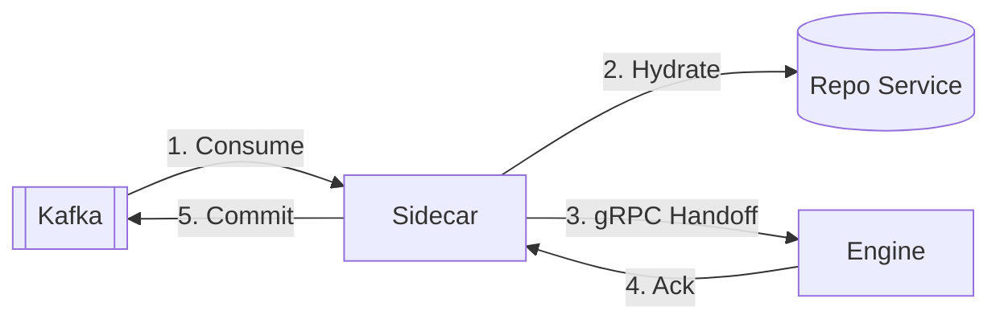
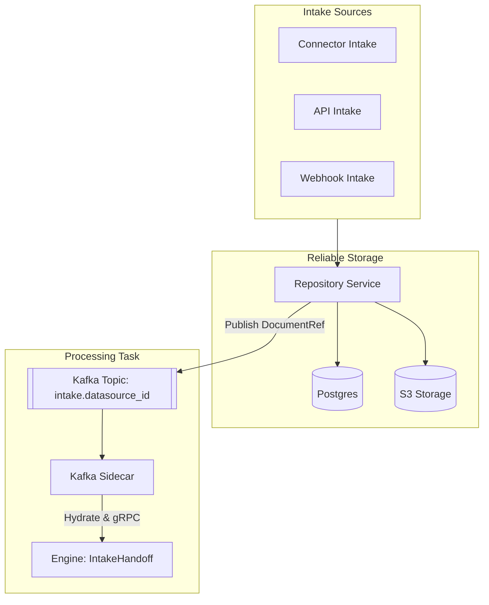
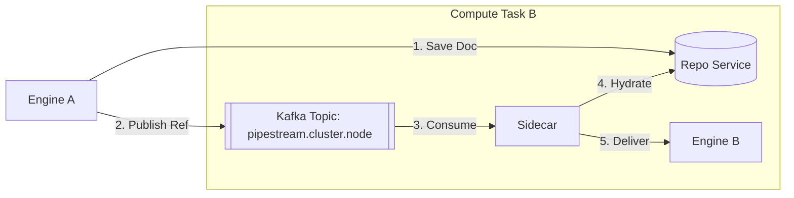
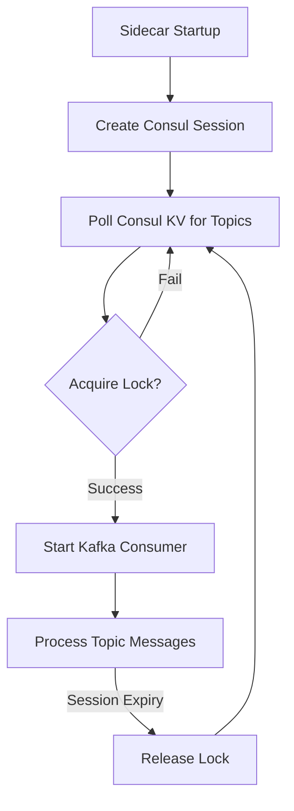
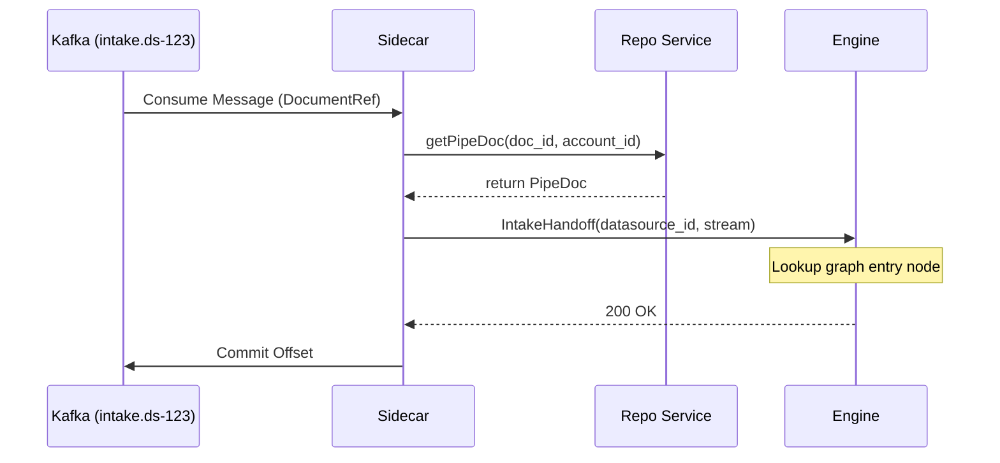
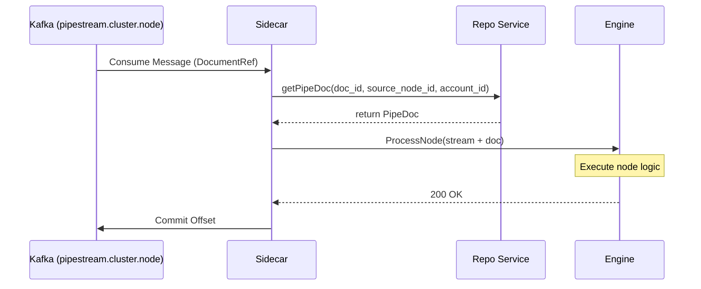
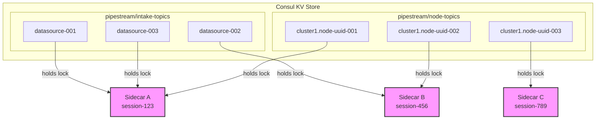
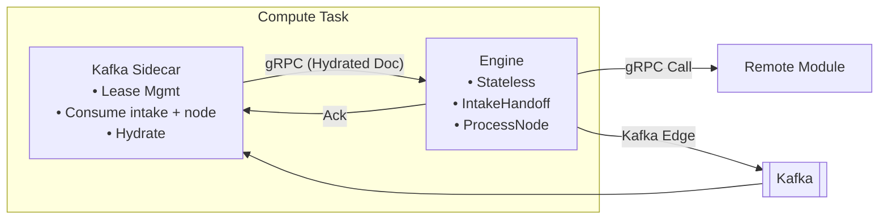

# Kafka Sidecar Pattern

The Kafka Sidecar is a specialized architectural component that bridges the gap between Pipestream's asynchronous messaging layer (Kafka) and its synchronous processing core (Engine). By isolating Kafka consumption in a sidecar, the Engine remains a pure gRPC service, simplified for low-latency processing and independent scaling.

## Sidecar Bridge pattern

The Pipestream Engine stays completely unaware of Kafka. It is a pure gRPC service. The Sidecar Bridge pattern handles the bridge between the asynchronous world of Kafka and the synchronous world of the Engine.



**Description**: This diagram shows the core "Bridge" loop where the Sidecar consumes a message from Kafka, hydrates it via the Repo Service, and hands it off to the Engine via gRPC. Once the Engine acknowledges, the Sidecar commits the offset back to Kafka.

## Two Topic Types

The Sidecar consumes two distinct topic patterns, each mapping to a specific Engine entry point:

| Topic Pattern | Publisher | Engine Endpoint | Purpose |
|---------------|-----------|-----------------|---------|
| `intake.{datasource_id}` | Repository Service | `IntakeHandoff()` | Initial document ingestion into the system. |
| `pipestream.{cluster}.{node}` | Engine (via Repo) | `ProcessNode()` | Inter-node routing for async pipeline steps. |

### Intake Topics

Intake topics receive documents from any intake service via the Repository. This asynchronous path ensures that intake bursts are buffered and that the heavy lifting of persistence and S3 upload is handled before the Engine begins its processing loop.

```java
public void publishToIntake(String datasourceId, String docId, String accountId) {
    // 1. Determine intake topic (1)
    String topic = "intake." + datasourceId;

    // 2. Build minimal document reference (2)
    DocumentReference ref = DocumentReference.newBuilder()
        .setDocId(docId)
        .setAccountId(accountId)
        .build();

    // 3. Publish to Kafka (3)
    kafkaPublisher.publish(topic, ref);
}
```

#### Code Deep Dive:
1. **Topic Selection**: The topic is derived directly from the `datasourceId`, ensuring that different sources (e.g., "s3-connector", "rest-api") are isolated.
2. **Reference Creation**: Instead of publishing the full document content to Kafka, we only send a `DocumentReference`. This keeps Kafka message sizes small and avoids broker bottlenecks.
3. **Kafka Handoff**: The message is published asynchronously. The Sidecar on the other end will be responsible for fetching the full document metadata before processing.

**Key Responsibilities:**
- **Persistence First**: Every document on an intake topic is already safely stored in S3 and Postgres.
- **Datasource Scoping**: Topics are scoped by datasource ID, allowing for granular scaling and monitoring.
- **Sidecar Hydration**: The Sidecar consumes the reference, fetches the full document from the Repo Service, and hands it off to the Engine.



**Description**: This flowchart illustrates how documents from various intake sources flow through the Repository Service for persistence in S3 and Postgres before being published to a datasource-specific Kafka topic for sidecar-led processing.

**Benefits of datasource-based topics:**
- Scale sidecars per datasource load.
- Pause/resume specific datasources without affecting others.
- Monitor throughput and latency per datasource.
- Apply different Kafka retention policies based on datasource priority.

### Node Topics

Node topics handle inter-node routing within the pipeline graph when an edge is configured with `MESSAGING` transport. This decouples processing nodes, providing durability and the ability to replay specific segments of a pipeline.

```java
public void routeToMessagingEdge(PipeDoc doc, GraphEdge edge, String currentNodeId, String accountId) {
    // 1. Check if the edge uses Kafka (1)
    if (edge.getTransportType() == MESSAGING) {
        // 2. Persist the document to storage (2)
        repoService.savePipeDoc(doc, currentNodeId, accountId);
        
        // 3. Create a dehydrated stream with a reference (3)
        PipeStream dehydrated = stream.toBuilder()
            .setDocumentRef(ref)
            .setCurrentNodeId(edge.getToNodeId())
            .build();
        
        // 4. Send to the node-specific topic (4)
        kafkaProducer.send(edge.getKafkaTopic(), dehydrated);
    }
}
```

#### Code Deep Dive:
1. **Transport Selection**: The routing logic checks the `TransportType`. Only edges explicitly marked as `MESSAGING` go through Kafka.
2. **Persistence Guarantee**: Before publishing to Kafka, the document *must* be saved to the Repository Service. This ensures that the message receiver can always hydrate the document even if the sender goes offline.
3. **Dehydration**: The full `PipeDoc` is cleared from the `PipeStream`, and a `DocumentReference` is inserted instead. This keeps the message under Kafka's 10MB limit.
4. **Targeted Delivery**: The message is sent to a topic specific to the next node, which will be picked up by a sidecar specifically leased to that node.

**Key Responsibilities:**
- **Inter-Node Decoupling**: Engines don't need to be online simultaneously for data to move between nodes.
- **Reference-Based Messaging**: Keeps Kafka messages small (DocumentRef only) while the document payload remains in S3.
- **Cross-Cluster Bridge**: Kafka serves as the primary mechanism for routing documents between different engine clusters.



**Description**: This diagram visualizes the asynchronous inter-node routing where Engine A persists a document and publishes a reference to Kafka, allowing Compute Task B to independently consume and process it.

## Direct Path (No Kafka)

For small documents or when synchronous response is needed, intake services can bypass Repository and call Engine directly:

```
Connector → Intake → Engine.IntakeHandoff(doc_stored_in_repo=false)
                           ↓
                     Engine has inline PipeDoc
                           ↓
                     Immediate processing
```

**Path selection criteria:**
- Size threshold (e.g., >1MB → repo path)
- Datasource config (some always want persistence)
- Client preference (sync response needed?)

The `doc_stored_in_repo` flag tells Engine how to handle downstream Kafka edges:

| Flag | On Kafka Edge |
|------|---------------|
| `true` | Publish DocumentRef (doc already stored) |
| `false` | Store to Repo first, then publish ref |

## Why a Sidecar?

Traditional "all-in-one" consumers struggle in large-scale multi-tenant environments:

- **Consumer Group Rebalancing**: With thousands of topics, standard Kafka rebalancing becomes a "stop-the-world" bottleneck. Sidecars avoid this by treating each topic as an independent lease.
- **Stateless Engine**: The Engine doesn't need to know about Kafka brokers, offsets, or partitions. It simply processes gRPC requests, making it easier to test and deploy.
- **Resource Isolation**: Memory-intensive hydration and Kafka buffering happen in the Sidecar, protecting the Engine's CPU cycles for mapping and module execution.
- **Local Handoff**: Sidecars typically run alongside the Engine, using `localhost` for gRPC communication to minimize latency.

## Lease Management

The Kafka sidecar uses a "lock-per-topic" strategy managed via Consul to distribute workloads without the heavy overhead of standard Kafka consumer group rebalancing. This allows the cluster to handle thousands of topics efficiently.

### Lease Acquisition Workflow
- **Service Registration**: Each sidecar registers a session with Consul upon startup.
- **Topic Discovery**: Sidecars poll Consul's KV store for available topic definitions.
- **Dynamic Locking**: A sidecar attempts to acquire an ephemeral KV lock for a topic. If successful, it starts a dedicated Kafka consumer for that topic.
- **Lease Persistence**: As long as the sidecar remains healthy and its Consul session active, it maintains the lock and continues processing the topic.

```java
public void acquireLeases() {
    // 1. Discovery phase (1)
    List<String> intakeTopics = consul.getKVKeys("pipestream/intake-topics/");
    List<String> nodeTopics = consul.getKVKeys("pipestream/node-topics/");
    
    for (String topicKey : concat(intakeTopics, nodeTopics)) {
        if (leasedTopics.size() >= MAX_LEASES) break;
        
        // 2. Lock acquisition (2)
        boolean acquired = consul.acquireLock(topicKey, sessionId);
        
        if (acquired) {
            // 3. Dynamic initialization (3)
            TopicType type = topicKey.startsWith("pipestream/intake-topics/") 
                ? TopicType.INTAKE 
                : TopicType.NODE;
            startConsumer(topicKey, type);
            leasedTopics.add(topicKey);
        }
    }
}
```

#### Code Deep Dive:
1. **Topic Discovery**: The sidecar polls Consul for all possible topics. It doesn't have a static list, allowing topics to be added or removed from the cluster dynamically.
2. **Ephemeral Locking**: The sidecar attempts to claim a topic by creating a lock in Consul linked to its session. If another sidecar already has the lock, this call fails, ensuring one-sidecar-per-topic.
3. **Lazy Initialization**: A Kafka consumer is only started *after* the lock is successfully acquired. This saves resources by only connecting to Kafka when work is guaranteed.



**Description**: This state diagram shows the sidecar's lifecycle for managing topic leases, from session creation and topic discovery in Consul to active message processing and automatic lock release on session expiry.

## Consumption and Hydration

Once a sidecar holds a lease, it follows a strict hydration-and-delivery flow to ensure that the Engine receives fully-formed documents despite Kafka's message size limits.

### Hydration Logic
1.  **Consume**: Retrieve `PipeStream` message from Kafka (contains `DocumentReference`).
2.  **Hydrate (Level 1)**: Call Repo Service with the reference to get the full `PipeDoc` metadata.
3.  **Deliver**: Forward the hydrated document to the Engine via gRPC.
4.  **Ack & Commit**: Once Engine returns success, commit the Kafka offset.

### Intake Topic Flow

The intake flow bridges external data sources into the Pipestream engine.



**Description**: This sequence diagram details the interaction between Kafka, the Sidecar, Repo Service, and the Engine during the intake phase, highlighting the hydration of a DocumentReference into a full PipeDoc before handoff.

### Node Topic Flow

The node flow handles inter-node transitions for edges using messaging transport.



**Description**: This sequence diagram shows the inter-node processing flow, where the sidecar hydrates a document reference for a specific node transition before triggering the Engine's processing logic.

## Implementation

### Consumer Loop

```java
void consumeLoop(String topic, TopicType type) {
    while (running) {
        // 1. Fetch batch from Kafka (1)
        ConsumerRecords<String, PipeStream> records = consumer.poll(Duration.ofMillis(100));
        
        for (ConsumerRecord<String, PipeStream> record : records) {
            try {
                // 2. Process and hand off (2)
                processRecord(record, type);
                
                // 3. Manual commit (3)
                consumer.commitSync(Map.of(
                    new TopicPartition(record.topic(), record.partition()),
                    new OffsetAndMetadata(record.offset() + 1)
                ));
            } catch (Exception e) {
                // 4. Fault tolerance (4)
                handleFailure(record, e);
            }
        }
    }
}
```

#### Code Deep Dive:
1. **Polling**: The sidecar pulls a batch of messages from its assigned topic.
2. **Synchronous Handoff**: Each message is processed (hydrated and delivered to the Engine) before the next one in the batch is started.
3. **At-Least-Once Delivery**: Offsets are only committed *after* the Engine acknowledges successful processing. If the sidecar crashes before committing, the message will be re-processed by the next sidecar to claim the lease.
4. **Resiliency**: Failures in hydration or Engine delivery are caught, triggering the retry/DLQ logic.

### Hydration and Delivery

```java
void processRecord(ConsumerRecord<String, PipeStream> record, TopicType type) {
    PipeStream stream = record.value();
    
    // 1. Level 1 Hydration (1)
    PipeDoc doc;
    if (stream.hasDocumentRef()) {
        DocumentReference ref = stream.getDocumentRef();
        doc = repoService.getPipeDoc(
            ref.getDocId(), 
            ref.getSourceNodeId(), 
            ref.getAccountId()
        );
    } else {
        doc = stream.getDocument();
    }
    
    // 2. Build hydrated stream (2)
    PipeStream hydrated = stream.toBuilder()
        .clearDocumentRef()
        .setDocument(doc)
        .build();
    
    // 3. Deliver based on topic type (3)
    if (type == TopicType.INTAKE) {
        deliverToIntakeHandoff(hydrated, extractDatasourceId(record.topic()));
    } else {
        deliverToProcessNode(hydrated);
    }
}

void deliverToIntakeHandoff(PipeStream stream, String datasourceId) {
    // 4. Call Engine Intake endpoint (4)
    IntakeHandoffResponse response = engineStub.intakeHandoff(
        IntakeHandoffRequest.newBuilder()
            .setStream(stream)
            .setDatasourceId(datasourceId)
            .setDocStoredInRepo(true)
            .build()
    );
    
    if (!response.getAccepted()) {
        throw new ProcessingException(response.getMessage());
    }
}

void deliverToProcessNode(PipeStream stream) {
    // 5. Call Engine ProcessNode endpoint (5)
    ProcessNodeResponse response = engineStub.processNode(
        ProcessNodeRequest.newBuilder()
            .setStream(stream)
            .build()
    );
    
    if (!response.getSuccess()) {
        throw new ProcessingException(response.getErrorMessage());
    }
}
```

#### Code Deep Dive:
1. **Metadata Hydration**: The sidecar resolves the `DocumentReference` into a full `PipeDoc` by calling the Repository Service. This ensures the Engine receives the actual document metadata, not just a pointer.
2. **Stream Reconstruction**: A new `PipeStream` is created that contains the full document. The reference is cleared to keep the object clean.
3. **Entry Point Selection**: The sidecar decides whether this is a new document entering the system (`INTAKE`) or a document moving between nodes (`NODE`).
4. **Intake Handoff**: Documents from intake topics are sent to the `IntakeHandoff` gRPC endpoint. The `docStoredInRepo=true` flag tells the Engine it doesn't need to persist this document again.
5. **Process Node**: Documents from inter-node topics are sent to the standard `ProcessNode` endpoint, just like a direct gRPC call from another Engine.

### Failure Handling

```java
void handleFailure(ConsumerRecord<String, PipeStream> record, Exception e) {
    // 1. Check retry limit (1)
    int retryCount = getRetryCount(record);
    
    if (retryCount < MAX_RETRIES) {
        // 2. Retry with backoff (2)
        scheduleRetry(record, retryCount + 1);
    } else {
        // 3. Move to DLQ (3)
        sendToDlq(record, e);
        
        // 4. Commit offset to proceed (4)
        consumer.commitSync(Collections.singletonMap(
            new TopicPartition(record.topic(), record.partition()),
            new OffsetAndMetadata(record.offset() + 1)
        ));
    }
}
```

#### Code Deep Dive:
1. **Retry Tracker**: The sidecar tracks how many times it has attempted to process this specific message.
2. **Exponential Backoff**: If the failure is transient (like the Engine being temporarily overloaded), the message is rescheduled for later.
3. **Poison Message Isolation**: If the message consistently fails (e.g., malformed metadata that causes a crash), it is moved to a Dead Letter Queue (DLQ) topic.
4. **Queue Progress**: Once the message is in the DLQ, the sidecar commits the offset. This ensures that one "poison" message doesn't block the entire pipeline for all other documents.

## Repository Publishing

Repository Service publishes to Kafka after storing documents:

```java
// In Repository Service
Uni<UploadResponse> uploadFilesystemPipeDoc(UploadRequest request) {
    // 1. Store raw bytes to S3 (1)
    return storeBlobToS3(request.getDocument().getBlobBag())
        // 2. Save metadata and S3 reference to Postgres (2)
        .flatMap(storageRef -> storePipeDocToPostgres(request.getDocument(), storageRef))
        .flatMap(docId -> {
            // 3. Determine target intake topic (3)
            String topic = "intake." + request.getDocument().getOwnership().getDatasourceId();
            
            // 4. Create dehydration reference (4)
            DocumentReference ref = DocumentReference.newBuilder()
                .setDocId(docId)
                .setAccountId(request.getDocument().getOwnership().getAccountId())
                .build();
            
            // 5. Notify the cluster via Kafka (5)
            return kafkaPublisher.publish(topic, ref)
                .map(v -> UploadResponse.newBuilder()
                    .setSuccess(true)
                    .setDocumentId(docId)
                    .build());
        });
}
```

#### Code Deep Dive:
1. **Blob Storage**: The raw file is uploaded to S3 first. This generates a `storage_ref`.
2. **Metadata Persistence**: The `PipeDoc` metadata (including the `storage_ref`) is saved to Postgres. This generates a `doc_id`.
3. **Isolation**: The topic is chosen based on the `datasourceId`. This allows different intake streams to be scaled independently.
4. **Dehydration**: We don't send the full metadata over Kafka. Instead, we create a `DocumentReference` containing only the `doc_id` and `accountId`.
5. **Notification**: Publishing the reference to Kafka triggers the sidecars to begin the processing cycle.

## Engine Stays Pure

The Engine doesn't know or care where requests originate:

```java
@GrpcService
public class EngineService {
    
    // 1. Entry point for new documents (1)
    public Uni<IntakeHandoffResponse> intakeHandoff(IntakeHandoffRequest request) {
        PipeStream stream = request.getStream();
        String datasourceId = request.getDatasourceId();
        
        // 2. Map datasource to pipeline graph (2)
        GraphNode entryNode = graphCache.getEntryNode(datasourceId);
        
        // 3. Begin processing (3)
        return processFromNode(stream, entryNode);
    }
    
    // 4. Entry point for inter-node steps (4)
    public Uni<ProcessNodeResponse> processNode(ProcessNodeRequest request) {
        PipeStream stream = request.getStream();
        PipeDoc doc = stream.getDocument();
        
        // 5. Execute node logic (5)
        return processAndRoute(stream, doc);
    }
}
```

#### Code Deep Dive:
1. **Intake Entry**: Handles documents arriving from intake services or Kafka intake topics.
2. **Graph Lookup**: Resolves which pipeline graph and specific entry node should handle the incoming document based on its source.
3. **Pipeline Start**: Kicks off the standard processing loop starting at the resolved entry node.
4. **Processing Entry**: Handles documents moving between nodes. The Engine doesn't care if this request came from a sidecar (Kafka) or another Engine (gRPC).
5. **Node Execution**: Triggers the filter/mapping/module-call sequence for the current node.

## Consul Lease Distribution



**Description**: This visualization shows how topic ownership is distributed across sidecars using Consul's KV store. Each sidecar holds an ephemeral lock for specific topics (both intake and inter-node), ensuring that work is distributed across the cluster without standard Kafka rebalancing overhead. If a sidecar fails, its Consul session expires and the locks are automatically released for other sidecars to claim.

## Topic Registration

### Intake Topics

Created when a datasource is configured:

```java
void onDatasourceCreated(Datasource datasource) {
    // 1. Create the physical topic in Kafka (1)
    String topicName = "intake." + datasource.getDatasourceId();
    kafkaAdmin.createTopic(topicName, partitions, replicationFactor);
    
    // 2. Register for sidecar lease discovery (2)
    consul.kvPut("pipestream/intake-topics/" + datasource.getDatasourceId(), "");
}
```

#### Code Deep Dive:
1. **Topic Provisioning**: Automatically creates the Kafka infrastructure required for the new datasource.
2. **Lease Registration**: Adds the topic to the Consul KV store. This makes it visible to all sidecars in the cluster, who will then compete to acquire a lease for it.

### Node Topics

Created when a graph node with Kafka edges is created:

```java
void onNodeCreated(GraphNode node) {
    // 3. Create the physical node topic (3)
    String topicName = "pipestream." + node.getClusterId() + "." + node.getNodeId();
    kafkaAdmin.createTopic(topicName, partitions, replicationFactor);
    
    // 4. Create the corresponding DLQ (4)
    String dlqTopic = "dlq." + node.getClusterId() + "." + node.getNodeId();
    kafkaAdmin.createTopic(dlqTopic, partitions, replicationFactor);
    
    // 5. Register for sidecar lease discovery (5)
    consul.kvPut("pipestream/node-topics/" + node.getClusterId() + "." + node.getNodeId(), "");
}
```

#### Code Deep Dive:
1. **Infrastructure Provisioning**: Creates the main messaging channel for the node.
2. **Resiliency Setup**: Every node with an input Kafka topic gets its own Dead Letter Queue (DLQ) for isolating poison messages.
3. **Lease Registration**: Notifies sidecars that a new node topic is available for consumption.

## Compute Task Visualization



**Description**: This high-level view shows the components within a single Compute Task pod, illustrating the local gRPC communication between the Sidecar and Engine, and how they interact with external systems like Kafka and Remote Modules.

## Edge Transport Selection

One transport per edge - no mixing:

| Edge Transport | Flow | Use Case |
|----------------|------|----------|
| **gRPC** | Engine → Engine (direct) | Fast path, no replay |
| **Kafka** | Engine → Repo → Kafka → Sidecar → Engine | Async, replayable |

## Benefits

| Benefit | Description |
|---------|-------------|
| **Pure gRPC Engine** | Engine code doesn't touch Kafka |
| **Multiple Intake Services** | Any service can publish via Repository |
| **Datasource Isolation** | Per-datasource topics for independent scaling |
| **Clean Separation** | Consumption logic isolated in sidecar |
| **Consul-Native Leases** | No custom lease management in engine |
| **Health-Linked Sessions** | Dead sidecar = released leases |
| **Independent Scaling** | gRPC load vs Kafka lag are separate concerns |
| **Replay Capability** | Kafka edges retain full replay ability |
| **Simplified Testing** | Engine tested with pure gRPC, no Kafka needed |

## Container Resources

| Container | CPU | Memory | Notes |
|-----------|-----|--------|-------|
| **Consul Agent** | 0.1 | 128MB | Lightweight |
| **Kafka Sidecar** | 0.5 | 2-3GB | Kafka buffers, ~50MB per topic |
| **Engine** | 1-2 | 1-2GB | Processing, gRPC, module calls |

Total per task: ~2-3 CPU, ~4-6GB RAM
