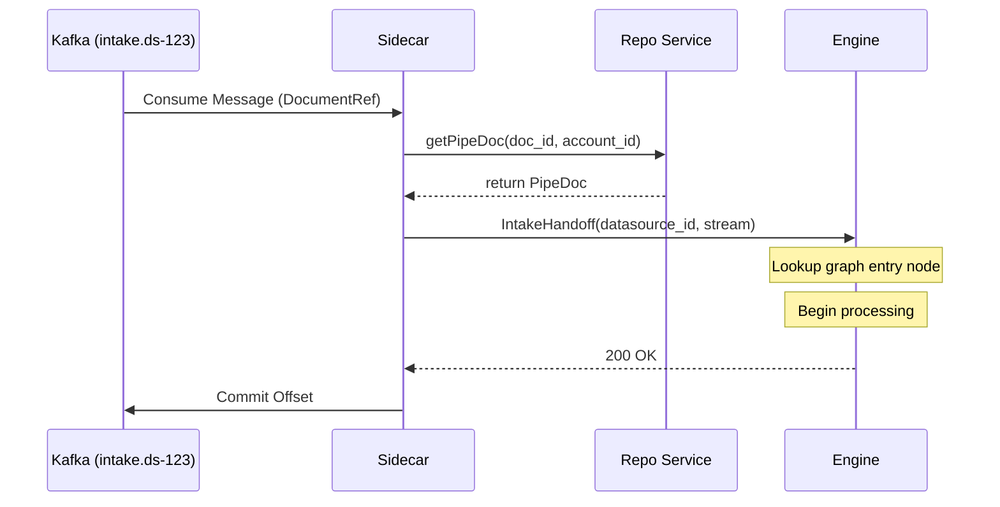
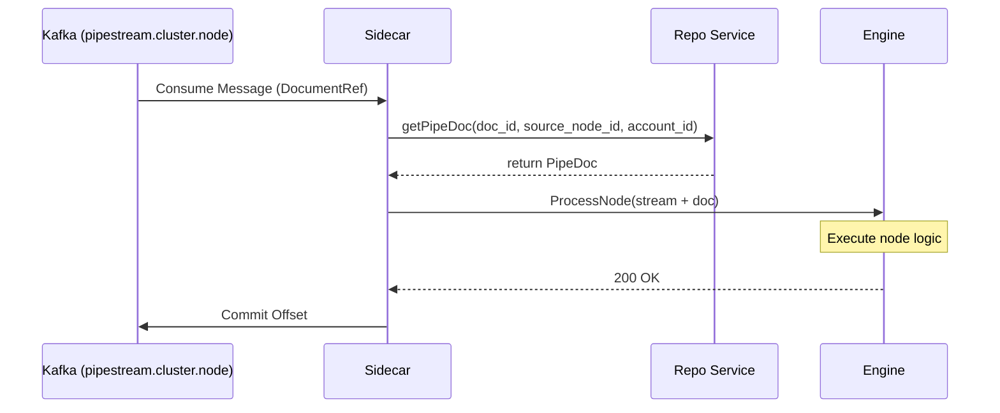
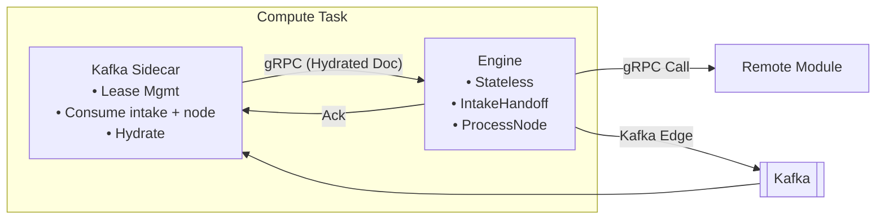

# Kafka Sidecar Pattern

The Kafka Sidecar is a specialized architectural component that bridges the gap between Pipestream's asynchronous messaging layer (Kafka) and its synchronous processing core (Engine). By isolating Kafka consumption in a sidecar, the Engine remains a pure gRPC service, simplified for low-latency processing and independent scaling.

## Sidecar Overview

- **Consumer Lease Management**: Sidecars use Consul-based sessions and KV locks to dynamically acquire and release topic leases, ensuring each Kafka topic is processed by only one sidecar at a time.
- **Reference Hydration (Level 1)**: Since Kafka messages only contain document references (to stay under 10MB), the Sidecar fetches the full `PipeDoc` metadata from the Repo Service before calling the Engine.
- **Reliable Handoff**: The Sidecar delivers the hydrated document to the Engine via gRPC and only commits the Kafka offset once the Engine acknowledges successful receipt.

## Two Topic Types

The Sidecar consumes two distinct topic patterns:

| Topic Pattern | Publisher | Sidecar Action |
|---------------|-----------|----------------|
| `intake.{datasource_id}` | Repository Service | Call `Engine.IntakeHandoff()` |
| `pipestream.{cluster}.{node}` | Engine (via Repo) | Call `Engine.ProcessNode()` |

### Intake Topics

Intake topics receive documents from any intake service via the Repository:

```
┌─────────────────────┐
│ Connector Intake    │──┐
└─────────────────────┘  │
                         │    ┌────────────┐    intake.{datasource_id}
┌─────────────────────┐  ├───►│ Repository │──────────────────────┐
│ API Intake (future) │──┤    └────────────┘                      │
└─────────────────────┘  │         │                              ▼
                         │         │ S3                    ┌──────────────┐
┌─────────────────────┐  │         ▼                       │   Sidecar    │
│ Webhook Intake      │──┘    ┌─────────┐                  │  (hydrate)   │
└─────────────────────┘       │ Storage │                  └──────────────┘
                              └─────────┘                         │
                                                                  ▼
                                                           ┌──────────────┐
                                                           │    Engine    │
                                                           │IntakeHandoff │
                                                           └──────────────┘
```

**Benefits of datasource-based topics:**
- Scale sidecars per datasource load
- Pause/resume specific datasources
- Monitor throughput per datasource
- Different retention policies per datasource
- Multiple intake services can publish to same datasource

### Node Topics

Node topics handle inter-node routing within the pipeline graph:

```
Engine A ───► Repo.SavePipeDoc() ───► S3
    │
    └───► Kafka.publish(pipestream.{cluster}.{node}, DocumentRef)
                    │
                    ▼
              ┌──────────┐
              │  Kafka   │
              └──────────┘
                    │
                    ▼
              ┌──────────┐
              │ Sidecar  │
              │ (hydrate)│
              └──────────┘
                    │
                    ▼ localhost gRPC
              ┌──────────┐
              │ Engine B │
              │ProcessNode│
              └──────────┘
```

## Direct Path (No Kafka)

For small documents or when synchronous response is needed, intake services can bypass Repository and call Engine directly:

```
Connector → Intake → Engine.IntakeHandoff(doc_stored_in_repo=false)
                           ↓
                     Engine has inline PipeDoc
                           ↓
                     Immediate processing
```

**Path selection criteria:**
- Size threshold (e.g., >1MB → repo path)
- Datasource config (some always want persistence)
- Client preference (sync response needed?)

The `doc_stored_in_repo` flag tells Engine how to handle downstream Kafka edges:

| Flag | On Kafka Edge |
|------|---------------|
| `true` | Publish DocumentRef (doc already stored) |
| `false` | Store to Repo first, then publish ref |

## Why a Sidecar?

Traditional "all-in-one" consumers struggle in large-scale multi-tenant environments:

- **Consumer Group Rebalancing**: With thousands of topics, standard Kafka rebalancing becomes a "stop-the-world" bottleneck. Sidecars avoid this by treating each topic as an independent lease.
- **Stateless Engine**: The Engine doesn't need to know about Kafka brokers, offsets, or partitions. It simply processes gRPC requests, making it easier to test and deploy.
- **Resource Isolation**: Memory-intensive hydration and Kafka buffering happen in the Sidecar, protecting the Engine's CPU cycles for mapping and module execution.
- **Local Handoff**: Sidecars typically run alongside the Engine, using `localhost` for gRPC communication to minimize latency.

## Lease Management

The sidecar uses a "lock-per-topic" strategy in Consul to distribute workload without complex consumer group rebalancing.

```java
public void acquireLeases() {
    // Get all available topics (both intake and node topics)
    List<String> intakeTopics = consul.getKVKeys("pipestream/intake-topics/");
    List<String> nodeTopics = consul.getKVKeys("pipestream/node-topics/");
    
    for (String topicKey : concat(intakeTopics, nodeTopics)) {
        if (leasedTopics.size() >= MAX_LEASES) break;
        
        // Try to acquire ephemeral lock linked to sidecar session
        boolean acquired = consul.acquireLock(topicKey, sessionId);
        
        if (acquired) {
            // Start Kafka consumer for this specific topic
            TopicType type = topicKey.startsWith("pipestream/intake-topics/") 
                ? TopicType.INTAKE 
                : TopicType.NODE;
            startConsumer(topicKey, type);
            leasedTopics.add(topicKey);
        }
    }
}
```

## Consumption and Hydration

### Intake Topic Flow



### Node Topic Flow



## Implementation

### Consumer Loop

```java
void consumeLoop(String topic, TopicType type) {
    while (running) {
        ConsumerRecords<String, PipeStream> records = consumer.poll(Duration.ofMillis(100));
        
        for (ConsumerRecord<String, PipeStream> record : records) {
            try {
                processRecord(record, type);
                consumer.commitSync(Map.of(
                    new TopicPartition(record.topic(), record.partition()),
                    new OffsetAndMetadata(record.offset() + 1)
                ));
            } catch (Exception e) {
                handleFailure(record, e);
            }
        }
    }
}
```

### Hydration and Delivery

```java
void processRecord(ConsumerRecord<String, PipeStream> record, TopicType type) {
    PipeStream stream = record.value();
    
    // Hydrate: DocumentRef → PipeDoc
    PipeDoc doc;
    if (stream.hasDocumentRef()) {
        DocumentReference ref = stream.getDocumentRef();
        doc = repoService.getPipeDoc(
            ref.getDocId(), 
            ref.getSourceNodeId(), 
            ref.getAccountId()
        );
    } else {
        doc = stream.getDocument();
    }
    
    // Build hydrated stream
    PipeStream hydrated = stream.toBuilder()
        .clearDocumentRef()
        .setDocument(doc)
        .build();
    
    // Deliver based on topic type
    if (type == TopicType.INTAKE) {
        deliverToIntakeHandoff(hydrated, extractDatasourceId(record.topic()));
    } else {
        deliverToProcessNode(hydrated);
    }
}

void deliverToIntakeHandoff(PipeStream stream, String datasourceId) {
    IntakeHandoffResponse response = engineStub.intakeHandoff(
        IntakeHandoffRequest.newBuilder()
            .setStream(stream)
            .setDatasourceId(datasourceId)
            .setDocStoredInRepo(true)
            .build()
    );
    
    if (!response.getAccepted()) {
        throw new ProcessingException(response.getMessage());
    }
}

void deliverToProcessNode(PipeStream stream) {
    ProcessNodeResponse response = engineStub.processNode(
        ProcessNodeRequest.newBuilder()
            .setStream(stream)
            .build()
    );
    
    if (!response.getSuccess()) {
        throw new ProcessingException(response.getErrorMessage());
    }
}
```

### Failure Handling

```java
void handleFailure(ConsumerRecord<String, PipeStream> record, Exception e) {
    int retryCount = getRetryCount(record);
    
    if (retryCount < MAX_RETRIES) {
        // Retry with backoff
        scheduleRetry(record, retryCount + 1);
    } else {
        // Send to DLQ
        sendToDlq(record, e);
        // Commit offset to move past poison message
        consumer.commitSync(...);
    }
}
```

## Repository Publishing

Repository Service publishes to Kafka after storing documents:

```java
// In Repository Service
Uni<UploadResponse> uploadFilesystemPipeDoc(UploadRequest request) {
    return storeBlobToS3(request.getDocument().getBlobBag())
        .flatMap(storageRef -> storePipeDocToPostgres(request.getDocument(), storageRef))
        .flatMap(docId -> {
            // Publish to intake topic
            String topic = "intake." + request.getDocument().getOwnership().getDatasourceId();
            DocumentReference ref = DocumentReference.newBuilder()
                .setDocId(docId)
                .setAccountId(request.getDocument().getOwnership().getAccountId())
                .build();
            
            return kafkaPublisher.publish(topic, ref)
                .map(v -> UploadResponse.newBuilder()
                    .setSuccess(true)
                    .setDocumentId(docId)
                    .build());
        });
}
```

## Engine Stays Pure

The Engine doesn't know or care where requests originate:

```java
@GrpcService
public class EngineService {
    
    // From Sidecar (Kafka intake topic)
    // From Intake Service (direct gRPC)
    public Uni<IntakeHandoffResponse> intakeHandoff(IntakeHandoffRequest request) {
        PipeStream stream = request.getStream();
        String datasourceId = request.getDatasourceId();
        
        // Lookup datasource → graph → entry node
        GraphNode entryNode = graphCache.getEntryNode(datasourceId);
        
        // Start processing at entry node
        return processFromNode(stream, entryNode);
    }
    
    // From Sidecar (Kafka node topic)
    // From another Engine (direct gRPC)
    public Uni<ProcessNodeResponse> processNode(ProcessNodeRequest request) {
        PipeStream stream = request.getStream();
        PipeDoc doc = stream.getDocument();
        
        // Process: filter, map, call module, route
        return processAndRoute(stream, doc);
    }
}
```

## Consul Lease Distribution

```
┌─────────────────────────────────────────────────────────────────────────────────┐
│                     CONSUL LEASE DISTRIBUTION                                    │
│                                                                                  │
│  consul/pipestream/intake-topics/                                               │
│    ├── datasource-001 → sidecar-A (session-123)                                │
│    ├── datasource-002 → sidecar-B (session-456)                                │
│    └── datasource-003 → sidecar-A (session-123)                                │
│                                                                                  │
│  consul/pipestream/node-topics/                                                 │
│    ├── cluster1.node-uuid-001 → sidecar-A (session-123)                        │
│    ├── cluster1.node-uuid-002 → sidecar-B (session-456)                        │
│    ├── cluster1.node-uuid-003 → sidecar-C (session-789)                        │
│    └── ...                                                                      │
│                                                                                  │
│  Each sidecar holds leases for N topics (both intake and node)                  │
│  On sidecar death: session expires, leases auto-release                         │
│  Other sidecars acquire released topics                                         │
│                                                                                  │
└─────────────────────────────────────────────────────────────────────────────────┘
```

## Topic Registration

### Intake Topics

Created when a datasource is configured:

```java
void onDatasourceCreated(Datasource datasource) {
    String topicName = "intake." + datasource.getDatasourceId();
    kafkaAdmin.createTopic(topicName, partitions, replicationFactor);
    
    // Register in Consul for lease distribution
    consul.kvPut("pipestream/intake-topics/" + datasource.getDatasourceId(), "");
}
```

### Node Topics

Created when a graph node with Kafka edges is created:

```java
void onNodeCreated(GraphNode node) {
    // Create topic for this node
    String topicName = "pipestream." + node.getClusterId() + "." + node.getNodeId();
    kafkaAdmin.createTopic(topicName, partitions, replicationFactor);
    
    // Create DLQ topic
    String dlqTopic = "dlq." + node.getClusterId() + "." + node.getNodeId();
    kafkaAdmin.createTopic(dlqTopic, partitions, replicationFactor);
    
    // Register in Consul for lease distribution
    consul.kvPut("pipestream/node-topics/" + node.getClusterId() + "." + node.getNodeId(), "");
}
```

## Compute Task Visualization



## Edge Transport Selection

One transport per edge - no mixing:

| Edge Transport | Flow | Use Case |
|----------------|------|----------|
| **gRPC** | Engine → Engine (direct) | Fast path, no replay |
| **Kafka** | Engine → Repo → Kafka → Sidecar → Engine | Async, replayable |

## Benefits

| Benefit | Description |
|---------|-------------|
| **Pure gRPC Engine** | Engine code doesn't touch Kafka |
| **Multiple Intake Services** | Any service can publish via Repository |
| **Datasource Isolation** | Per-datasource topics for independent scaling |
| **Clean Separation** | Consumption logic isolated in sidecar |
| **Consul-Native Leases** | No custom lease management in engine |
| **Health-Linked Sessions** | Dead sidecar = released leases |
| **Independent Scaling** | gRPC load vs Kafka lag are separate concerns |
| **Replay Capability** | Kafka edges retain full replay ability |
| **Simplified Testing** | Engine tested with pure gRPC, no Kafka needed |

## Container Resources

| Container | CPU | Memory | Notes |
|-----------|-----|--------|-------|
| **Consul Agent** | 0.1 | 128MB | Lightweight |
| **Kafka Sidecar** | 0.5 | 2-3GB | Kafka buffers, ~50MB per topic |
| **Engine** | 1-2 | 1-2GB | Processing, gRPC, module calls |

Total per task: ~2-3 CPU, ~4-6GB RAM
