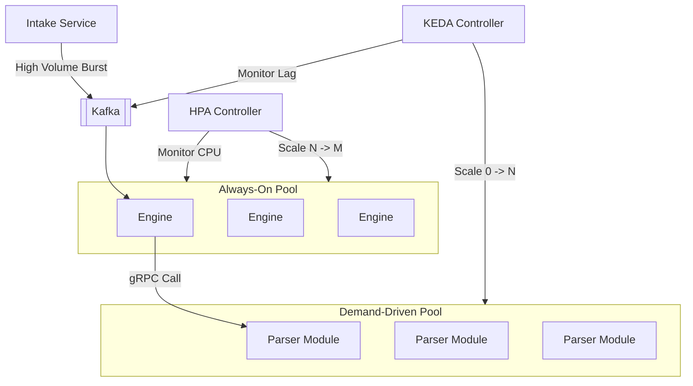
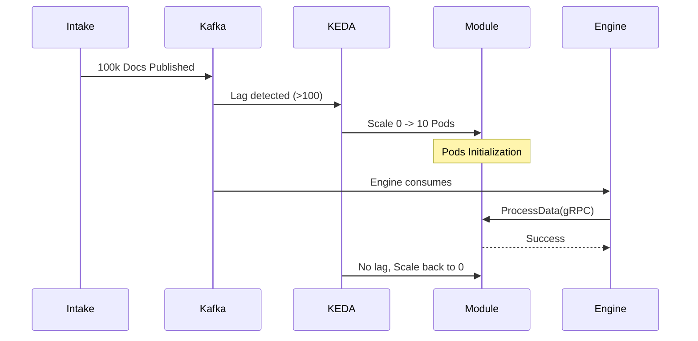

# Scaling Model

The Pipestream Scaling Model ensures the system can handle massive document throughput while maintaining cost-efficiency. By separating the baseline "always-on" orchestration (Engine) from the demand-driven "scale-to-zero" processing (Modules), the architecture optimizes for both low-latency performance and high-volume burst capacity.

### Scaling Architecture
- **Engine Pool (Horizontal Scaling)**: Engines are scaled based on CPU utilization and gRPC request latency. They maintain a baseline presence to handle real-time traffic from the intake service and other engines.
- **Remote Modules (Scale-to-Zero)**: Modules like parsers and embedders are scaled using KEDA (Kubernetes Event-Driven Autoscaling). They can scale to zero when no documents are in the pipeline, eliminating idle costs for expensive resources like GPUs.
- **Kafka Buffering**: Kafka acts as a shock absorber, allowing the system to ingest documents at a higher rate than the modules can immediately process. Scaling triggers (like consumer lag) ensure the processing capacity catches up with the ingestion volume.

### Module Scaling (KEDA) Implementation

Modules are scaled based on the volume of work pending in their respective Kafka topics or the rate of gRPC requests they receive.

```yaml
# KEDA ScaledObject for GPU Embedder
apiVersion: keda.sh/v1alpha1
kind: ScaledObject
metadata:
  name: embedder-scaler
spec:
  scaleTargetRef:
    name: embedder
  // 1. Scale-to-zero (1)
  minReplicaCount: 0              
  maxReplicaCount: 10
  cooldownPeriod: 300             
  triggers:
    // 2. Throughput-based scaling (2)
    - type: prometheus            
      metadata:
        query: sum(rate(grpc_server_started_total{service="embedder"}[1m]))
        threshold: "10"
    // 3. Backlog-based scaling (3)
    - type: kafka                 
      metadata:
        topic: prod.embedder
        lagThreshold: "5"
```

#### Code Deep Dive:
1. **Cost Optimization**: Setting `minReplicaCount: 0` ensures that expensive resources (like GPU nodes) are completely released when no documents are waiting to be processed.
2. **Predictive Scaling**: By monitoring the rate of gRPC requests (via Prometheus), KEDA can scale up the module instances as soon as traffic begins to flow from the Engines.
3. **Reactive Scaling**: Monitoring Kafka consumer lag provides a safety net. If documents are piling up in the messaging layer faster than they can be processed, KEDA will spawn additional instances to clear the backlog.

### Deep Dive: Workload Optimization

Pipestream distinguishes between orchestration load and processing load to maximize resource utilization:

- **Orchestration Load**: Engine tasks (mapping, routing, hydration) are lightweight and CPU-bound. These are handled by a stable pool of engines that scale traditionally via HPA (Horizontal Pod Autoscaler).
- **Processing Load**: Module tasks (OCR, embedding, chunking) are heavy and often require specialized hardware. These are treated as "functions-as-a-service" that only exist when work is available.
- **Cold Start Mitigation**: While modules can scale to zero, the first document in a burst may experience a slight delay. Kafka persistence ensures no data is lost during the 10-30 seconds it takes for a module pod to initialize.
- **Multi-Tenant Isolation**: Scaling can be tuned per account or cluster, ensuring that a spike in one tenant's ingestion doesn't starve the resources of another.

### Visualization of Scaling Dynamics



### Cost Efficiency Comparison

| Component | Scaling Strategy | Idle Cost | Peak Capacity |
|-----------|------------------|-----------|---------------|
| **Engine** | HPA (CPU/RAM) | Low (Fixed) | High (Elastic) |
| **Parser (CPU)** | KEDA (Lag/Rate) | **Zero** | High (Elastic) |
| **Embedder (GPU)** | KEDA (Lag/Rate) | **Zero** | Moderate (GPU Limited) |
| **Sinks** | KEDA (Lag) | **Zero** | High (Elastic) |

### Batch Ingestion Flow


