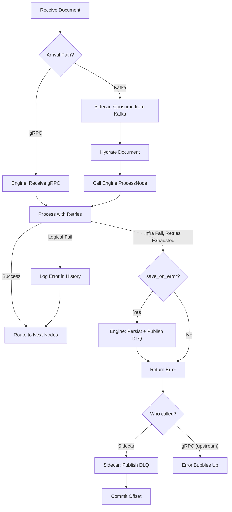
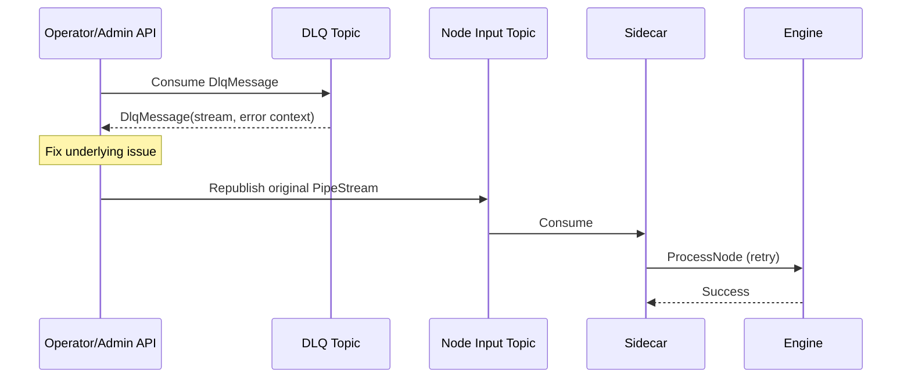
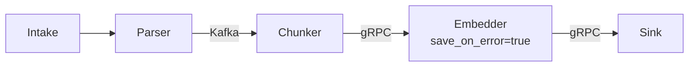

# Dead Letter Queue (DLQ) Handling

The Dead Letter Queue (DLQ) captures documents that fail processing after exhausting retries. By isolating these "poison messages" in dedicated Kafka topics, Pipestream ensures pipeline execution continues for healthy documents while providing operators with tools to investigate and replay failures.

## Failure Types

| Failure Type | Example | Retry? | DLQ? |
|--------------|---------|--------|------|
| **Logical** | Module returns `success=false` (invalid PDF) | No | No |
| **Infrastructure** | Timeout, connection refused, 503 | Yes | After retries exhausted |

**Key distinction:** Logical failures are valid processing outcomes - the module ran successfully but couldn't process the document. Infrastructure failures indicate something is broken and may resolve with retry.

## DLQ Ownership Model

DLQ handling depends on how the document arrived at the Engine:

| Arrival Path | On Failure | DLQ Published By |
|--------------|------------|------------------|
| **Via Sidecar (Kafka)** | Engine returns error | Sidecar (has offset context) |
| **Via gRPC (direct)** | Engine returns error | None - error bubbles up |
| **Via gRPC with `save_on_error=true`** | Engine returns error | Engine (persists first, then publishes) |

## DLQ Flow: Kafka Path

When documents arrive via Kafka, Sidecar handles DLQ publishing:

```
┌─────────────────────────────────────────────────────────────────┐
│                                                                  │
│   Sidecar                          Engine                       │
│   ┌──────────────────┐             ┌──────────────────────┐     │
│   │ Consume from     │   gRPC      │ Call module          │     │
│   │ Kafka            │────────────►│ with retries         │     │
│   │                  │             │                      │     │
│   │                  │◄────────────│ Return success/error │     │
│   │                  │             └──────────────────────┘     │
│   │                  │                                          │
│   │ If error:        │                                          │
│   │ • Publish to DLQ │                                          │
│   │ • Commit offset  │                                          │
│   └──────────────────┘                                          │
│                                                                  │
└─────────────────────────────────────────────────────────────────┘
```

**Why Sidecar owns DLQ for Kafka arrivals:**
- Sidecar already has Kafka client
- Sidecar knows original topic/offset for replay context
- Engine stays focused on processing

## DLQ Flow: gRPC Path with save_on_error

For expensive nodes in gRPC chains, enable `save_on_error` to capture failures:

```
┌─────────────────────────────────────────────────────────────────┐
│                                                                  │
│   Caller (Engine/Intake)           Engine (with save_on_error)  │
│   ┌──────────────────┐             ┌──────────────────────┐     │
│   │ Call Engine      │   gRPC      │ Call module          │     │
│   │                  │────────────►│ with retries         │     │
│   │                  │             │                      │     │
│   │                  │             │ If failure:          │     │
│   │                  │             │ • Persist to Repo    │     │
│   │                  │             │ • Publish to DLQ     │     │
│   │                  │◄────────────│ Return error         │     │
│   │                  │             └──────────────────────┘     │
│   │ Receives error   │                                          │
│   │ (doc is safe     │                                          │
│   │  in DLQ)         │                                          │
│   └──────────────────┘                                          │
│                                                                  │
└─────────────────────────────────────────────────────────────────┘
```

## Node Configuration: save_on_error

Per-node option to enable DLQ for gRPC arrivals:

```protobuf
message NodeProcessingConfig {
  // ... existing fields ...
  
  // If true, persist failed documents to DLQ even when reached via gRPC edge.
  // Default: false (gRPC errors bubble up to caller)
  // Use case: Expensive nodes where you don't want to redo upstream processing.
  bool save_on_error = 7;
}
```

**When to use `save_on_error=true`:**

| Node Type | save_on_error | Rationale |
|-----------|---------------|-----------|
| Parser | `false` | Cheap to rerun from intake |
| Chunker | `false` | Fast, just retry |
| Embedder (GPU) | `true` | Expensive - don't redo parsing/chunking |
| External API | `true` | Rate limited, may have side effects |
| LLM call | `true` | Costly, slow to redo |

**Frontend UX:** Checkbox "Enable failure replay for this node" with tooltip explaining that failed documents will be saved for later replay.

## Engine: Retry Logic

The Engine implements automatic retry with exponential backoff for transient gRPC failures. See [02-processing-loop.md#module-call-retry](./02-processing-loop.md#module-call-retry) for full details.

### Retry Configuration

```properties
# application.properties
pipestream.module.retry.max-attempts=3
pipestream.module.retry.initial-delay-ms=100
pipestream.module.retry.max-delay-ms=2000
```

### Retryable Status Codes

Only transient failures trigger retry:
- `UNAVAILABLE` - Service temporarily down
- `DEADLINE_EXCEEDED` - Request timeout
- `RESOURCE_EXHAUSTED` - Rate limiting

Non-retryable errors (INVALID_ARGUMENT, NOT_FOUND, INTERNAL, etc.) fail immediately.

### Integration with save_on_error

After retries are exhausted, the `save_on_error` flag determines behavior:

```java
private Uni<PipeStream> processNodeLogic(PipeStream stream, GraphNode node) {
    return ensureHydration(stream, node)
        .flatMap(hydratedStream -> {
            // ... filter, pre-map, module call, post-map ...
        })
        .onFailure().recoverWithUni(error -> {
            // After retry exhaustion, check save_on_error
            if (node.getSaveOnError() && stream.hasDocument()) {
                LOG.warnf("Module %s failed, saving document due to save_on_error=true",
                        node.getModuleId());
                return saveErrorState(stream, node, error)
                        .flatMap(v -> Uni.createFrom().failure(error));
            }
            return Uni.createFrom().failure(error);
        });
}

void publishToDlq(PipeStream stream, Exception error, int retryCount) {
    // Ensure doc is persisted
    PipeDoc doc = stream.getDocument();
    String nodeId = stream.getCurrentNodeId();
    String accountId = stream.getMetadata().getAccountId();
    
    repoService.savePipeDoc(doc, nodeId, accountId);
    
    // Publish to DLQ
    DlqMessage dlqMessage = DlqMessage.newBuilder()
        .setStream(stream.toBuilder()
            .clearDocument()
            .setDocumentRef(DocumentReference.newBuilder()
                .setDocId(doc.getDocId())
                .setSourceNodeId(nodeId)
                .setAccountId(accountId)
                .build())
            .build())
        .setErrorType(error.getClass().getSimpleName())
        .setErrorMessage(error.getMessage())
        .setFailedAt(Timestamps.now())
        .setFailedNodeId(nodeId)
        .setRetryCount(retryCount)
        // No original topic/offset for gRPC arrivals
        .build();
    
    String dlqTopic = "dlq." + graphCache.getNode(nodeId).getClusterId() + "." + nodeId;
    kafkaProducer.send(dlqTopic, dlqMessage);
}
```

## Sidecar: DLQ Publishing

Sidecar handles DLQ for failed Engine calls when documents arrive via Kafka:

```java
void processRecord(ConsumerRecord<String, PipeStream> record) {
    PipeStream stream = record.value();
    
    try {
        // Hydrate and call Engine
        PipeDoc doc = hydrate(stream);
        ProcessNodeResponse response = engineStub.processNode(
            ProcessNodeRequest.newBuilder()
                .setStream(stream.toBuilder().setDocument(doc).build())
                .build()
        );
        
        if (!response.getSuccess()) {
            // Engine exhausted retries - send to DLQ
            sendToDlq(record, stream, response);
        }
        
        // Commit offset (success or DLQ'd)
        commitOffset(record);
        
    } catch (Exception e) {
        // Engine unreachable - Sidecar-level retry/DLQ
        handleSidecarFailure(record, e);
    }
}

void sendToDlq(ConsumerRecord<String, PipeStream> record, 
               PipeStream stream, 
               ProcessNodeResponse errorResponse) {
    
    DlqMessage dlqMessage = DlqMessage.newBuilder()
        .setStream(stream)
        .setErrorType(errorResponse.getErrorType())
        .setErrorMessage(errorResponse.getErrorMessage())
        .setFailedAt(Timestamps.now())
        .setFailedNodeId(stream.getCurrentNodeId())
        .setOriginalTopic(record.topic())
        .setOriginalPartition(record.partition())
        .setOriginalOffset(record.offset())
        .setRetryCount(errorResponse.getRetryCount())
        .build();
    
    String dlqTopic = "dlq." + extractClusterAndNode(record.topic());
    kafkaProducer.send(dlqTopic, dlqMessage);
}
```

## DLQ Configuration

Per-node DLQ settings:

```protobuf
message DlqConfig {
  // Whether DLQ is enabled for this node (default: true)
  bool enabled = 1;
  
  // Kafka topic for DLQ messages
  // Default: "dlq.{cluster_id}.{node_id}"
  optional string topic = 2;
  
  // Maximum retry attempts before sending to DLQ (default: 3)
  int32 max_retries = 3;
  
  // Backoff between retries
  google.protobuf.Duration retry_backoff = 4;
}
```

## DLQ Message Schema

```protobuf
message DlqMessage {
  // The failed stream (contains document reference)
  PipeStream stream = 1;
  
  // Error details
  string error_type = 2;           // "TIMEOUT", "CONNECTION_REFUSED"
  string error_message = 3;
  google.protobuf.Timestamp failed_at = 4;
  int32 retry_count = 5;
  
  // Origin context for replay (populated by Sidecar, empty for save_on_error)
  string failed_node_id = 6;
  string original_topic = 7;
  int32 original_partition = 8;
  int64 original_offset = 9;
}
```

## Failure Handling Visualization



## Node-Specific DLQ Topics

Each node has its own DLQ topic:

```
dlq.cluster1.parser-node      ← Failures from parser
dlq.cluster1.chunker-node     ← Failures from chunker  
dlq.cluster1.embedder-node    ← Failures from embedder
```

This allows operators to:
- Identify which pipeline stage is failing
- Replay failures to specific nodes
- Monitor per-node error rates

## Replay Process



## gRPC Checkpointing Strategy

For pure gRPC chains without `save_on_error`:

| Scenario | Recovery Strategy |
|----------|-------------------|
| Error in gRPC chain | Replay from last Kafka checkpoint (upstream) |
| No Kafka in pipeline | Replay from intake |

**Best practice:** Place Kafka edges before expensive nodes to create natural checkpoints:



In this example:
- Kafka edge before Chunker = checkpoint
- Embedder has `save_on_error=true` for GPU cost protection
- If Sink fails, replay from Chunker (or Embedder's DLQ if it failed)

## Monitoring

Key metrics to track:

| Metric | Alert Threshold |
|--------|-----------------|
| `dlq_messages_total` | Any increase |
| `dlq_messages_by_node` | > 10/min for any node |
| `retry_count_histogram` | High retry rates before success |
| `dlq_age_seconds` | Messages sitting > 1 hour |
| `save_on_error_dlq_count` | Track gRPC-path DLQ usage |
