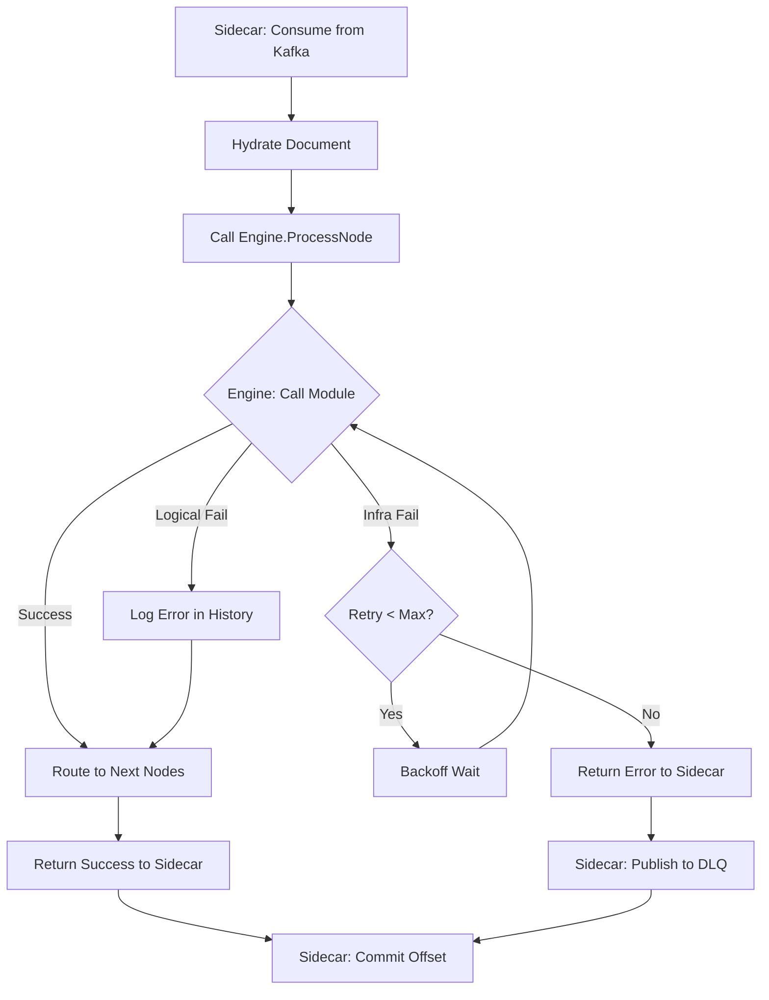
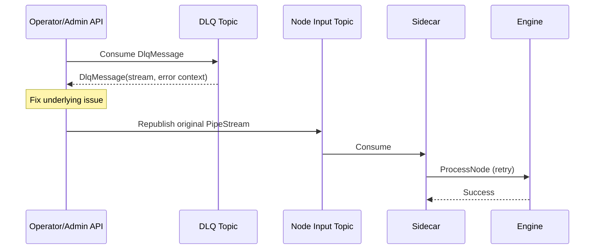

# Dead Letter Queue (DLQ) Handling

The Dead Letter Queue (DLQ) captures documents that fail processing after exhausting retries. By isolating these "poison messages" in dedicated Kafka topics, Pipestream ensures pipeline execution continues for healthy documents while providing operators with tools to investigate and replay failures.

## Failure Types

| Failure Type | Example | Retry? | DLQ? |
|--------------|---------|--------|------|
| **Logical** | Module returns `success=false` (invalid PDF) | No | No |
| **Infrastructure** | Timeout, connection refused, 503 | Yes | After retries exhausted |

**Key distinction:** Logical failures are valid processing outcomes - the module ran successfully but couldn't process the document. Infrastructure failures indicate something is broken and may resolve with retry.

## DLQ Flow

DLQ handling is split between Engine (retry) and Sidecar (DLQ publish):

```
┌─────────────────────────────────────────────────────────────────┐
│                                                                  │
│   Sidecar                          Engine                       │
│   ┌──────────────────┐             ┌──────────────────────┐     │
│   │ Consume from     │   gRPC      │ Call module          │     │
│   │ Kafka            │────────────►│ with retries         │     │
│   │                  │             │                      │     │
│   │                  │◄────────────│ Return success/error │     │
│   │                  │             └──────────────────────┘     │
│   │                  │                                          │
│   │ If error:        │                                          │
│   │ • Publish to DLQ │                                          │
│   │ • Commit offset  │                                          │
│   └──────────────────┘                                          │
│                                                                  │
└─────────────────────────────────────────────────────────────────┘
```

**Why Sidecar owns DLQ:**
- Sidecar already has Kafka client
- Sidecar knows original topic/offset for replay context
- Engine stays pure gRPC (no Kafka dependency)

## Engine: Retry Logic

Engine handles retries for module calls:

```java
ProcessNodeResponse processNode(ProcessNodeRequest request) {
    PipeStream stream = request.getStream();
    GraphNode node = graphCache.getNode(stream.getCurrentNodeId());
    DlqConfig dlqConfig = node.getDlqConfig();
    
    int attempt = 0;
    Exception lastError = null;
    
    while (attempt < dlqConfig.getMaxRetries()) {
        try {
            // Call module
            ProcessDataResponse response = callModule(node, stream.getDocument());
            
            if (response.getSuccess()) {
                // Success - continue routing
                routeToNextNodes(stream, response.getOutputDoc());
                return ProcessNodeResponse.newBuilder()
                    .setSuccess(true)
                    .build();
            } else {
                // Logical failure - log and continue (no retry)
                logErrorInHistory(stream, response.getErrorDetails());
                routeToNextNodes(stream, response.getOutputDoc());
                return ProcessNodeResponse.newBuilder()
                    .setSuccess(true)  // Processing succeeded, module chose to fail
                    .build();
            }
            
        } catch (ModuleUnavailableException | TimeoutException e) {
            // Infrastructure failure - retry
            attempt++;
            lastError = e;
            if (attempt < dlqConfig.getMaxRetries()) {
                waitForBackoff(attempt, dlqConfig.getRetryBackoff());
            }
        }
    }
    
    // Exhausted retries - return error to caller
    return ProcessNodeResponse.newBuilder()
        .setSuccess(false)
        .setErrorMessage(lastError.getMessage())
        .setErrorType(lastError.getClass().getSimpleName())
        .setRetryCount(attempt)
        .build();
}
```

## Sidecar: DLQ Publishing

Sidecar handles DLQ for failed Engine calls:

```java
void processRecord(ConsumerRecord<String, PipeStream> record) {
    PipeStream stream = record.value();
    
    try {
        // Hydrate and call Engine
        PipeDoc doc = hydrate(stream);
        ProcessNodeResponse response = engineStub.processNode(
            ProcessNodeRequest.newBuilder()
                .setStream(stream.toBuilder().setDocument(doc).build())
                .build()
        );
        
        if (!response.getSuccess()) {
            // Engine exhausted retries - send to DLQ
            sendToDlq(record, stream, response);
        }
        
        // Commit offset (success or DLQ'd)
        commitOffset(record);
        
    } catch (Exception e) {
        // Engine unreachable - Sidecar-level retry/DLQ
        handleSidecarFailure(record, e);
    }
}

void sendToDlq(ConsumerRecord<String, PipeStream> record, 
               PipeStream stream, 
               ProcessNodeResponse errorResponse) {
    
    DlqMessage dlqMessage = DlqMessage.newBuilder()
        .setStream(stream)
        .setErrorType(errorResponse.getErrorType())
        .setErrorMessage(errorResponse.getErrorMessage())
        .setFailedAt(Timestamps.now())
        .setFailedNodeId(stream.getCurrentNodeId())
        .setOriginalTopic(record.topic())
        .setOriginalPartition(record.partition())
        .setOriginalOffset(record.offset())
        .setRetryCount(errorResponse.getRetryCount())
        .build();
    
    String dlqTopic = "dlq." + extractClusterAndNode(record.topic());
    kafkaProducer.send(dlqTopic, dlqMessage);
}
```

## DLQ Configuration

Per-node DLQ settings (from issue #14):

```protobuf
message DlqConfig {
  // Whether DLQ is enabled for this node (default: true)
  bool enabled = 1;
  
  // Kafka topic for DLQ messages
  // Default: "dlq.{cluster_id}.{node_id}"
  optional string topic = 2;
  
  // Maximum retry attempts before sending to DLQ (default: 3)
  int32 max_retries = 3;
  
  // Backoff between retries
  google.protobuf.Duration retry_backoff = 4;
}
```

## DLQ Message Schema

```protobuf
message DlqMessage {
  // The failed stream (contains document reference)
  PipeStream stream = 1;
  
  // Error details
  string error_type = 2;           // "TIMEOUT", "CONNECTION_REFUSED"
  string error_message = 3;
  google.protobuf.Timestamp failed_at = 4;
  int32 retry_count = 5;
  
  // Origin context for replay
  string failed_node_id = 6;
  string original_topic = 7;
  int32 original_partition = 8;
  int64 original_offset = 9;
}
```

## Failure Handling Visualization



## Node-Specific DLQ Topics

Each node has its own DLQ topic:

```
dlq.cluster1.parser-node      ← Failures from parser
dlq.cluster1.chunker-node     ← Failures from chunker  
dlq.cluster1.embedder-node    ← Failures from embedder
```

This allows operators to:
- Identify which pipeline stage is failing
- Replay failures to specific nodes
- Monitor per-node error rates

## Replay Process



## What About gRPC Edges?

DLQ is a Kafka concept. For gRPC edges:

| Scenario | Behavior |
|----------|----------|
| Module fails (infra) | Engine retries, then returns error to caller |
| Caller is another Engine | Error propagates up the call chain |
| No DLQ | Errors bubble up synchronously |

This is intentional - gRPC edges are for fast, synchronous paths where the caller wants immediate feedback, not eventual consistency.

## Monitoring

Key metrics to track:

| Metric | Alert Threshold |
|--------|-----------------|
| `dlq_messages_total` | Any increase |
| `dlq_messages_by_node` | > 10/min for any node |
| `retry_count_histogram` | High retry rates before success |
| `dlq_age_seconds` | Messages sitting > 1 hour |
