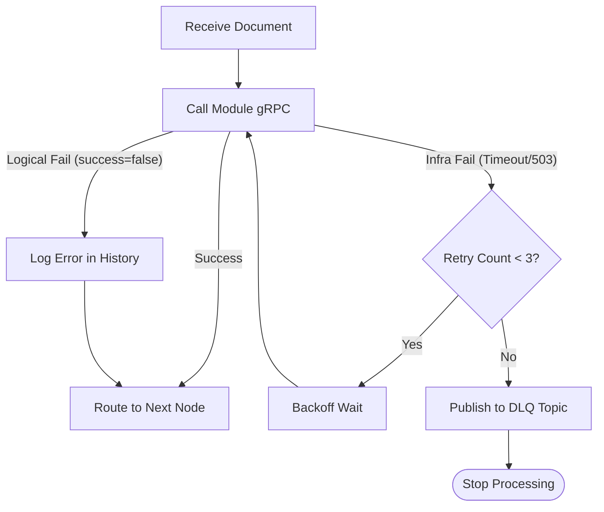
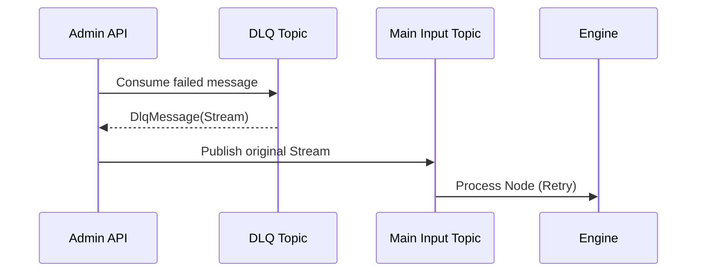

# Dead Letter Queue (DLQ) Handling

The Dead Letter Queue (DLQ) is a critical resiliency mechanism that captures documents failing to process due to infrastructure or transient errors. By isolating these "poison messages" in dedicated Kafka topics, Pipestream ensures that pipeline execution continues for healthy documents while providing operators with the tools to investigate and replay failures.

### DLQ Workflow
- **Failure Identification**: The Engine distinguishes between logical failures (where a module returns `success=false`) and infrastructure failures (like gRPC timeouts or module unavailability). Only infrastructure failures trigger the DLQ process.
- **Retry Strategy**: Before a document is sent to the DLQ, the Engine applies a configurable retry policy (e.g., 3 attempts with exponential backoff) to resolve transient network issues.
- **DLQ Persistence**: Exhausted failures are wrapped in a `DlqMessage`—containing the original `PipeStream` and detailed error context—and published to a node-specific DLQ topic (e.g., `dlq.prod.node-uuid`).

### Retry and DLQ Implementation

The Engine's processing loop wraps module calls in a retry handler to manage infrastructure instability.

```java
void processWithRetry(PipeStream stream, GraphNode node) {
    DlqConfig dlqConfig = node.getDlqConfig();
    int attempt = 0;
    
    while (attempt < dlqConfig.getMaxRetries()) {
        try {
            // 1. Core execution (1)
            processNode(stream); 
            return; 
        } catch (ModuleUnavailableException | TimeoutException e) {
            // 2. Transient failure handling (2)
            attempt++;
            if (attempt < dlqConfig.getMaxRetries()) {
                // 3. Backoff wait (3)
                waitForBackoff(attempt, dlqConfig.getRetryBackoff());
            } else {
                // 4. DLQ handoff (4)
                sendToDlq(stream, node, e, attempt);
            }
        }
    }
}
```

#### Code Deep Dive:
1. **Orchestration**: The standard processing loop is executed. This includes filtering, hydration, and module invocation.
2. **Infrastructure Exceptions**: The retry logic only triggers for connectivity or timeout issues. Logical failures (where the module returns an error status) do not trigger retries.
3. **Wait Cycle**: Uses an exponential backoff strategy to prevent "thundering herd" issues when a remote module is restarting.
4. **Final Failure**: If all retries are exhausted, the document is wrapped in a `DlqMessage` and published to a specialized Kafka topic for operator intervention.

### Deep Dive: DLQ Strategy

Pipestream's DLQ design prioritizes system availability and auditability:

- **Logical Failures vs. DLQ**: If a module returns `success=false` (e.g., "invalid PDF format"), this is considered a successful execution of the *step*. The error is logged in the document history, and the pipeline continues to the next node.
- **Node-Specific Topics**: Every node in the graph has its own DLQ topic, allowing operators to pinpoint exactly which stage of the pipeline is failing.
- **Preservation of Context**: `DlqMessage` includes the original Kafka topic and offset, allowing for precise correlation with broker logs during troubleshooting.
- **Replayability**: Documents in the DLQ can be "replayed" by republishing them to the node's main input topic once the underlying issue (e.g., a module crash) is resolved.

### Failure Handling Visualization



### DLQ Message Schema (Protobuf)

The `DlqMessage` acts as a container for both the failed data and the metadata required for diagnostics.

```protobuf
message DlqMessage {
  // The failed stream (with document_ref to repo)
  optional PipeStream stream = 1;
  
  // Diagnostic details
  optional string error_type = 2;           // "TIMEOUT", "CONNECTION_REFUSED"
  optional string error_message = 3;
  optional google.protobuf.Timestamp failed_at = 4;
  
  // Origin context for replay
  optional string failed_node_id = 6;
  optional string original_topic = 7;
}
```

### Replay Sequence


