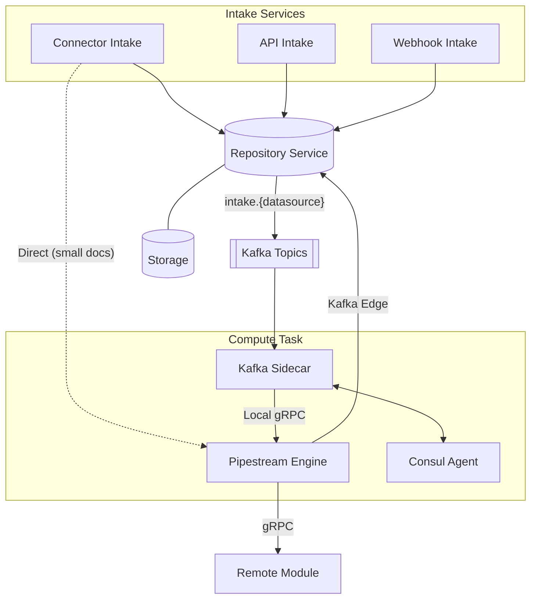

# PipeStream Engine Architecture

The PipeStream Engine is the central orchestration brain of the platform. It manages the lifecycle of documents as they flow through a pipeline graph, coordinating between data intake, remote processing modules, and persistent storage.

## Documentation Index

| Document | Description |
|----------|-------------|
| [01: Overview](./01-overview.md) | High-level architecture, design principles, and core components. |
| [02: Processing Loop](./02-processing-loop.md) | Step-by-step logic for how the engine handles a single node execution. |
| [03: Graph Management](./03-graph-management.md) | DAG storage, versioning, and high-performance in-memory caching. |
| [04: Transport & Routing](./04-transport-routing.md) | Hybrid gRPC/Kafka transport selection and CEL-based routing. |
| [05: Hydration Model](./05-hydration-model.md) | Multi-level strategy for fetching metadata and binary content. |
| [06: Mapping & Filtering](./06-mapping-filtering.md) | In-engine field transformations and node bypass logic using CEL. |
| [07: Module Integration](./07-module-integration.md) | The gRPC contract for remote modules and service discovery via Consul. |
| [08: Kafka Sidecar](./08-kafka-sidecar.md) | Dual-topic consumption (intake + node), lease management, and hydration. |
| [09: Scaling Model](./09-scaling-model.md) | Infrastructure-agnostic scaling strategies with Fargate and Kubernetes examples. |
| [10: DLQ Handling](./10-dlq-handling.md) | Resiliency through retries and node-specific dead-letter topics. |

## Architecture Overview

The Pipestream architecture is built on the principle of **functional isolation**. The Engine is a pure gRPC service that focuses entirely on orchestration, while infrastructure concerns like Kafka consumption and lease management are offloaded to sidecars.

### Dual Intake Paths

Documents can enter the pipeline two ways:

| Path | Flow | Use Case |
|------|------|----------|
| **Repository Path** | Intake → Repo → Kafka → Sidecar → Engine | Large files, async, replay needed |
| **Direct Path** | Intake → Engine (gRPC) | Small docs, sync response needed |

Repository owns Kafka publishing for intake topics, allowing multiple intake services to feed the same pipeline.

### Key Design Principles

*   **Pure gRPC Engine**: The engine has no knowledge of Kafka or message brokers. It only receives and sends gRPC requests, making it stateless and easy to test.
*   **Sidecar Bridge**: The Kafka Sidecar consumes both intake topics (`intake.{datasource_id}`) and node topics (`pipestream.{cluster}.{node}`), hydrating documents before delivering to the engine.
*   **Consul-Based Leases**: Topic ownership is distributed dynamically across the cluster using Consul sessions, preventing "stop-the-world" Kafka rebalances.
*   **Explicit Transport**: Every edge in the graph is configured as either **gRPC (Fast Path)** for low latency or **Kafka (Reliable Path)** for durability and cross-cluster routing.
*   **Multi-Level Hydration**: Documents are passed as lightweight references whenever possible, with full metadata (Level 1) or binary blobs (Level 2) fetched only when required.
*   **Stateless Modules**: Processing modules are "dumb" transformers that follow a simple `PipeDoc in -> PipeDoc out` contract, unaware of their position in the graph.
*   **Repository Abstraction**: Engine and Sidecar never see storage details (S3 paths, credentials). They work with logical coordinates; Repository Service handles all storage.

## Edge Transport Selection

| Transport | Flow | Best For |
|-----------|------|----------|
| **gRPC** | Engine → Engine (Direct) | Real-time processing, low-latency hops, same-cluster traffic. |
| **Kafka** | Engine → Repo → Kafka → Sidecar → Engine | Cross-cluster routing, heavy processing, replayability, and backpressure. |

## Related Resources

- [Proto Changes Issue](https://github.com/ai-pipestream/pipestream-protos/issues/14) - CEL integration, IntakeHandoff RPC, DLQ config
- [pipestream-protos](https://github.com/ai-pipestream/pipestream-protos) - Proto definitions
- [connector-intake-service](https://github.com/ai-pipestream/connector-intake-service) - Document intake gateway
